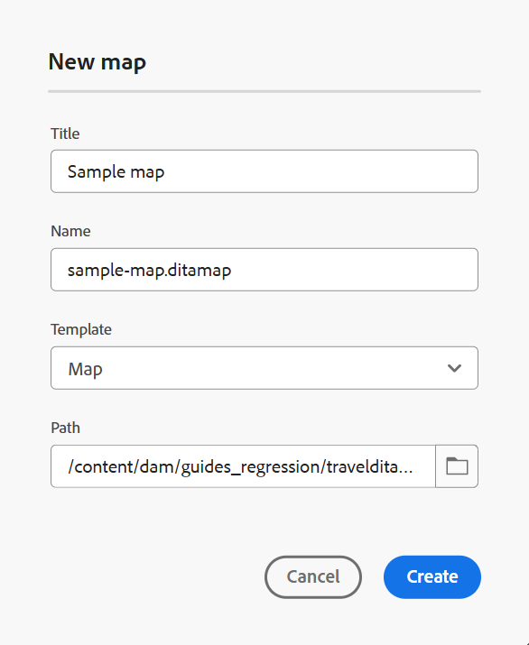
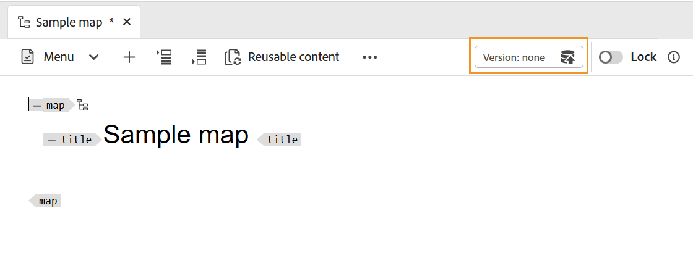

# Create a map {#id176FEN0D05Z}

Adobe Experience Manager Guides provides two out-of-the-box map templates - DITA map and Bookmap. You can also create your own map templates and share those with your authors to create map files.

Perform the following steps to create a map:

1. In the Repository panel, select the **New file** icon and then select **DITA Map** from the dropdown menu. 

    {width="800" align="left"}

    You can also access this option from the [Experience Manager Guides Home page](./intro-home-page.md) and the options menu of a folder in the Respository view. 

2. The **New map** dialog box is displayed.
    
3. In the **New map** dialog box, provide the following details:
    - A Title for the map.
    - \(Optional\)* The file name for the map. The file name is auto-suggested based on the topic Title. In case your administrator has enabled automatic file names based on UUID setting, then you will not see the Name field.
    - A template on which the topic will be based. For a map file, the available options are **Bookmap**, **Map**, and **Subject scheme**.
    - Path where you want to save the map file. By default, the path of currently selected folder in the repository is shown in the Path field.

    {width="300" align="left"}

    
4. Select **Create**. 
    
The map is created at the specified path. Also, the map is opened in the Map Editor for editing.

{width="300" align="left"}

## Add topics to a map file 

In addition to editing map files directly from the Editor, you can also open topic files in a map for editing the Editor. You can add topics to a map file. 

Perform the following steps to add topics to a map file from the Map console:

1. In the Repository view, navigate to and open the map file that you want to edit.
1.  Select the **Edit** icon.

    {width="650" align="left"}
   
1. The map file opens in the Map Editor. If you have opened a new map file, then only the title of the map is shown in the editor.

    {width="800" align="left"}

        
    -   **A** - \(*Tab bar*\): This is similar to the Editor's tab bar. View [tab bar](./web-editor-features.md#tab-bar) in the Editor for more details.

    -   **B** - \(*Toolbar*\) This is the toolbar that allows you to work with map files. For more information about the functionalities available through the toolbar, view [Features available in the Map Editor's toolbar](#features-available-in-the-map-editors-toolbar).
    
    -   **C** - \(*Map views*\): Allows you to switch the Map Editor between the Layout, Author, Source and Preview. The **Layout** view allows you to organize the topics in a DITA map. This gives the tree or hierarchical view of the map. The **Author** view allows you to edit the topics in the Map Editor. This also gives the WYSIWYG view of the map file. The **Source** view allows you to work with the underlying XML of the map file. The Preview gives you a consolidated view of all topic and sub-maps within the map file. 

    -   **D** - \(*Left Panel*\): Gives access to the left panel which gives you access to the Collections, Repository, Map, Outline and other features. You can expand or collapse it by clicking the Expand/Collapse icon. For more details about the features available in the left panel, view [Left panel](./web-editor-features.md#left-panel) in the Editor.

    -   **E** - \(*Middle Area*\): Map content editing area.

    -   **F** - \(*Right Panel*\): Gives access to the Properties panel. You can see the content properties and the map properties of the selected topic or map. For more details about the functionalities available in this panel, view [Right panel](web-editor-features.md#right-panel) in the Editor.

1.  In the Left Panel, switch to the **Repository** view.

1.  In the Adobe Experience Manager repository, navigate to the folder that contains the topics or sub-maps that you want to add.

1.  Select the topic or map file in the **Repository** view and drag-and-drop it into the \(middle\) map content editing area.

    The topic is added in the map.

    {width="800" align="left"}

1.  To add subsequent topics or a sub-map, drag-and-drop the topic or sub-map to the required location in the map.

    Consider the following points while building your map file:

    -   The file is added at a location where the dashed rectangle bar appears in the map editing area. In the following screenshot, the *A sample topic* topic will get added in between the *Smart Suggest 1* and *Smart Suggest 2* topics.

        {width="800" align="left"}

    -   To replace a topic, drag and drop the new topic on top of the topic that you want to replace. and drop it over indicates that it will get replaced with the topic being dropped on it.               

    -   If you add a sub-map to your DITA map, the sub-map is shown as a link in the DITA map. To view all the topics of the sub-map, Crtl+Click the sub-map link. The content of the sub-map are shown in a new tab. Similarly, to open a topic from the DITA map, Crtl+Click the topic link and it opens up in the new tab.

    -   You can use shortcut keys CTRL+Z and CTRL+Y or their respective icons in the toolbar to undo or redo any change in the map.

    -   To change the position of a topic, select the topic \(by selecting the topic icon\), then drag-and-drop it at the desired location in the map file. In the following screenshot, the topic *Smart Suggest 1* is being moved after the *A Sample topic* topic.

        {width="800" align="left"}

    -   To check the properties of your map file, right-click anywhere in the map editing area and choose **Properties** from the context menu. Based on your Adobe Experience Manager version, you could see properties like metadata, schedule \(de\)activation, references, document state and more.

1.  Select **Save**.

## Create a map from the Assets UI

You can also create a map file from the Assets UI and open it in the Map Editor for editing. 

Perform the following steps to create a map from the Assets UI:

1.  In the Assets UI, navigate to the location where you want to create the map file.

1.  Select **Create** \> **DITA Map**.

1.  On the Blueprint page, select the type of map templates you want to use and select **Next**.

    >[!NOTE]
    >
    > The way the topics are referred in a map file depend on the map template. For example, if you select the Map template, then the topic references \(`topicref`\) are used to refer to topics. In case of a Bookmap, topic references are created using the `chapter` element in DITA.

    {width="800" align="left"}

1.  On the Properties page, specify the map **Title**.

1.  \(Optional\) Specify the file **Name**.

    If your administrator has configured automatic file name based on UUID setting, then you will not see the option to specify the file name. A UUID-based file name is automatically assigned to the file.

    If the file naming option is available, then also the name is automatically suggested based on the Title of your map. If you want to manually specify the map file name, then ensure that the file name does not contain any spaces, apostrophe, or braces and ends with `.ditamap`.

1.  Select **Create**.

    The Map Created message appears.

    Every new map file that you create from the Assets UI or the Editor is assigned a unique map ID. Also, the new map is saved as the latest working copy in DAM. Until you save a revision of a newly created map, you will not see any version number in the Version History. If you open the map for editing, the version information is shown in the right top corner of the map file's tab:

    {width="800" align="left"}

    The version information for a newly created map is shown as *none*. When you save a new version, then it is assigned a version number as 1.0. For more information about saving a new version, see [Save as new version](web-editor-features.md#save-as-new-version).

    You can choose to open the map for editing in the configured map editor, or save the map file in the Adobe Experience Manager repository.

    >[!NOTE]
    >
    > To use the Advanced Map Editor, access the map file in the Editor. In case your administrator has configured the Advanced Map Editor as the default editor in the map files, then the map file is opened directly in the Advanced Map Editor for editing. View *Set the Advanced Map Editor as default* section in Install and configure Adobe Experience Manager Guides as a Cloud Service.

### Add topics to a map file from the Assets UI

Perform the following steps to add topics to a map file from the Assets UI:

1.  In the Assets UI, navigate to the map file that you want to edit.

    >[!NOTE]
    >
    > Ensure that you have not enabled the asset Select mode.

1.  To get an exclusive lock on the map file, select the map file and then select the **Checkout** opption on the top.

    >[!NOTE]
    >
    > Once you have an exclusive lock on a map file, other users would not be able to edit the map. However, they would be able to work on the topics within the map file. If your administrator has configured your Editor to lock files before editing, then you will not be able to edit a file until you lock it. 

1.  With the map file selected, select **Edit Topics**.

    {width="800" align="left"}

    Or, you can also select the **Edit Topics** option from the action menu on the map file:

    {width="800" align="left"}

    The map file is opened for editing in the in the Editor. To add topics to the map file, follow the steps (4-8) in [Add topics to a map file](#add-topics-to-a-map-file).

**Parent topic:**[Work with the Map Editor](map-editor.md)
