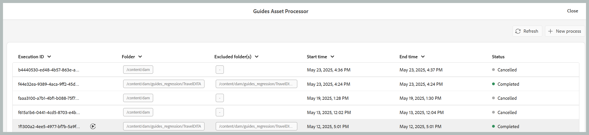

# Processing or reprocessing assets

In data-intensive workflows such as publishing, efficient asset management is crucial for maintaining performance and reliability. The process of processing or reprocessing assets is specifically designed to handle user-specific assets that require intensive data operations. This approach addresses two primary scenarios: when the initial processing of assets encounters errors, or when files were not processed at all due to the absence of a post-processing trigger. By enabling targeted, folder-level processing, users can isolate and process only the necessary assets, thereby avoiding the overhead of unnecessary computations. This selective approach significantly enhances performance, reducing the time required for critical operations like publishing and report generation. Overall, it contributes to greater efficiency and speed in handling complex data tasks.

## Processing the assets

Follow the below mentioned steps to process or reprocess the assets

1. Select the **Tools** icon on the left panel of the Experience Manager home page.
1. Select **Guides** from the list and then select the **Asset Processor** Tile.

    {width="550" align="left"}

1. The Guides Asset Processor window opens with the following details:

    **Execution ID**: It is the unique Id for each reprocessing task that you perform.

    **Folder**: Shows the folder selected for migration.

    **Excluded Folders**: Points to the folder that is excluded from migration.

    **Start time:** Shows the date and time the migration process is initiated.

    **End Time**: Shows the date and time the migration process ends.

    **Status**: Points to the status of migration as In progress, Completed or Cancelled.

    {width="550" align="left"}

1. To start the process, select the **New Process** tab on the top right corner of the window.

    {width="550" align="left"}

1. Select the folder you want to reprocess. You can also select the folders (within the parent selected folder) you want to exclude or ignore.

    >[!NOTE]
    >
    > Only one folder can be selected at a given time. For specific operations you   can exclude multiple folders.

1. Select **Create**. You get a pop-up showing Success and the Process triggered successfully as shown in the snippet. 
1. You can see the status of the migration process on the window. Additionally, you can restart the migration process by selecting the restart icon that appear on hovering in front of the Execution Id of the tasks you triggered.

    {width="550" align="left"}

1. You can also view the logs of the migration process of your folder by selecting the View logs icon that appears hovering in front of the Execution Id of the tasks you triggered.

    {width="550" align="left"}

