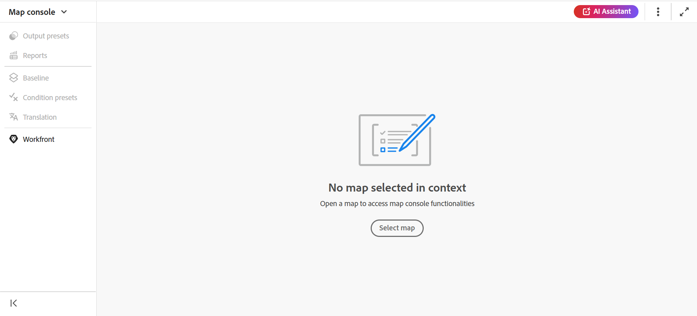

# Open files in Map console

Perform the following steps to open a DITA map file in Map console:

1. Open **Map console** from the home page. 

    {width="300"align="left"}
    
    Since no map file is selected, you are promted to select a map file to use the map management and publishing features.
    
    
2. Click **Select path**, and select a path where your DITA map file is located.

    The map file opens in the map console.

    {width="800"align="left"}
    
    
## Open map files from the Editor 
    
  
You can also open an existing map file in the Map console from the Editor. 

1. Navigate to and select the DITA map file in the Respository view. 

    The map file opens in the Map view. 

2. Select the **Open in map console** icon.

    The map file opens in the Map console. 

    {width="800" align="left"}

