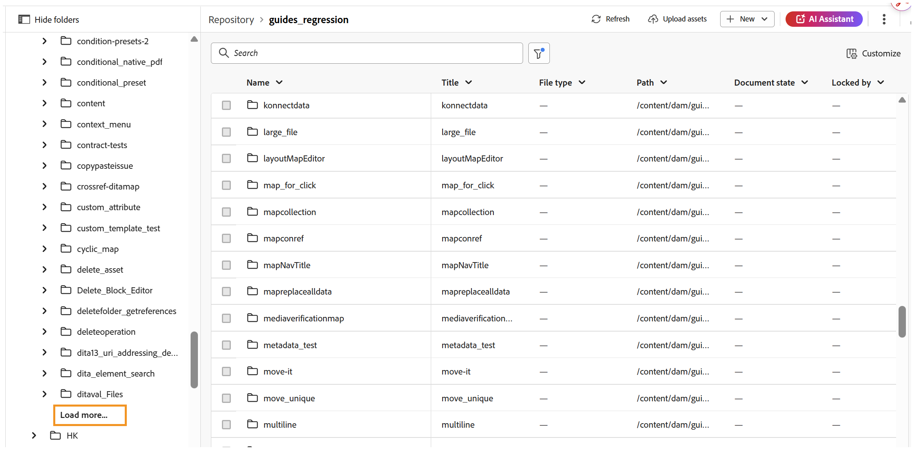
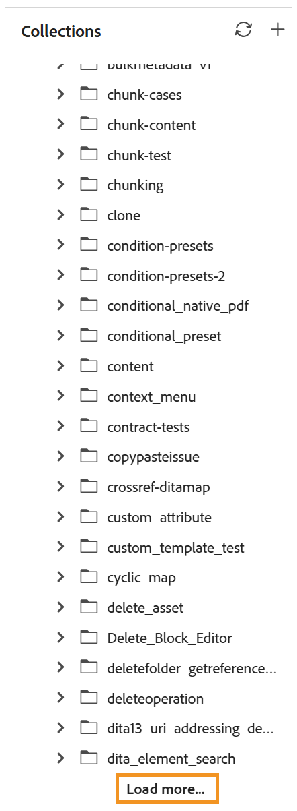
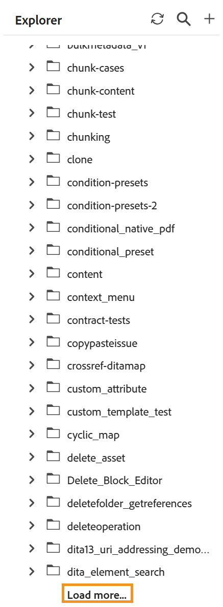
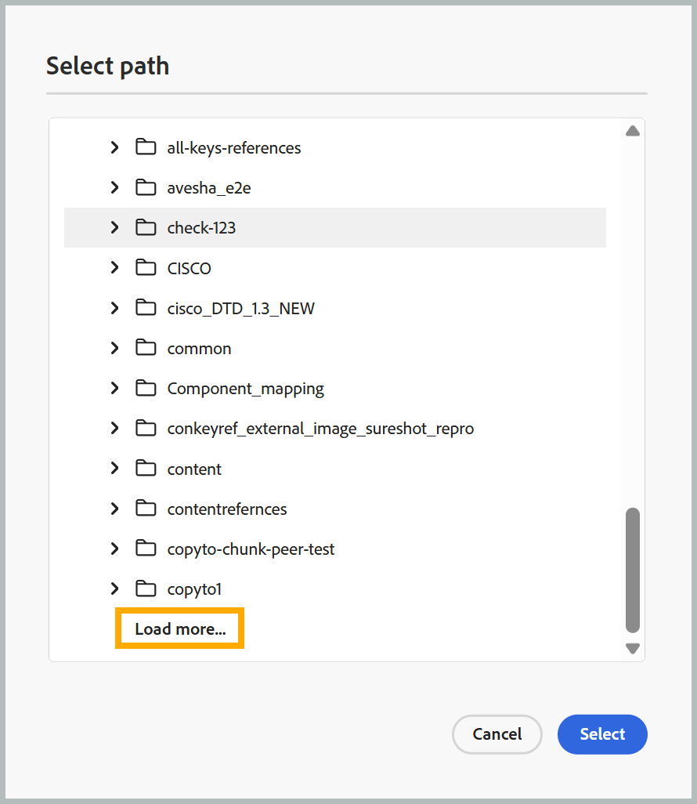

## Paginated loading of files and folders

>[!NOTE]
>
> This feature is enabled by default. To disable it, contact your Customer Success Team. 

Experience Manager Guides uses a paginated API for loading files and folders. Instead of loading all content at once, folders load progressively in batches of 50 assets, with additional assets retrieved automatically as you scroll or by selecting **Load more**. 

Sorting is performed server-side, so applying a sort order fetches freshly sorted results rather than reordering data already loaded in the browser. Common operations, such as rename, delete, add, and move, no longer reload an entire folder. Instead, they update only the affected item or refresh the first page of results. The *Always locate a file in Explorer* functionality is also no longer automatic. For any asset, you can still use the context menu to locate the file in Explorer.

The sections below describe how each of these applies for different interfaces, panels, and dialogs.

### Home Repository table

- **Browsing**: Uses infinite scrolling. The first 50 assets load initially, with additional assets appended as you scroll. Switching folders clears the current list and loads the assets from the newly selected folder.
- **Rename**: In-place; no folder refresh.
- **Delete**: The parent folder refreshes to show the first 50 assets.
- **Add or duplicate**: The new file is inserted at the top (name and path only). Additional details; document state, lock status, file type, creation date, and so on are fetched in a single batched background request and filled in automatically shortly after.
- **Move**: Moving a file into the active folder adds it at the top with no full refresh; moving a file out of the active folder refreshes the folder to its first 50 assets.
- **Refresh button**: Reloads the active folder, showing the first 50 assets.
- **Sorting**: Loads 50 assets per page. 
- **Folder navigation panel**: Each node loads its children in a batch of 50, with a **Load more** appended when more assets exist. 

  {width="650"}

### Collections

- Adding a file inserts it at the top of the folder without a full refresh.
- Opening a folder loads the first 50 assets, with a **Load more** option appended for subsequent batches of 50.

  {width="650"}

### Explorer

- **Parent folder**: Infinite scrolling. The first 50 assets load initially; more are appended automatically as you scroll.
- **Child folders**: Expanding a folder loads the first 50 assets. If more assets exist, a **Load more** option appears at the bottom; selecting it loads the next 50, and so on.

  {width="650"}

- **Rename**: Happens in-place. The folder is not refreshed.
- **Delete**: The parent folder (or root) refreshes to show the first 50 assets.
- **Add or duplicate**: The new file appears at the top of the folder. No full refresh occurs.
- **Move**: Moving between unrelated folders refreshes the source folder to its first 50 assets and adds the item at the top of the destination (loading the destination's first 50 assets if it wasn't already open).
- **Refresh**: A new refresh button in the Explorer panel header reloads the root level, showing the first 50 assets.

### Search panel

- Browsing search results now uses infinite scrolling, the first 50 assets load initially, with more appended as you scroll.

### Template panel 

- The root level shows only the **map** and **topic** categories, retrieved via a separate, non-paginated API. No infinite scrolling occurs at the root.
- Expanding a subfolder loads the first 50 assets, with a **Load more** option appended for additional batches.

### Select path dialog

- Each folder node loads its 50 sub folders, with a **Load more** appended when more assets exist.

  {width="650"}

- When the dialog opens and navigates to a specific target path, the tree auto-expands from root to target. Ancestor folders along the way load at a larger 500-item page size; the target folder loads at the standard 50-item size.
- If a page fails to load, a **Load more – Retry** row appears in its place.