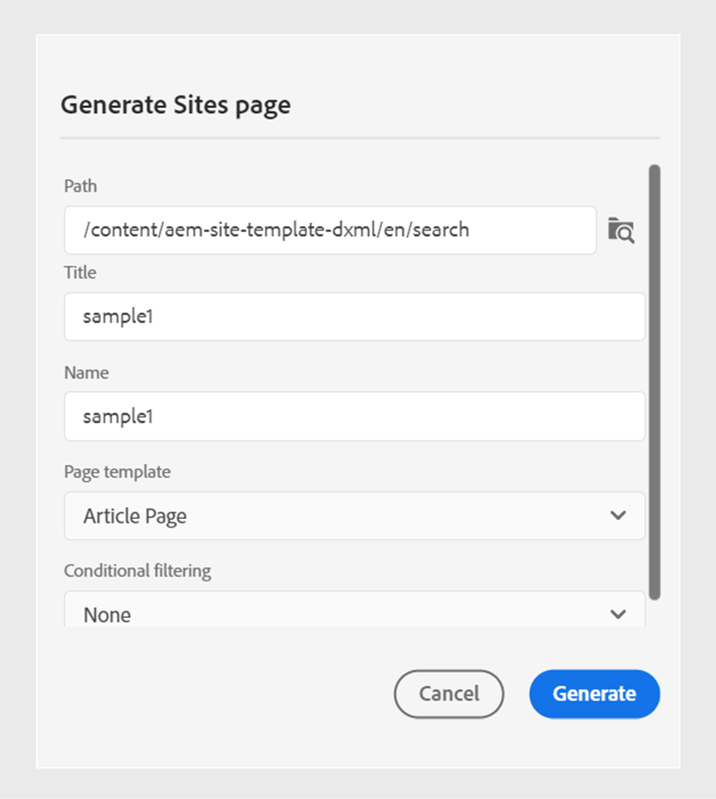

# Publish Experience Manager Sites pages

Experience Manager Sites page refers to DITA content published on the Adobe Experience Manager website. Experience Manager Guides allow you to publish an independent topic to an Experience Manager Sites page. This feature allows you to publish a topic and its elements without creating a DITA map and the output presets. You can easily update the topic, republish the Experience Manager Sites page, and reuse it across different web pages.

You can easily publish your marketing content, user manuals, compliance documents, and product specifications to dedicated and high-performance web pages.  Overall, this feature allows you to utilize the structured content creation capabilities of Experience Manager Guides while maintaining a consistent user experience on your Experience Manager website.

To generate an Experience Manager Sites page, perform the following steps:

       
1. Select **New Output**  from the **Outputs** section in the **File Properties** of a topic.
1. Select **Sites page**.  

   

    >[!NOTE]
    >
    > You can also publish an Experience Manager Sites page from the **Repository View**. Select the topic that you want to publish as an Experience Manager Sites page. Then, from the **Options** menu, select **Publish As** > **Sites page**.

1. In the **Generate Sites page** dialog box, fill in the following details:
        {width="500" align="left"}
        
    *Add the path, title, name, and mapping details to publish a topic or its elements as a Sites page. You can overwrite an existing Experience Manager Sites page.*  

    * **Path**: Browse and select the path of the folder where you want to publish the Experience Manager Sites page. You can also select an existing Experience Manager Sites page and republish it.
    * **Title**: Type the title of the Experience Manager Sites page. By default, the title is populated with the title of the topic. You can edit it. This title is used to generate the name of the Experience Manager Sites page.
    * **Name**: Type the name of the Experience Manager Sites page. By default, the name is populated with the title of the topic and the spaces are replaced with '_'. For example, *sample_sites_page*. You can edit it. This name is used to generate the URL for the Experience Manager Sites page.
    * **Template**: Select the Experience Manager Sites page template to create your Experience Manager Sites page. You can view the templates in the folder on the path you select. Your administrator can also upload custom templates. 

    * You can also select different conditions to publish the content.  Select one of the following options:

               
        * **None**: Select this option if you don’t want to apply any condition on the published output.
        * **Using DITAVAL**: Select the DITAVAL file to generate personalized content. You can select the DITAVAL file using the browse dialog or by typing the file path. 
        * **Using attributes**: You can define condition attributes in your DITA topics. Then, select the condition attribute to publish the relevant content.
        
        >[!NOTE] 
        > 
        >Conditions are enabled only if condition attributes are defined in the topic.
        
           

1. Click **Generate** to publish the Experience Manager Sites page.
1. You can view the Experience Manager Sites page for a topic under the **Outputs** section in the **File Properties**. The Experience Manager Sites pages appear according to the date and time of their publishing, with the latest as the first. 
 
    {width=300 align="left"}
       
     *View the Experience Manager Sites page present for a topic and republish them.*  

 

Once you’ve published the Sites page, you can also use them on any Adobe Experience Manager Site.

## Options menu for an Experience Manager Sites

You can also perform the following actions for an Experience Manager Sites from the **Options** menu:

* **Generate**: Republish the Experience Manager Sites page to update it with the latest content from the DITA topic. When you regenerate the output, you cannot change the path, name, title, and template of the Sites page. However, you can select different conditions while regenerating the output.

* **Duplicate**: Duplicate an Experience Manager Sites page. You can change the path, name, title, and the template. You can also select different conditions when you duplicate a Sites page.

* **Remove**: Remove an Experience Manager Sites page from the outputs list. A confirmation prompt appears. Once you confirm, the Experience Manager Sites page is removed from the **Outputs** list. But the Experience Manager Sites page is not deleted from the folder.

* **View**: View the Experience Manager Sites page editor. You can also make changes and save them.
