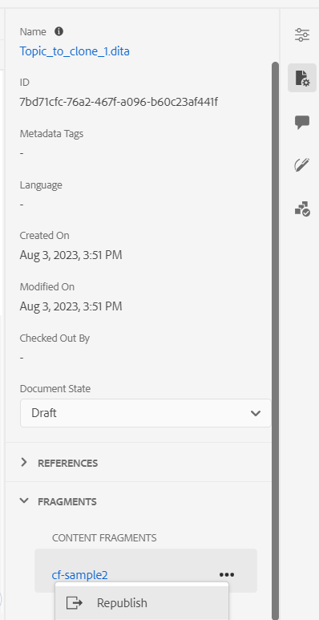

# Publish to a experience fragment

Experience fragments are pieces of modular content in Adobe Experience Manager. These content blocks are based on templates and encapsulate both content and its layout. These reusable pieces of content allow content creators to assemble and deliver consistent, scalable experiences across multiple channels that Experience Manager supports. This feature helps you easily create consistent marketing experiences efficiently, such as newsletters, promotion banners, and customer testimonials.  

Experience Manager Guides allow you to publish a topic or its elements to an experience fragment. You can create a JSON-based mapping between a topic and components in an experience fragment and use this mapping to publish a topic or its elements to an experience fragment. You can then use experience fragments in any Experience Manager site or extract the details via APIs supported by experience fragments.

To create a experience fragment, perform the following steps:

1. Create a folder where you want to save the experience fragments that you create based on the experience fragment templates. For example, "sales-experience-fragments". 
1. Edit the folder’s properties (for example, "sales-experience-fragments").
    * Add the path of the folder, which contains the experience fragment templates in the cloud configuration. 
For example, add `/conf/we-retail` in the cloud configuration. This configuration connects all the experience fragment templates with the folder.
    
    * To add the allowed template, specify the regular expression for retrieving the required templates in the **Allowed Templates** field. 
For example:
`/libs/cq/experience-fragments/components/experiencefragment/template`

    {width="650" align="left"}
       *Add the cloud configuration in the folder properties to connect it with the fragment templates.* 
1. Select the topic that you want to publish in the **Repository View**. 
1. From the **Options** menu, select **Publish As** > **Experience fragment**.  
1. In the **Generate Experience Fragment** dialog box, fill in the following details:
        {width="500" align="left"}
       *Add the path, model, and mapping details to publish a topic or its elements as a experience fragment. You can overwrite an existing experience fragment.*  

    * **Path**: Browse and select the path of the folder where you want to publish the experience fragment. You can also select an existing experience fragment and publish it.
    * **Title**: Enter the title of the experience fragment.
    * **Name**: Enter the name of the experience fragment.
    * **Template**: Select the experience fragment template that you want to use to create your experience fragment. The templates are picked from the folder which you have configured in the properties. 
    * **Mapping**: It picks the mapping from the *experienceFragmentMapping.json* file and displays it.  

      

        Based on your setup your administrator can add the mappings in the *experienceFragmentMapping.json* file. 
    
        

        
Cloud Services

     
         Learn more about how to [create a mapping between a topic and a experience fragment](../cs-install-guide/conf-experience-fragment-mapping-cs.md) in the  Cloud Services Installation and Configuration Guide. 
        

        

        
 On-premise  Software

        Learn more about how to [create a mapping between a topic and a experience fragment](../install-guide/conf-experience-fragment-mapping.md) in the On-premise Installation and Configuration Guide.

        

    * Select the **Overwrite existing content** checkbox if your experience fragment already exists and you wish to overwrite it. AEM Guides displays an error if you don’t select the checkbox and your experience fragment already exists. 
1. Click **Generate** to publish the experience fragment.
1. You can view the experience fragments for a topic under the **Outputs** section in the **File properties**.
 
    {width="300" align="left"}
       
     *View the experience fragments present for a topic and republish them.*  

You can also republish the experience fragment to update the experience fragment with the latest content from the DITA topic.

Once you’ve published the experience fragments, you can also use them in any AEM site.
