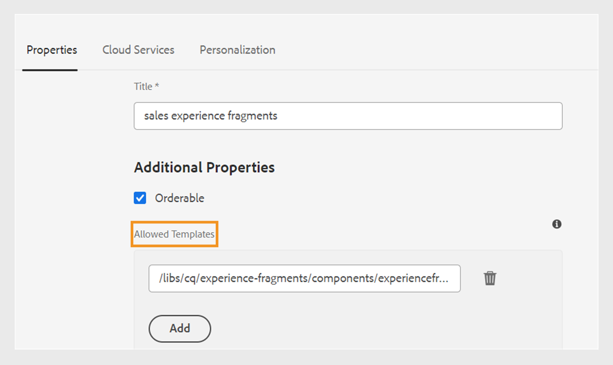

# Publish to an Experience Fragment

Experience Fragments are pieces of modular content in Adobe Experience Manager. These content blocks are based on templates and encapsulate both content and its layout. These reusable pieces of content allow content creators to assemble and deliver consistent, scalable experiences across multiple channels that Experience Manager supports. This feature helps you easily create consistent marketing experiences efficiently, such as newsletters, promotion banners, and customer testimonials.  

Experience Manager Guides allow you to publish a topic or its elements to an Experience Fragment. You can create a JSON-based mapping between a topic and components in an Experience Fragment. Then, use the mapping to publish a topic or its elements to an Experience Fragment. You can then use Experience Fragments in any Experience Manager site or extract the details via APIs supported by Experience Fragments.

To generate an Experience Fragment, perform the following steps:

1.  Create a folder in the Experience Fragments. Use this folder to save the Experience Fragments that you create based on the Experience Fragment templates. For example, *sales-experience-fragments*. 
1. Select the folder and then select the **Properties** icon from the top.
1. Edit the folder’s properties (for example, *sales-experience-fragments*).
   
    
    *  **Title**: View or edit the title of the folder.
    
    * **Allowed Templates**: Contains the list of templates that can be added as child pages of the experiencefragment. To add the allowed template, specify the regular expression for retrieving the required templates in the **Allowed Templates** field. 
    For example: 
    `/libs/cq/experience-fragments/components/experiencefragment/template`

        If you do not define an allowed template for a folder, the templates are picked from the parent folder or the templates folder by default. 
    * **Orderable**: Allows you to change the order of the assets inside a folder.
    {width="650" align="left"}
       *Add the cloud configuration in the folder properties to connect it with the fragment templates.* 
1. In the **Repository View**, select the topic that you want to publish as an Experience Fragment. . 
1. From the **Options** menu, select **Publish As** > **Experience Fragment**.  
1. In the **Generate Experience Fragment** dialog box, fill in the following details:
        {width="500" align="left"}
        
    *Add the path, template, and mapping details to publish a topic or its elements as an Experience Fragment. You can overwrite an existing Experience Fragment.*  

    * **Path**: Browse and select the path of the folder where you want to publish the Experience Fragment. You can also select an existing Experience Fragment and republish it.
    * **Title**: Tyoe the title of the Experience Fragment.
    * **Name**: Type the name of the Experience Fragment. By default, the name is created from the title, and the spaces are replaced with '_'. For example, *sample_expereince_fragment*. 
    * **Template**: Select the Experience Fragment template that you want to use to create your Experience Fragment. The templates are picked from the folder that you have configured in the properties. 
    * **Mapping**: It picks the mapping from the *experienceFragmentMapping.json* file and displays it.  

      

        Your administrator can add the mappings in the *experienceFragmentMapping.json* file.  Learn more about how to [create a mapping between a topic and an Experience Fragment](../cs-install-guide/conf-experience-fragment-mapping-cs.md) in the  Installation and Configuration Guide.

    * You can also select different conditions to publish the content.  Select one of the following options:

        * **None**: Select this option if you don’t want to apply any condition on the published output.
        * **DITAVAL**: Select DITAVAL file(s) to generate personalized content. You can select the DITAVAL file using the browse dialog or by typing the file path. 
        * **Condtion attributes**: You can define condition attributes in your DITA topics. Then, select the condition attribute in the condition preset to publish the relevant content.

        To know more about condition presets, view [Use condition presets](generate-output-use-condition-presets.md).
        
    * Select the **Overwrite existing content** checkbox if your Experience Fragment already exists and you wish to overwrite it. Experience Manager Guides displays an error if you don’t select the checkbox and your Experience Fragment already exists. 
1. Click **Generate** to publish the Experience Fragment.
1. You can view the Experience Fragments for a topic under the **Outputs** section in the **File properties**. The Experience Fragments appear according to the date and time of their publishing. 
 
    {width=300 align="left"}
       
     *View the Experience Fragments present for a topic and republish them.*  

 

Once you’ve published the Experience Fragments, you can also use them on any Adobe Experience Manager Site.

## Options menu for an Experience Fragment 

You can also perform the following actions for an Experience Fragment from the **Options** menu:

* **Generate**: Republish the Experience Fragment to update it with the latest content from the DITA topic. When you regenerate the output, you cannot change the path, name, title, and template of the Experience Fragment. However, you can select different conditions while regenerating the output.

* **Duplicate**: Duplicate an Experience Fragment. You can change the path, name, title, and the template. You can also select different conditions when you duplicate an Experience Fragment.

* **Remove**: Remove an Experience Fragment from the outputs list. A confirmation prompt appears. Once you confirm, the Experience Fragment is removed from the **Outputs** list. 

* **View**: View the Experience Fragment in an editor. You can also make changes and save them.

 
