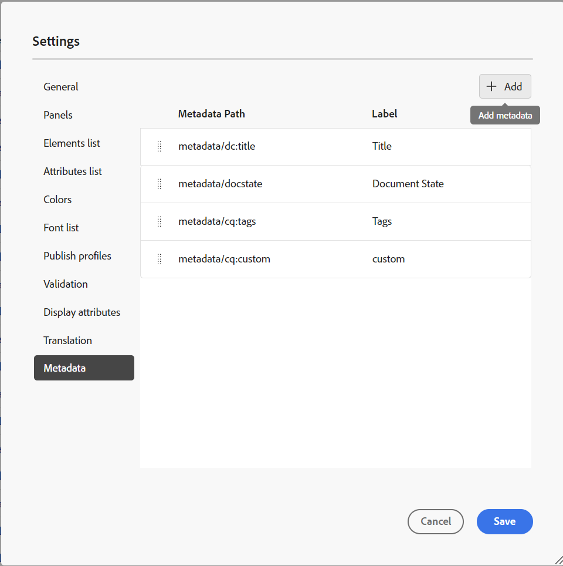

# DITA map report from the Map Console {#id231HF0Z0NXA}

Adobe Experience Manager Guides comes with a feature in the Map console that enables you to check the overall integrity of your map and generate reports for it.

You can view the topic list, manage the metadata of all references, view the multimedia list and fix all the broken links for the current map from the **Reports** tab in the Map Console which you can access as follows: 

1.  In the **Repository** panel, open the DITA map file in Map view.

    >[!NOTE]
    >
    > You can also open a DITA map directly in the **Map console** tab from the drop-down on the left top of the home page.
    
1.  Select the **Open in map console** icon.

    {width="600" align="left"}

1.  Select **Reports** from the left panel.

You can locate all the four reports from the **Reports** panel. Based on your requirement you can select any of the reports as shown here.

{width="800" align="left"}

The Reports panel provides access to four different types of reports. Each report, along with its accessibility and features, is discussed in detail below. 

## Topic List report 

The **Topic List** report provides detailed information about your topics, such as the reference type, document state, and author.

You can view the topic list report of a map by performing the following steps:

1.  Select **Topic List** from the Reports panel. The list of topics present in the DITA map is displayed.

    {width="800" align="left"}

1.  From the **Filters** panel you can filter your topics based on the **Reference type** \(direct or indirect\), **Document State** \(for example if your topics are in Edit, In-Review, or Reviewed state, these are listed\) or the **Author** of the topic.

    >[!NOTE]
    >
    > All the filters provide an exhaustive list of options present in the system.

1.  You can also use the following topic filtering options to choose to display the following columns in the list:

    -   **Title** The title of the topic is specified in the DITA map. You can select the topic to edit it.
    -   **File Name** Name of the file.
    -   **UUID** The universally unique identifier \(UUID\) of the file.
    -   **File Location** The complete path of the topic.
    -   **Reference Type** The type of reference – direct or indirect.
    -   **Document State** The state of the topic.
    -   **Author** The user who worked last on the topic.
    -   **Parent Map** The list of all maps where the topic is directly referenced.
    >[!NOTE]
    >
    > Select **Refresh** to get a fresh list of topics and view any change in your map file or if any reference within your topic file is updated.

1.  Select **Download** to download the snapshot of all the topics in the DITA map. The excel sheet contains the selected columns and the topics filtered in the **Topic List** view. You can then open this topic list excel file in MS Excel.

## Metadata report

The **Metadata report** provides a detailed report of your references in the current DITA map such as the reference type, document state, tags, file location etc. 

You can view the metadata report of a map by performing the following steps:

1.  Select **Metadata** from the Reports panel. The list of all references of a map is displayed along with it's metadata such as tags, document state, custom metadata. This includes the media references also. To add a new custom metadata column, refer to [Add custom metadata fields](#add-custom-metadata-columns) section.   

    {width="800" align="left"}    
    

1.  From the **Filters** panel you can filter your topics based on the **Document State** \(for example if your topics are in Edit, In-Review, or Reviewed state, these are listed\), **References** \(direct or indirect\), **File Type** \(Map, Topic, Document, Image, Video and Others\) of the reference.

    >[!NOTE]
    >
    > All the filters provide an exhaustive list of options present in the system.

1.  You can also choose to view only the **Files with no tags** or also choose specific tags from the **Tags** filter to view the files associated with them.
1.  You can also use the following topic filtering options to choose to display the following columns in the metadata list:
    -   **Title** \(selected by default\) The title of the referenced file is specified in the DITA map. You can select the file to edit it.

        >[!NOTE]
        >
        > A checked-out icon also appears near the title of a checked-out file. You can hover over the icon to view the name of the user.

    -   **File Name** The name of the file.
    -   **File Location** The complete path of the file.
    -   **UUID** The universally unique identifier \(UUID\) of the file.
    -   **Tags** \(selected by default\) Tags applied on the file.

        >[!NOTE]
        >
        > By default, you can view two tags for a file. To view more tags, select **Show More**. Select **Show Less** to contract the list again.

    -   **Document State** \(selected by default\) The current state of the reference file.
    -   **Reference Type** The type of reference – direct or indirect
    -   **File Type** \(selected by default\) Type of the source file. The available options are Map, Topic, and Image.
    -   **Locked by** The user who has locked the file.              

1.  Select **Download** to download the snapshot of all the references in the DITA map. The excel sheet contains the selected columns and the references filtered in the **Metadata** view. You can then open this metadata excel file in MS Excel.

### Manage metadata in bulk from the Metadata report

You can apply tags on an individual topic or use the bulk tagging feature to apply multiple tags on multiple topics, a DITA map, or on a sub-map. You can also change the document state of all selected topics to the next possible common document state.

### Update metadata

To update metadata, perform the following steps:

1.  To update metadata, select the files for which you want to update. You can select the files that are appearing in the Metadata panel, by checking in the check box appearing adjacent to **Title**. If you want to select all the records, use the **Select all** tab above the Title bar as shown below.

    >[!NOTE]
    >
    > You cannot select any checked-out files. A checked-out icon also appears near the title of a checked-out file. You can hover over the icon to view the name of the user.

    {width="800" align="left"}
        

1.  Select **Manage** from the top.

    {width="350" align="left"}

1.  If you want to add any new tags, select new tags from the dropdown list to apply them to all selected topics. You can also delete any tag by selecting the cross icon near the tag.

    >[!NOTE]
    >
    > The common tags applied on all the selected topics are listed.

1.  Select a new document state if you want to change the document state of all the selected references. The drop-down displays the common possible state for all selected topics. For example, if the current state of your topics is In-Review, then you can view Draft, Approved, or Reviewed state.
1.  Select **Update** to update the metadata. A confirmation message is displayed for the metadata whether it is updated successfully or has any failed updates. You also select **Download Report** to download the snapshot of the report. This CSV contains the details of the updated status for the selected references.

### Add custom metadata columns

This feature enables you to add custom metadata columns as per requirement, which are then displayed in the metadata reports. It also provides enhanced flexibility in metadata reporting. To add new custom metadata column perform the following steps:

1.  To add a custom metadata column, select **Settings** from the three dots on the top-right corner of the metadata page.

    {width="600" align="left"}

1.  Select **Metadata** on the left panel of the pop-up that appears.
1.  Add a new custom metadata field as per the requirement using the **Add** tab.

    {width="600" align="left"}

1.  Specify a specific metadata path and an appropriate title for the same which you want to add in the columns of metadata report. For example a custom metadata with the title language and a specific path is added. 

    >[!NOTE]
    >
    > If you want to remove a particular metadata column, you can delete it from the list displayed. Additionally, you can edit the **Label** to alter the display title of column.

    {width="600" align="left"}

    

1.  Select **Save** and **Refresh** the Metadata view. A new custom column **Language** is added in the list of Columns in the Filter panel.

    >[!NOTE]
    >
    > Adding a new metadata column also gets reflected in the **Version History** panel in the Editor. For more information, view **[Metadata](web-editor-features.md)**.

    {width="600" align="left"}

  
  Similarly, you can follow the aforementioned steps to add any new custom metadata fields based on your requirement that are needed in the metadata reports.
    
      
 
## Multimedia report 

The **Multimedia** report provides detailed information about the multimedia used in your map, such as the title, type \(audio, video, and images\), files in which multimedia is used, and the reference type of the files, in which they have been used. You can also view the UUID and the location of the multimedia within the repository. You can view a report of the multimedia by performing the following steps:

1.  Select **Multimedia** from the Report panel. The list of multimedia present in the DITA map is displayed.
1.  From the **Filters** panel you can order the list by multimedia or by the names of used in references.

    -   When you order by **Multimedia**, the name of the multimedia is displayed in the first column and then the names of all references in which they have been used, are displayed in another column on the same row. For example, the following screenshot shows the multimedia testSong.mp3 in the first column and two references in which it is used, are displayed in the third column on the same row.

        {width="650" align="left"}

    -   If you order by **Used In** column, you will view the transposed view wherein the names of the references in which multimedia have been used are listed in the first column while the multimedia names are listed in another column on separate rows. For example, the following screenshot shows the names of two references \(testing_indirect and Video content Topic\) in the first column and the multimedia testSong.mp3 is displayed in the third column on two separate rows.

        {width="650" align="left"}

1.  You can filter your multimedia based on the **Multimedia Type**, and **Reference Type**. The list of multimedia files is displayed based on your selection in the drop-down. For example, you can choose to display only the audio references in your DITA map, and a file shows only the audio references used in it.
    
1.  You can also use the following filtering options to choose to display the following columns in the list:

    -   **Multimedia** \(selected by default\) The title of the multimedia is specified in the DITA map. You can select the multimedia to edit it.
    -   **Multimedia Location** The complete path of the multimedia.
    -   **Multimedia UUID** The universally unique identifier \(UUID\) of the file.
    -   **Multimedia Type** \(selected by default\) Type of the multimedia. The available options are Audio, Video, or Image.
    -   **Used In** \(selected by default\) The references in which the multimedia has been used. You can select the reference to edit it.
    -   **Reference Type** \(selected by default\) The type of reference - direct or indirect.
    >[!NOTE]
    >
    > Select **Refresh** to get a fresh list of multimedia and view any change in your map file or if any multimedia within your DITA map is updated.

1. Select **Download** to download the snapshot of the all multimedia in the DITA map. The excel sheet contains the selected columns and the multimedia filtered in the **Multimedia** view. You can then open this multimedia excel sheet in MS Excel.    

## View and fix the broken links

The **Broken Links** is a useful report which provides you with the details of the broken links present in your current map. You can view the broken links, which can be for DITA topics, multimedia file references, content key references, and so on. You also have the ability to fix them here itself.
The report provides detailed information such as the broken link, link type, files in which reference is used, and the type of files they have been used in. 
You can view the report for broken links by performing the following steps:

1. Select **Broken Links** from the Reports panel. The list of broken links or references present in the DITA map is displayed.
1. From the **Filters** panel you can order the list by links or by the names of used in references.

    – When you order by **Broken Link**, the paths of the broken links are displayed in the first column and then the names of all references in which they have been used, are displayed in another column on separate rows. If the same broken link is used in multiple files, then they are displayed on one row and are shown as grouped or sub-rows. For example, the following screenshot shows two broken links in the first column and the reference in which they are used, `m_ElectricalSpecs_900.ditamap` is displayed in the third column on two separate rows.

    {width="800" align="left"}
     
    – If you order by **Used In** column, you will view the transposed view wherein the names of the references in which the broken links have been used are listed in the first column while the broken links are listed in another column on the same row. For example, the following screenshot shows the reference (in which the broken link is used) `m_ElectricalSpecs_900.ditamap` in the first column and the broken links are displayed in the third column on the same row.

    {width="800" align="left"}

1. You can filter your broken links based on the **File Type** and **Link Type**. The list of broken links is displayed based on your selection in the drop-down. For example, you can choose to display only the content references in your DITA map, and a file shows only the broken content references used in it.

    DITA Topic, DITA Map, File reference, Key reference, Content Reference, Content Key Reference, Image Reference, Multimedia File Reference, and Multimedia Key Reference are available values for **Link Type** drop-down, and DITA Topic, DITA Map, Document,Image, Video, Audio, and Others are available values for **File Type** dropdown.
1. You can also use the following filtering options to choose to display the following columns in the list:

    – **Broken Link** (selected by default) The path of the broken link is specified in the DITA map. 

    – **Link Type** (selected by default) The type of the links. The available options are DITA Topic, DITA Map, File reference, Key reference, Content Reference, Content Key Reference, Image Reference, Multimedia File Reference, and Multimedia Key Reference.

    – **Used In** (selected by default) The references in which the broken link has been used. You can select the reference to view it in author mode.

    – **File Type** (selected by default) The type of reference – DITA Topic, DITA Map, Document,Image, Video, Audio, and Others.
    
    Select **Refresh** to get a fresh list of broken links and view any change in your map file or if any broken link within your DITA map is updated.
1. You can select on the **Fix link** icon () to fix the broken link. 

    >[!NOTE] 
    >
    > Hover over the broken link path under the Broken Link column to view the Fix link ()  icon.

    You can fix a link in both views- when you have ordered by **Broken Links** or by **Used In**.

    >[!NOTE]
    >
    > When you fix a broken link while you have ordered by Broken Links, the link will be fixed in all the files where it is used (which are grouped in a single row).

1. You need to update the required reference details in the **Update Link** dialog. The details required in **Update Link** dialog would depend on the type of reference.     
Once you fix a link, it is not displayed under the list of broken links. Instead, you can view it under the Topic List or Metadata. 

1. Select **Download** to download the snapshot of all the broken links in the DITA map. The excel file contains the selected columns and the broken links filtered in the Broken Links view. You can then open and view this excel file in any MS Excel.

**Parent topic:**[Reports](reports-intro.md)
