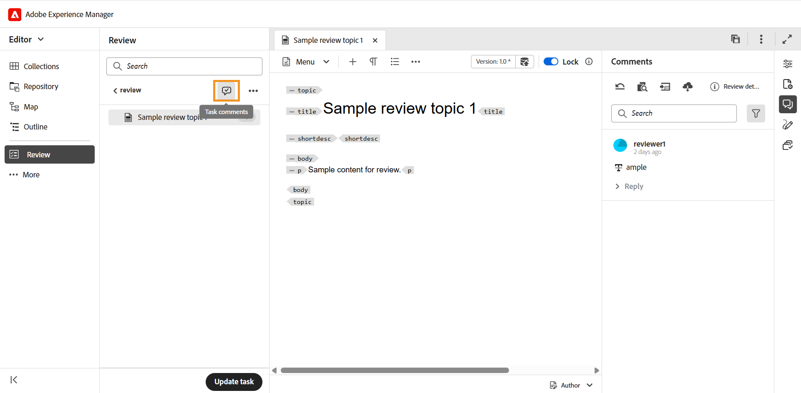

# Close a review task or request a re-review as an Author

>[!IMPORTANT]
>
> The features explained in this article are available only if they have been configured by your Administrator at the backend. Contact your Administrator for details. 

When a review task is marked as completed by a Reviewer, a notification is triggered to the task initiator, enabling them to access and review the task and related task level comments. 

As the initiator of the review task, you can then decide how to proceed based on the feedback. The available options are:

- Close the review task
- Request a re-review

## Close a review task or request a re-review 

 Perform the following steps to close a review task or request a re-review:

1. Open the Review task in the Editor. 
2. In the Review panel, select the review task from the **Active tasks** list.
    
    >[!NOTE]
    >
    > You can also open the task in the task dashboard for a more comprehensive view. To do this, select **Open in task dashboard** from the Options menu of any active review task. This opens the task details in the Assets UI.

    
3. Select the **Task comments** panel to access and review the task level comments added by the Reviewer.

    .

    The **Task comments** dialog is displayed on the right. 

    .
3. Select **Update task** to take further action on the selected review task.     
4. In the **Update task** dialog, choose one of the following actions:
    - **Close review**: Closes the review task. A notification is sent to all users involved in the review task indicating its closure.
    - **Reqest a re-review**: Initiates another round of review. You can select a different version of the topic for review. The Reviewer who completed the previous review will receive a notification to provide feedback on the updated version. Other Reviewers are notified about the topic update but are not required to take action.
    .
5. Select **Confirm**.

