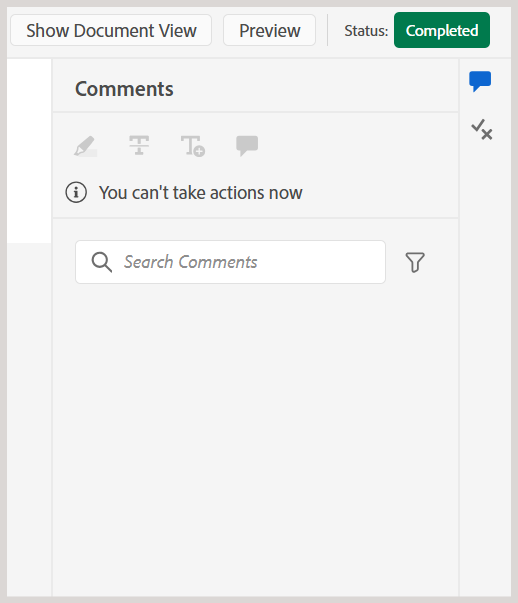
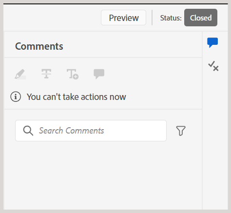
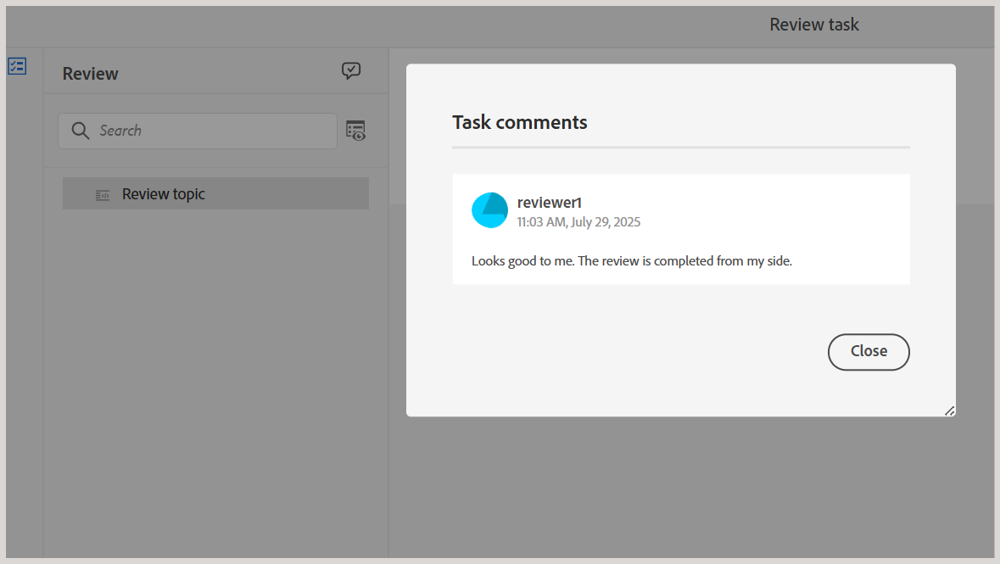

# Complete the review task as a Reviewer

>[!IMPORTANT]
>
> The new features described in this article are enabled by default with 2508 release of Experience Manager Guides as a Cloud Services. Reviews that were created before the migration are not impacted and will continue to use the earlier workflow. If you prefer to continue using the existing features without these updates, contact your Customer Success team to have the new features disabled. 

As a Reviewer, you can mark a review task as complete once you have reviewed all the content and want to notify the Author. You can also leave any final comments at this stage.

Perform the following steps to complete a review task:

1. Open the review task assigned to you.
2. Select **Mark as done** from the top as shown below: 

    {width="350" align="left"}

    The **Complete task** dialog is displayed.
3. In the **Complete task** dialog, add final comments for the Author and select **Complete**. 

    >[!NOTE]
    >
    > The task-level comments serve as a summary or final comments, and are distinct from the text-level comments added during the topic review. In this dialog, you may either outline follow-up actions such as requesting the Author to address specific comments and resend the task for review or indicate that the review is complete.  

    For example, as a Reviewer, you may add a comment as a follow-up action for the Author:

    {width="350" align="left"}

    Or, add a comment to indicate the completion of the task as shown below:    

    {width="350" align="left"}
    

You have successfully marked the task as completed, and its status is now set to **Completed**. No further actions are allowed once the task is marked as completed. A notification is sent to the Author or initiator of the review task to draw their immediate attention. For more details on how review notifications trigger, view [Understanding review notifications](./review-understanding-review-notifications.md).

{width="350" align="left"}

Based on the feedback, if the Author or initiator of the task decides to [close the review task](./review-close-review-task.md), the task status on the Review UI is changed to **Closed**. 

{width="350" align="left"}

## View task-level comments

All task-level comments are displayed in the **Tasks comments** dialog, which is available in the read-only mode. When you complete a review task with a final comment, your input is recorded in this dialog for future reference.

To access task-level comments from the Review UI, navigate to the left panel and select the **Task comments** icon. 

{width="350" align="left"}

The **Task comments** dialog is displayed on the right. 

{width="350" align="left"}

The comments within the dialog are displayed in chronological order, with the recent comments appearing first and the oldest comments appearing last. This order helps you follow the conversation as it progressed over time.

The **Task comments** dialog is accessible to all the users involved in the review task, including the Author or initiator of the review task and other Reviewers. Hence, the comments from other Reviewers (if involved) might also appear in the Task comments dialog. This helps ensure clear and traceable communication throughout the review process. 

After reviewing the task-level feedback, the Author can either request a re-review or close the review task. In both cases, all comments captured during the review process remain available in the **Task comments** dialog for reference.
