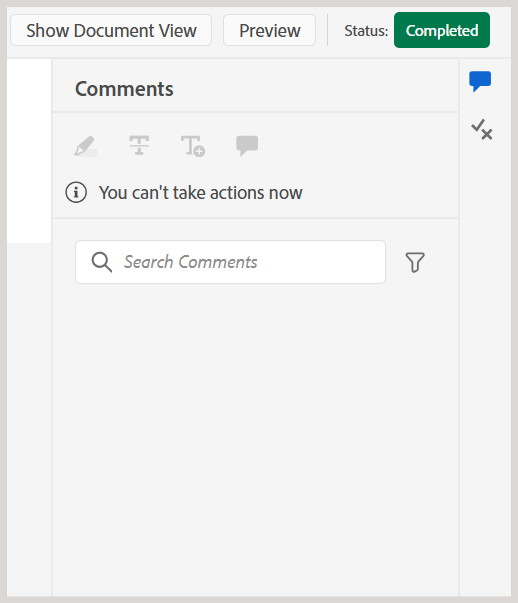
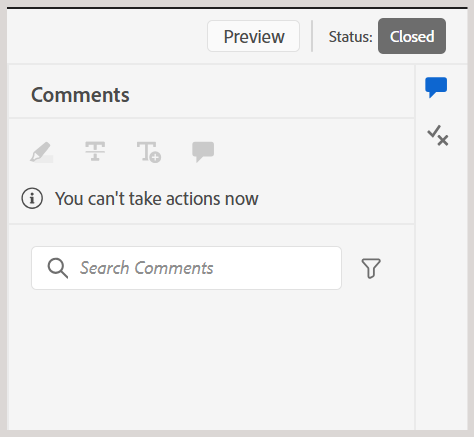
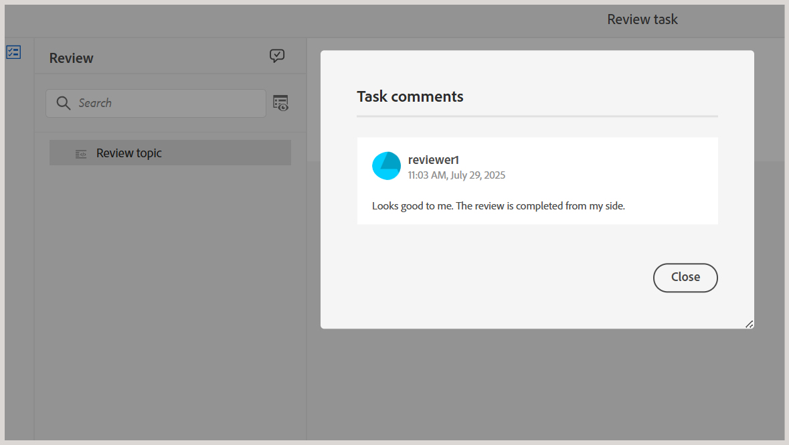

# Complete the review task as a Reviewer

As a Reviewer, you can mark a review task as complete once you have reviewed all the content and want to notify the Author. You can also leave any final comments at this stage.

Perform the following steps to complete a review task:

1. Open the review task assigned to you.
2. Select **Mark as done** from the top as shown below: 

    {width="350"}

    The **Complete task** dialog is displayed.
3. In the **Complete task** dialog, add final comments for the Author and select **Complete**. 

    >[!NOTE]
    >
    > The task-level comments serve as a summary or final comments, and are distinct from the text-level comments added during the topic review. In this dialog, you may either outline follow-up actions such as requesting the Author to address specific comments and resend the task for review or indicate that the review is complete.  

    For example, as a Reviewer, you may add a comment as a follow-up action for the Author:

    {width="350"}

    Or, add a comment to indicate the completion of the task as shown below:    

    {width="350"}
    

You have successfully marked the task as completed, and its status is now set to **Completed**. No further actions are allowed once the task is marked as completed. A notification is sent to the Author or initiator of the review task to draw their immediate attention. For more details on how review notifications trigger, view [Understanding review notifications](./review-understanding-review-notifications.md).

{width="350"}

Based on the feedback, if the Author or initiator of the task decides to [close the review task](./review-close-review-task.md), the task status on the Review UI is changed to **Closed**. 

{width="350"}

>[!NOTE]
>
>By default, when a reviewer marks a review task as **Complete**, the task remains in the reviewer's AEM Inbox until the author or task initiator reviews the feedback and closes the review task.
>
>However, you can choose to enable task synchronization between the Review UI and the AEM Inbox. When this feature is enabled, marking a review task as **Complete** in the Review UI automatically completes the corresponding task and removes it from the reviewer's AEM Inbox. Similarly, completing a task from the AEM Inbox automatically marks it as complete in the Review UI.
>
>The author or task initiator can still review the feedback and reassign the task if additional review is required. When a task is reassigned, a new AEM Inbox notification is generated for the reviewer, allowing the task to be reviewed again.
>
>To enable this feature in your environment, contact your Customer Success team.

## View task-level comments

All task-level comments are displayed in the **Tasks comments** dialog, which is available in the read-only mode. When you complete a review task with a final comment, your input is recorded in this dialog for future reference.

To access task-level comments from the Review UI, navigate to the left panel and select the **Task comments** icon. 

{width="350"}

The **Task comments** dialog is displayed on the right. 

{width="350"}

The comments within the dialog are displayed in chronological order, with the recent comments appearing first and the oldest comments appearing last. This order helps you follow the conversation as it progressed over time.

The **Task comments** dialog is accessible to all the users involved in the review task, including the Author or initiator of the review task and other Reviewers. Hence, the comments from other Reviewers (if involved) might also appear in the Task comments dialog. This helps ensure clear and traceable communication throughout the review process. 

After reviewing the task-level feedback, the Author can either request a re-review or close the review task. In both cases, all comments captured during the review process remain available in the **Task comments** dialog for reference.

## Delegate a review task to another Reviewer

>[!IMPORTANT]
>
> This feature is enabled by default. If you prefer not to use this feature in your environment, contact your Customer Success team. 

As a Reviewer, you may sometimes want another user to weigh in on a review before it goes back to the Author. For example, if part of the content falls outside your expertise, or you'd like a second opinion before marking the task as **Complete**. Instead of routing this through a project administrator, you can recommend a reviewer directly from the review task using the **Delegate** option.

Selecting **Delegate** does not complete the review task on your behalf. It sends your recommendation to the Author (initiator of the task), who decides whether to add the recommended reviewer to the task.

Perform the following steps to delegate a review task:

1. Open the review task assigned to you.
2. Once you've reviewed the content, select **Delegate**, next to **Mark as done**.

   {width="350"}

3. The **Recommend Reviewer** dialog is displayed. Select a user from the drop-down list to recommend as a reviewer for this task.

   {width="350"}

4. *(Optional)* Add a comment for the Author, for context.
5. Select **Delegate**.

A notification is sent to the Author, indicating that you've requested to add a Reviewer to the task. For details on how the Author responds to this request, view [Request a re-review or close a review task as an Author](./review-close-review-task.md).

