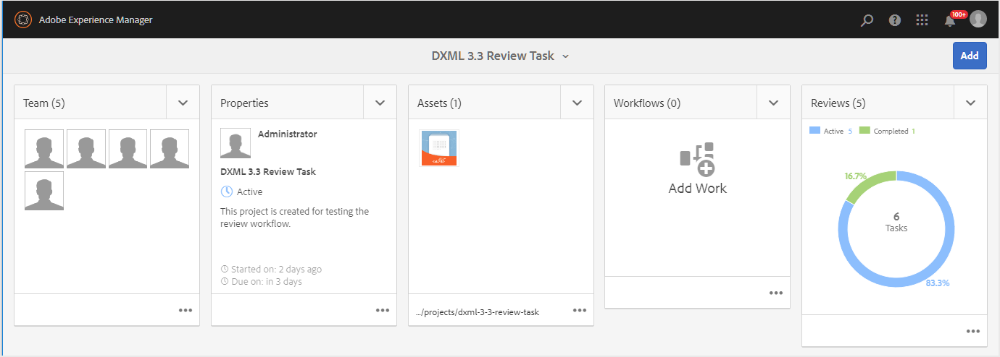
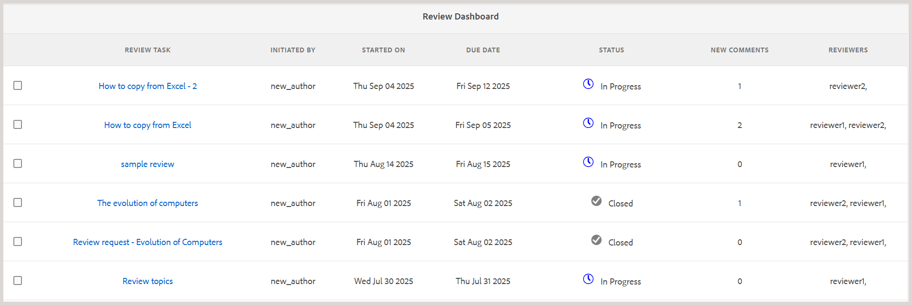
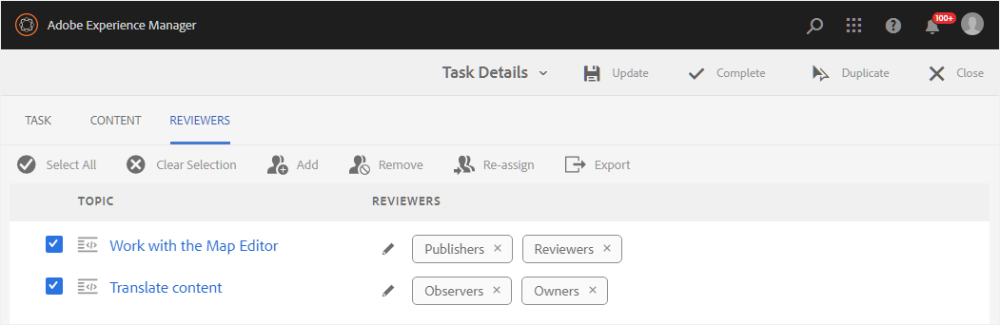

# Manage review tasks using the Review Dashboard {#id2056B0Y70X4}

Review management workflow can include a variety of tasks. For example, you may want to add reviewers for a particular topic or extend the deadline for a review. You might also want to mark the review task as complete if you think that all the stakeholders have given their feedback. These tasks can be managed using the Review Dashboard.

Perform the following steps to access and use the Review Dashboard:

>[!NOTE]
>
> You can manage review tasks for only those projects for which you are the Author \(or initiator\). Even if you are a Reviewer or Publisher \(user\), you will not have access on any of the project tasks.

1.  In the **Projects** console, select the review project you want to manage.

    A Project panel with task tiles is displayed.

    {align="left"}

    >[!NOTE]
    >
    > Alternatively, you can directly access the project dashboard from the left panel of Editor. Open the [Review panel](./web-editor-left-panel.md#review) and use the **Open the project dashboard** icon placed against each review project listed in the Review panel. 

1.  Select the three dots in the **Reviews** tile.

    The Review Dashboard is displayed. The dashboard lists all review tasks that you have created.

    {align="left"}

    The Review Dashboard displays the details about the review task such as the task name, who started the review, date when the review was started, due date, status, number of new comments that have not been accepted or rejected by the author, and name of reviewers. The tasks are listed in the order of newly created tasks to older tasks. 
    
    In the Review dashboard, the **Status** field can show one of the following values: 
    - **In Progress**: This indicates that the review is still on-going. 
    - **Closed**: This indicates that the review task has been completed.  

    >[!NOTE]
    >
    > If you select the Review Task link, the topic or map file sent for review is opened.

1.  Select a review task.

    You are shown Edit Properties and [Status](#check-review-status-id199RF0A0UHS) options in the toolbar.

1.  If you select **Edit Properties**, the Task Details page is displayed.

    There are three tabs on the Task Details page– Task, Content, and Reviewers. The following sections explain the various functions available under each tab.

## Task tab 

{align="left"}

You can perform the following actions under the **Task** tab:

-   Modify the title of the task in the **Title** field.
-   Add default assignees in the **Assign To** drop-down list. The reviewers you add from here are given access to review all topics that are a part of this review task. You can choose to remove or selectively add more reviewers to specific topics from the [Reviewers tab](#Reviewer-tab-id199RF0N0MUI).
-   Update the description of the task in the **Description** field.
-   Modify the **Due Date**. You can prepone or postpone the deadline for the completion of the task.
-   Select the option to restrict users to review only those topics that are assigned to them.
-   Select **Update** to update the modified details. 

    A toast message is displayed to confirm if the update is successful or not.
-   Select **Complete** to mark the review task as complete before the due date. When an individual topic's task is marked as Complete, the review of the selected topic is closed. However, in case of topics shared for review through a DITA map, marking the DITA map task as Complete will close the review of all topics within the map that were shared for review.
-   Select **Duplicate** to create a copy of the review task. The process of creating a duplicate review task is similar to creating a new review task. Once you launch the duplicate task workflow, you are shown the Create Review Task page. You need to provide the new task details as explained in [Send topics for review](review-send-topics-for-review.md#).

    If you have selected a review task created out of a DITA map, then you are shown the topics that are a pert of the map. You can then choose the topics that you want to include in the new review task.

    In case of review task duplicated from one or multiple topics review, then only those topics are shown in the review task list. You can choose to share these topics for review with a different set of Reviewers.

-   Select **Close** to go to the Inbox page.

## Content tab 

{align="left"}

You can perform the following actions under the **Content** tab:

-   Change the version of the topic sent for review. You can choose the latest version of the topic, version as on date, version with specific label, or version with a specific baseline \(for a DITA map\).

-   Select **Update** to share the updated version of the topic with the reviewers. The reviewers get an email notification stating that the newer version of topic has been sent for review. The next time a Reviewer opens the topic, they view the updated version of the topic.

    >[!NOTE]
    >
    > In case of an updated version of a topic, the old comments are retained in the newer version as well. Reviewers can also view the differences between the two versions.

-   Select **Complete** to mark the review task as complete before the due date. When an individual topic's task is marked as Complete, the review of the selected topic is closed. However, in case of topics shared for review through a DITA map, marking the DITA map task as Complete will close the review of all topics within the map that were shared for review.

-   Select **Duplicate** to create a new review task using the current task as the base.

## Reviewers tab {#Reviewer-tab-id199RF0N0MUI}

{align="left"}

You can perform the following actions under the **Reviewers** tab:

-   **Select All**: Selects all topics in the topic list. You can easily perform a batch operation after selecting all topics.
-   **Clear Selection**: Deselects the topics selected in the topics list.

    >[!NOTE]
    >
    > You can also individually select or deselect a topic by selecting on the checkbox next to the topic.

-   **Add**: Displays the Add Reviewers dialog. You can type the name of a Reviewer or user role \(or group\) that you want to add as a Reviewer to the selected topics.
-   **Remove**: Displays the Remove Reviewers dialog. You can type the name of a Reviewer or user role \(or group\) that you want to remove as Reviewer from the selected topics.
-   **Re-Assign**: Displays the Re-Assign Reviewers dialog. You can type the name of a Reviewer or user role \(or group\) that you want to assign the review task to. This removes all existing reviewers from the selected topics and assigns the newly selected reviewers to those topics.
-   **Export**: Allows you to export the review task details in a CSV file. The file contains details such as the path and title of the topic, name of Reviewer, and version of topics sent for review.
-   **Edit Reviewers**: Selecting the icon in the topic list displays the Edit Reviewers dialog. You can add or remove reviewers for the selected topic from this dialog.

## Check the status of a review task {#check-review-status-id199RF0A0UHS}

In Experience Manager Guides, each review task has a status that reflects its current status. From the Review Dashboard, you can access this information by selecting a task and choosing the **Status** option.

{width="650" align="left"}

This opens a status report of the review task as shown below:

{width="650" align="left"}

Alternatively, you can access the status report directly from the [Review panel](./web-editor-left-panel.md#review) in the Editor. Open an active review task from the Review panel, select **Update task** and choose **Check review status**. 

The status report for the review task contains the following details:

-   Name\(s\) of the Reviewer to whom the review task is assigned.
-   The Status column indicates the review status. The Status could be one of the following:
    -   **Not Started**: The Reviewer has not yet opened the review task.
    -   **In Progress**: The Reviewer has opened the review task and is in the process of reviewing the topic.
    -   **Complete**: The Reviewer has completed the review and marked the task as complete in the Review UI. The review task is in the AEM notification Inbox for each Reviewer.
-   When a Reviewer opens a review link and navigates to a particular topic that topic is added to the Topics Reviewed list. This helps authors to determine if the reviewers had opened their respective sections or not. If any comments are given, those are shown in brackets.
-   Total number of comments made on all topics. In case of multiple topics under review, the number of comments for each topic is mentioned \(in brackets\) against the topic name.
-   The date when any topic was last accessed by the Reviewer.

**Parent topic:**[Introduction to review](review.md)
