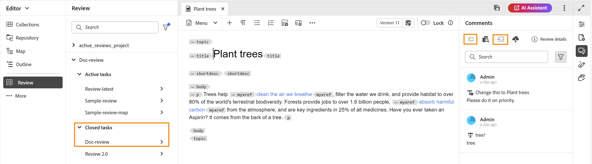

# View a completed review task

You can complete review tasks for those projects for which you are the Author (or initiator). Once a review task is complete, you and all reviewers can access it in read-only mode.

## As a reviewer

As a reviewer, you can see an indicator in the comments panel to show that the review has ended. The comments toolbar is not displayed, so you cannot highlight, strikethrough, insert text, or add comments. You can read a comment but cannot edit or delete any comments. You also cannot add a reply to the comments. You cannot see the contextual toolbar (used to highlight or strikethrough any text). The outdated comments icon is also not displayed in a completed review task.

However, you can search or filter any comments. You can also choose to show or hide conditions and display conditionalized content accordingly. You can download any attachments but cannot upload or delete any attachments for the comments.

{width="800" align="left"}

 
## As an author

You can view the completed review tasks in the **Review** panel under the drop down of the project in the **Closed tasks** as shown in the screenshot. You can search or filter review tasks based on Projects. For example, you can select specific projects in the **Filter** dialog box and have them displayed in the Active review panel. You can further filter the results using the **Tasks initiated by me** and **Show only active tasks** options. 

{width="800" align="left"}

For closed review tasks, you can read a comment but cannot accept or reject a comment. You cannot edit or delete any comments. You also cannot add the reply for the comment. The Outdated Comments icon and the Import Comments into Author View icon are not displayed in a completed review task. The Revert topic icon and import icon gets disabled after the review task is completed as shown in screenshot.

You can also search or filter any comments present in the Review panel. You can download any attachments but cannot upload or delete any attachments for the comments.

{width="800" align="left"}

So, both as a reviewer or an author you can view the reviewed content along with the comments, but you cannot make any changes in a completed review task.
