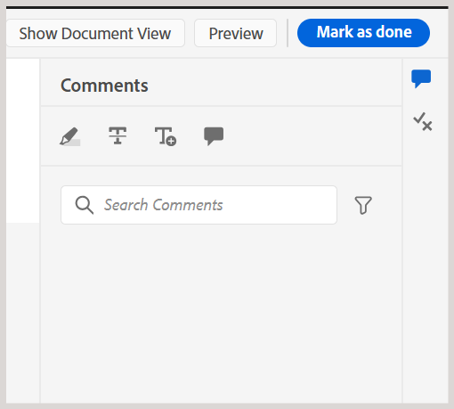

# Complete the review task as a Reviewer

>[!IMPORTANT]
>
> The features covered in this article are available only if configured by your Administrator at the backend. Contact your your Administrator for details. 

As a Reviewer, you can mark a review task as complete once all the required feedback has been provided and addressed by the Author or task initiator. By marking the task as complete, you indicate that your part of the review is completed and leave final comments for the Author.

Peform the following steps to complete a review task:

1. Open the review task assigned to you.
2. Navigate to the **Comments** panel and select **Mark as done** from the top. 

    {width="350" align="left"}

    The **Complete task** dialog is displayed.
3. In the **Complete task** dialog, add final comments for the Author and select **Complete**. 

     {width="350" align="left"}

You have successfully marked the task as completed, and its status is now set to **Complete**. No further actions are allowed once the task is marked as completed. 

{width="350" align="left"}

## View task level comments

All task level comments are displayed in the **Tasks comments** panel, which is available in read-only mode in the read only mode. When you complete a review task with a final comment, your input is recorded in this panel for future reference. 

To access task level comments from the Review UI, navigate to the left panel and select the **Task comments** icon. 

{width="350" align="left"}

The **Task comments** panel is displayed on the right.

{width="650" align="left"}

The **Task comments** panel is also accessible to the Author or initiator of the review task, ensuring clear and traceable communication throughout the review process. After reviewing the task level feedback, the Author can either request a re-review or close the review task. In both cases, all comments captured during the review process remain available in the **Task comments** panel for reference.

