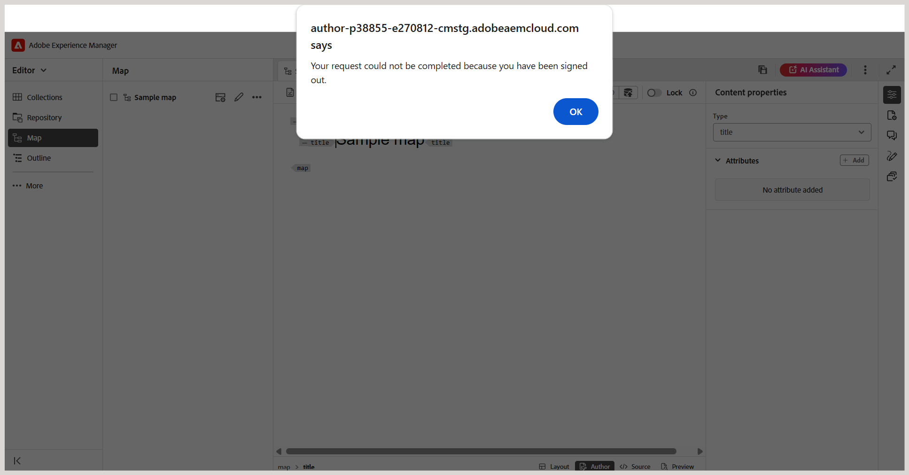

# Why does Experience Manager Guides sign me out after certain period of time? 

Experience Manager Guides ends a user session after a defined period of inactivity (idle timeout). This auto logout functionality is configured in the Adobe Experience Manager. When the session expires, a pop-up alert is displayed to notify the user about the expired session. This alert restricts the user from making any further changes to the content. 

**How does session timeout work?**

Experience Manager Guides sends a background request `token.json` every 30 seconds to validate the session. If the session is still active, a valid token is returned. If the session has expired due to inactivity, an empty token is returned, and the session is considered inactive.

**What happens when the session expires?**

When an inactive session is detected:

- A pop-up alert appears to notify that you have been signed out. 

    

- The alert disables all interactions with the application.

- Selecting **OK** refreshes the browser and redirects you to the login page.
- Upon logging in, you are redirected to the last opened page of Experience Manager Guides.

**Next steps**

The session expiry alert helps prevent data loss by restricting you from making changes to the application during an inactive session. To avoid accidental loss of content, it is recommended that you save your work regularly in the Editor, especially before stepping away from your system for an extended period.
