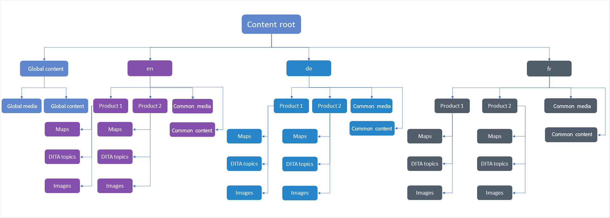

# Best practices for content translation {#id1678G0S702F}

Consider the following point for translating content:

-   The folder and file names must comply with the file naming standards such as—there should be no spaces, apostrophe, braces, equals sign, special or non-ASCII characters.

-   If you translate content in different languages, you must create folders corresponding to each language. Each of these language folders will contain the content corresponding to that language. For example, you can create folders using the language designator like `de` for German, `fr` for French, and so on. Or, you can create folders using the language and region designators like `fr-FR` for French as used in France or `fr-CA` for French as used in Canada.
-   The target language should also have the actual locales selected as per the target language folders on their instance.
-   The cloud configuration should be same as that of the source folder and there should be only one cloud configuration in one folder. You can create multiple folders under /conf, if you want to use multiple translation connectors.
-   A folder should not have more than 1000 files in it.
-   Ensure that the user tasked with initiating the translation process has Read, Modify, Create, and Delete permissions on the source and target language folders.
-   As translating content requires creation of a translation project, the user must have access to create project in Adobe Experience Manager.
-   If you want to use Conditional Presets with your map, you must create them before initiating the translation process. As Conditional Presets are also bundled in the translated version of the map, creating the presets before initiating the translation process ensure that they are available in the translated version.
-   Content translation process must be started from DITA map console and not the Adobe Experience Manager Assets UI.
-   The Component-Based DITA Translation Workflow must not be used if you are translating content via human translation. However, this option must be used for machine translation.
-   The globally used content and media that don't require localization, should be kept out of the language copies.
-   All the common content that has to be localized, should be kept in a common folder under the language folder.

The following illustration shows an example of a folder structure in Adobe Experience Manager when you have globally used content and three language copies.

## Configure translation service 

Perform the following steps to configure the human or machine translation service to use:

1.  In the Assets UI, select the source language folder.

1.  Open the folder properties, and go to **Cloud Services** tab.

1.  In the **Cloud Services** tab, configure the translation service that you want to use.

    You can configure machine-based or human translation.

    Ensure that there is only one configuration for translation connector in one folder. Multiple folders can be created under /conf, if there are multiple translation connectors. The source language folder must have a cloud configuration selected before starting the translation process.

    >[!NOTE]
    >
    > View [Configuring the Translation Integration Framework](https://experienceleague.adobe.com/docs/experience-manager-cloud-service/sites/administering/reusing-content/translation/integration-framework.html?lang=en) in Adobe Experience Manager documentation for details on integrating with third-party translation services.

1.  Select **Save & Close** to save the updated folder properties.    

## Start the translation job {#id225IK030OE8}

Perform the following steps to start the translation job:

1.  In the **Projects** console, navigate to the project folder you created for localization.

1.  Select the localization project to open the details page.

1.  Select the arrow on the **Translation Job** tile, and select **Start** from the list to start the translation workflow.

    >[!NOTE]
    >
    > If you are using Human translation service, then you need to export the content for translation. Once you have the translated content, then you need to import it back into the translation project.

1.  To view the status of the translation job, select the ellipsis at the bottom of the **Translation Job** tile.

After the translation completes, the status of the translation job changes to *Ready to Review*. To complete the translation process, you need to accept the translated copy and asset metadata from the Translation Job tile in the Project console. If you want to start a new translation project, view [Create a translation project](translate-documents-web-editor.md#create-a-translation-project).

>[!NOTE]
>
>- If you reject the translation for one or more topics in a translation job, the **In Progress** translation status of all the rejected topics revert to their original status. The status of the referred topics is checked and reverted according to the latest translation state. Also, the translation files created in the destination language folder are not deleted even if the translation is rejected for them.
>- If you reject, delete or cancel the translation job for a topic present in multiple projects (for any one of the projects), the **In Progress** translation status of the topic does not revert but that project gets removed from the **In Progress** project list for that given asset. 
>- Additionally, if you cancel or delete the translation job or delete the entire project, the **In Progress** translation status reverts to their original status.

**Parent topic:**[Content translation overview](translation.md)
