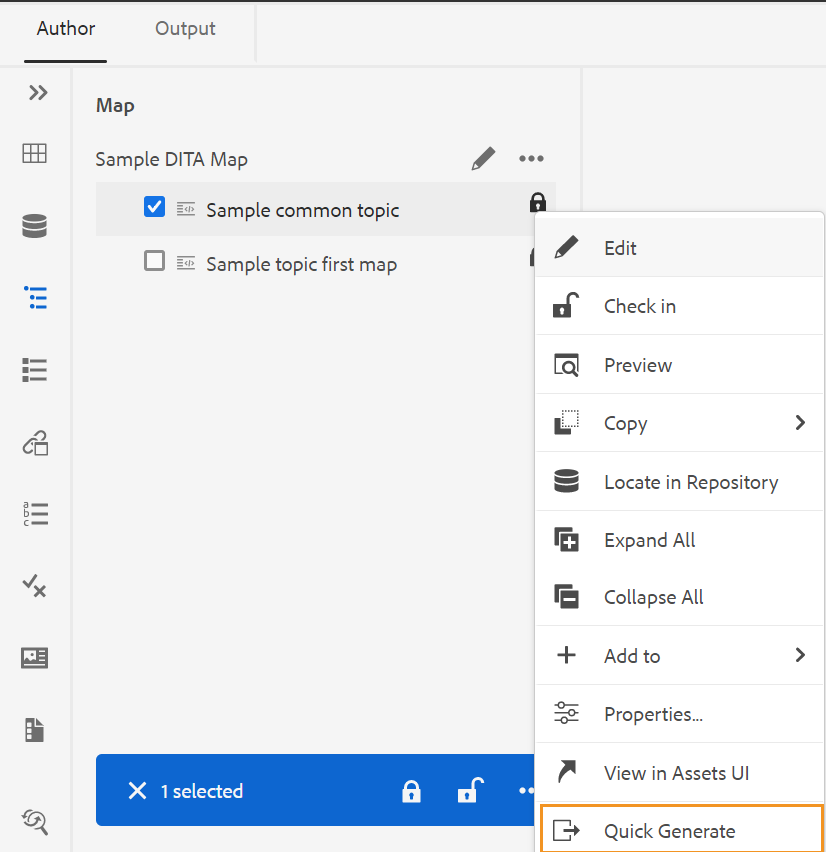

# Generate output from the Repository panel or the Map View panel {#id218CL6010AE}

>[!NOTE]
>
> The Quick Generate panel, previously available in Adobe Experience Manager Guides, has been deprecated starting from version 4.0 and 2502. You can't access the Quick Generate panel to generate output from the Repository panel or the Map view panel.

You can also use the output presets created for your DITA map to generate output from the Repository panel or the Map View panel.

-   Use the **Quick Generate** feature within the Repository panel or the Map View panel to generate output for the selected single topic or the entire DITA map.

    >[!NOTE]
    >
    > You can also access the **Quick Generate** feature from the Favorites panel or the Search panel.

-   Use the **Generate Output** feature within the Map View panel to generate the output for the selected multiple topics.

## Publish a topic used across one or more DITA maps 

Perform the following steps to generate output for one or more topics in your DITA map:

1. In the **Author** tab, select the topic in your DITA map which you want to publish.

1. Select **Quick Generate** from the Options menu of the selected topic.
 {width="650"}

1.  To publish a topic used in a single DITA map, select the output presets of your map which you want to use to publish and click **Generate**.
{width="350"}

1.  You will see the status of the output generation process. To view the output, hover the mouse pointer over the topic and click View Output.

1. If you have a common topic which is used across multiple topics, select the various DITA maps and also the output presets which you want to use to publish and click **Generate.**

    {width="350"}

1.  You will see the status of the output generation process.

    -   **Topics**: Lists the selected topics for which output is being generated.
    -   **Preset**: Displays the output presets which contain the selected topics.
    -   **Map**: Lists the DITA maps which contain the selected topic.
    -   **Status**: Displays the publishing status of each topic.
    To view the output, hover the mouse pointer over the topic and click View Output.
    

## Generate output for a DITA map from the Web Editor 

Perform the following steps to generate output for the entire DITA map:

1.  In the **Author** tab, select the DITA map which you want to publish.

1.  Select **Quick Generate** from the Options menu of your DITA map.

    {width="650"}

1.  Select the output presets of your DITA map which you want to use to publish and click **Generate.**

1.  You will see the status of the output generation process. To view the output, hover the mouse pointer over the topic and click View Output.

## Generate output for more than one topic 

Perform the following steps to generate output for more than one topic in your DITA map from the Map View panel:

1.  In the **Author** tab, select the topics which you want to publish.

1.  Select **Generate Output** from the Options menu at the bottom.

1.  Select the output preset of your DITA map which you want to use to publish.

    >[!NOTE]
    >
    > You will see only those output presets of the current DITA map which contain all the selected topics.

    {width="650"}

1.  You will see the status of the output generation process.To view the output, hover the mouse pointer over the topic and click View Output.

**Parent topic:**[Article-based publishing from the Web Editor](web-editor-article-publishing.md)
