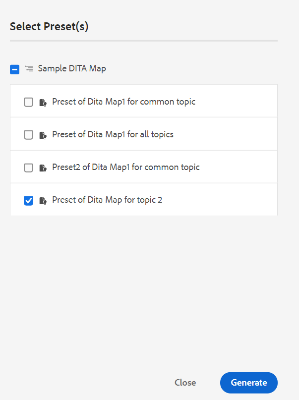

# Generate output from the Repository panel or the Map View panel {#id218CL6010AE}

You can also use the output presets created for your DITA map to generate output from the Repository panel or the Map View panel.

-   Use the **Quick Generate** feature within the Repository panel or the Map View panel to generate output for the selected single topic or the entire DITA map.

    >[!NOTE]
    >
    > You can also access the **Quick Generate** feature from the Favorites panel or the Search panel.

-   Use the **Generate Output** feature within the Map View panel to generate the output for the selected multiple topics.

## Publish a topic used across one or more DITA maps 

Perform the following steps to generate output for one or more topics in your DITA map:

1. In the **Author** tab, select the topic in your DITA map which you want to publish.

1. Select **Quick Generate** from the Options menu of the selected topic.
 {width="650" align="left"}

1.  To publish a topic used in a single DITA map, select the output presets of your map which you want to use to publish and click **Generate**.
{width="350" align="left"}

1.  You will see the status of the output generation process. To view the output, hover the mouse pointer over the topic and click View Output.

1. If you have a common topic which is used across multiple topics, select the various DITA maps and also the output presets which you want to use to publish and click **Generate.**

    {width="350" align="left"}

1.  You will see the status of the output generation process.

    -   **Topics**: Lists the selected topics for which output is being generated.
    -   **Preset**: Displays the output presets which contain the selected topics.
    -   **Map**: Lists the DITA maps which contain the selected topic.
    -   **Status**: Displays the publishing status of each topic.
    To view the output, hover the mouse pointer over the topic and click View Output.
    {width="800" align="left"}

## Generate output for a DITA map from the Web Editor 

Perform the following steps to generate output for the entire DITA map:

1.  In the **Author** tab, select the DITA map which you want to publish.

1.  Select **Quick Generate** from the Options menu of your DITA map.

    {width="650" align="left"}

1.  Select the output presets of your DITA map which you want to use to publish and click **Generate.**

1.  You will see the status of the output generation process. To view the output, hover the mouse pointer over the topic and click View Output.

## Generate output for more than one topic 

Perform the following steps to generate output for more than one topic in your DITA map from the Map View panel:

1.  In the **Author** tab, select the topics which you want to publish.

1.  Select **Generate Output** from the Options menu at the bottom.

1.  Select the output preset of your DITA map which you want to use to publish.

    >[!NOTE]
    >
    > You will see only those output presets of the current DITA map which contain all the selected topics.

    {width="650" align="left"}

1.  You will see the status of the output generation process.To view the output, hover the mouse pointer over the topic and click View Output.

**Parent topic:**[Article-based publishing from the Web Editor](web-editor-article-publishing.md)
