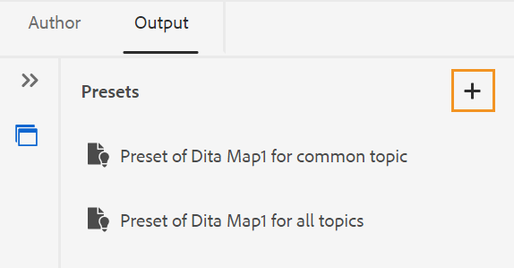

# Create output presets for Knowledge Base from the Editor {#id218CL400JW3}

Perform the following steps to create output presets for your DITA map:

1.  In the Assets UI, navigate to the map file that you want to edit.

1.  To get an exclusive lock on the map file, select the map file and select **Checkout**.

1.  Select the **Edit Topics** option from the action menu on the map file.

    The map file is opened for editing in the Editor.

    >[!NOTE]
    >
    > You can add or delete any topic from the map using the Advanced Map Editor. For more details, view [Work with the Advanced Map Editor](map-editor-advanced-map-editor.md#).

1. Select the **Open in map console** icon. The map opens in the map console. 

1. Navigate to the **Output presets** tab and select the + icon to create an output preset for your DITA map.

    {width="350" align="left"}

1. Select **Knowledge Base** from the **Type** drop-down, enter name, and select **Adobe Experience Manager** in the **New output preset** dialog box.
1. Select the **Add to current folder profile** option to create an output preset for the current folder profile.  icon indicates a folder profile level preset.  

   Learn more about [Manage Global and Folder Profile output presets](./web-editor-manage-output-presets.md).

 1. Select **Add**.   

    The preset for Knowledge Base is created.

    {width="800" align="left"}

Once the preset is created, you can generate the output for specific knowledge base articles. To do this, navigate to the **Articles** tab and select the topics for which you wish to generate the output.
1. Select **Generate output** at the top to generate the output.

    {width="800" align="left"}

1. In the **Confirm files for publishing** prompt, select the files you want to publish and confirm by selecting **Publish**.

    {width="800" align="left"}

You will view the status of the output generation process. The **Topics** column lists the topics for which output is being generated while the **Status** column displays the publishing status of each topic.

{width="800" align="left"}

To view the output, close the Output Generated dialog box and select **View output** on the preset page. 

>[!NOTE]
>
> You can also Rename, Duplicate, or Delete an existing output preset from the Options menu.

**Parent topic:**[Article-based publishing from the Editor](web-editor-article-publishing.md)
