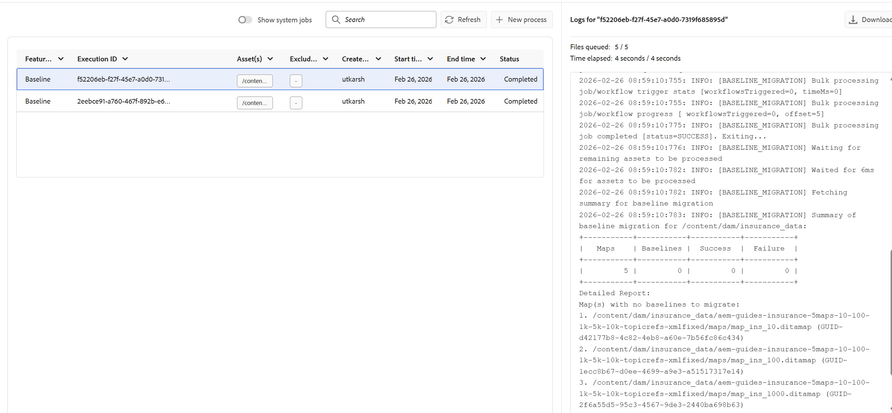
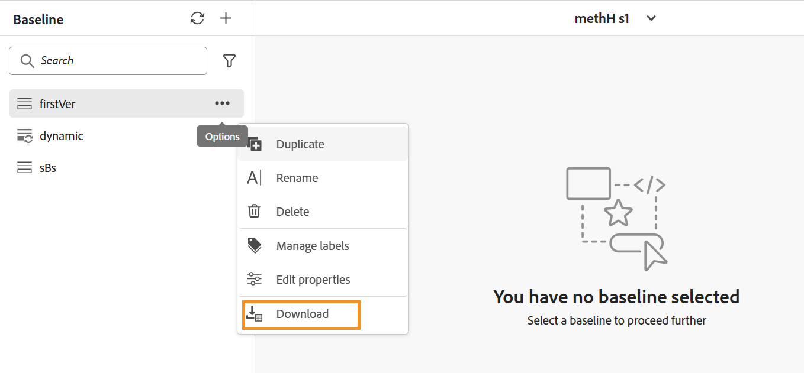
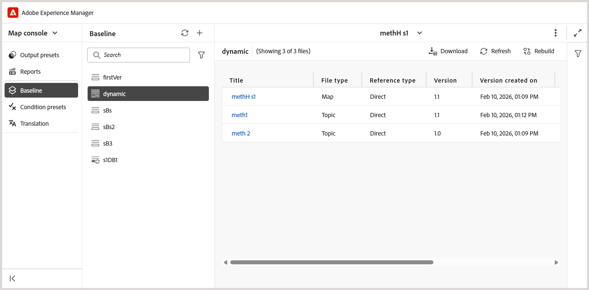
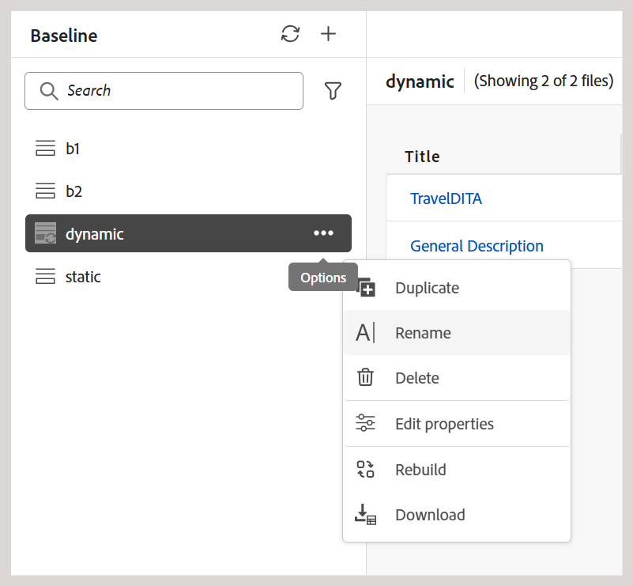
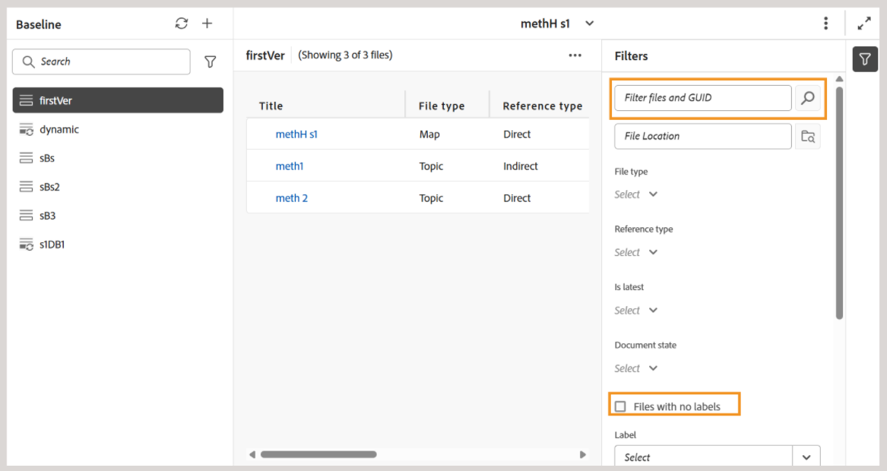
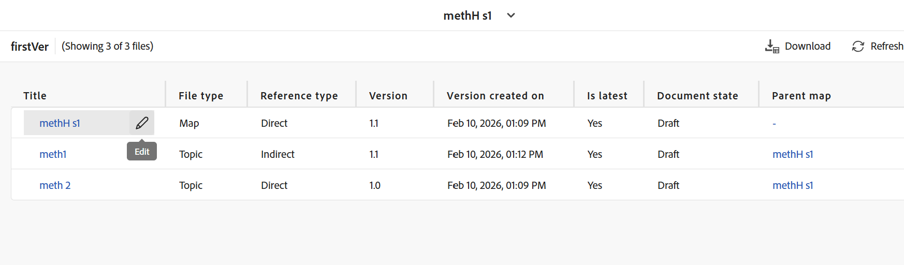
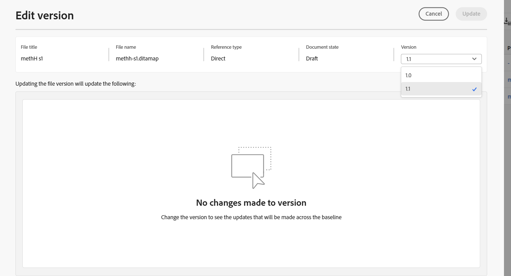
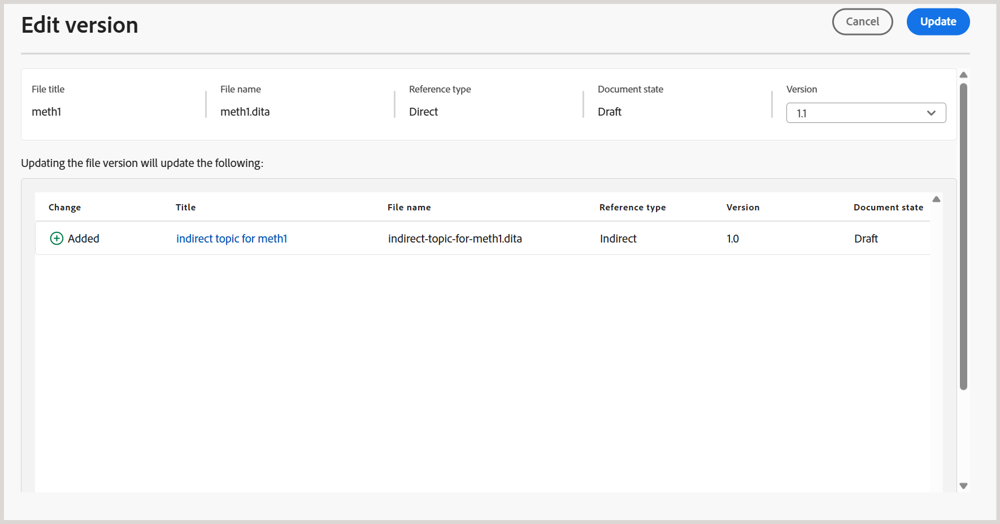

# New baseline (Beta) in Experience Manager Guides

>[!NOTE]
>
> - This article applies to new baseline , currently available as a *Beta* feature, that offers improved performance and stability available with the Experience Manager Guides 2026.04.0 release. 
> - To enable the new baseline feature for Cloud Service, contact the Customer Success Team.
> - To enable the new baseline feature for On-Premise, view [Configure New Baseline](../install-conf-guide/conf-new-baseline-on-prem.md).

The new baseline feature addresses critical reliability and performance issues associated with large, complex maps. It comes with a redesigned baseline architecture that delivers a faster, more stable, and more consistent baseline experience. Before we dive into the details, here's a short walkthrough video that highlights the capabilities of the new baseline feature.

>[!VIDEO](https://video.tv.adobe.com/v/3483154/aem-guides)

The new baseline model strengthens baseline handling by addressing the common pain points:

- Slow loading and poor responsiveness when working with large baselines
- Inconsistent baseline states caused by partial updates or failed validations
- Limited visibility and control when managing extensive baseline content
- Performance bottlenecks during baseline creation, updates, or rebuilds

The following sections describe the new baseline model, including the enhancements it introduces, key behavior changes to consider before migration, and instructions for migrating to and using the new baseline:

- [Key enhancements introduced in the new baseline](#key-enhancements-introduced-in-the-new-baseline)
- [Behavior changes to know before migrating to the new baseline](#behavior-changes-to-know-before-migrating-to-the-new-baseline)
- [Migrate to the new baseline](#migrate-to-new-baseline)
- [Use the new baseline](#use-the-new-baseline)

## Key enhancements introduced in the new baseline

The new baseline introduces significant improvements that make baseline management faster and easier to scale without changing how you work. Consider moving to the new baseline for:

- **Improved performance and scalability:** The baseline data model and rendering behavior have been optimized to scale efficiently with large baselines, using incremental loading and a streamlined data structure to improve responsiveness.
- **Stronger UI and backend consistency:**  Any changes made to a baseline (such as version or dependency updates) are now reflected in the UI only after successful backend validation, preventing the creation of invalid baselines. 
- **Filtering, sorting, and navigation:** Baselines support comprehensive filtering across multiple attributes, including document state, labels, file type, reference type, and GUID‑based search across the entire baseline. Pagination is supported for large baselines, with an option to include files that have no labels.
- **Clear visibility into dependency impact:** Dependency impact (for added or removed dependencies) is displayed as a preview before version changes are applied, enabling you to review the changes before applying them.
- **More flexible label management:** Labels can be moved between versions within a baseline, providing greater flexibility when managing labels across different topic versions.
- **Deterministic editing and saving behavior:** baseline edits support row-level updates, load resource-intensive data (such as version trees and dependency differences) only during version updates, and complete save operations deterministically in a single step - reducing unexpected save failures and partial updates.
- **More reliable baseline creation:** baselines are created using stored reference data rather than runtime parsing, with required version information validated upfront to prevent incomplete or invalid baselines.
- **API and automation support:** The new baseline model is fully supported through REST APIs and the Java SDK, enabling automation and integration with external workflows.

## Behavior changes to know before migrating to the new baseline

Before migrating to the new baseline model, review the following behavior changes. These changes affect how baselines are created, updated, and managed, and may influence existing workflows.

| Area | Change (description) |
|------|-------------|
| **Reference resolution** | Direct map references are classified as **DIRECT**. Invalid references are skipped, and references from `reltable` continue to be excluded. This is supported in edited and new baselines, but not in baselines that have only been migrated.|
| **Pick Automatically** | Version selection is evaluated immediately before resolving direct references to ensure accurate version resolution. This is supported in edited and new baselines, but not in baselines that have only been migrated. |
| **Baseline creation rules** | Version **1.0** is mandatory. Baselines with missing or ambiguous versions may resolve differently after migration. |
| **Migration handling** | Invalid references are skipped. **DIRECT** references take precedence, unpinned references move to the latest version, and additional metadata is added from version **5.0** onward. |
| **Baseline data model** | The new graph‑based baseline model removes mutable fields and is not backward compatible with the previous baseline model. |
| **API usage** | Baseline operations are supported through REST APIs and the Java SDK. Raw baseline objects are no longer exposed. |
| **Version purging** | After migration, version purging considers only baselines stored in the new baseline repository. |
| **UI** | Dynamic baselines can be viewed, and reference version editing are streamlined. |

## Migrate to new baseline  

Once you have the feature enabled from Customer Success Team, you need to migrate the existing baselines to the new baseline. 

Perform the following steps, to migrate the existing baseline to the new baseline.

1. Select the Adobe Experience Manager logo at the top and choose **Tools**.
1. In the **Tools** panel select **Guides**.
1. Select the **Bulk Processor** tile.

    

    The **Guides Bulk Processor** page is displayed.    

1. Select **New Process** from the top right corner of the page to start a new processing task.

    The **New process** dialog is displayed.   

1. Provide the following details in the dialog:

    1. **Feature type**: Select **Baseline** from the drop down.
    1. **Select folder(s) and file(s)**: Navigate and choose one or multiple folders and files to process. You can select only folders for baseline migration.

        >[!NOTE]
        >
        > Select the folder that contains all the guide content and map files. If map files are stored separately, choose the directory where the map files are located.

    1. **Select folder(s) to ignore**: Optionally, select sub-folders within the chosen parent folder to exclude from the migration.   

    

1. Select **Create**. 

A pop-up showing **Asset processing triggered successfully** is displayed. You can view the status of the processing task on the page.

You can also select **View logs** to check and download the logs for the migration task. 

The log report provide details of the migration, including the number of maps migrated, baselines successfully migrated, and related details.      

>[!NOTE]
>
> No baseline edits should be made during migration, particularly in working copies, to prevent failures. Post‑migration, some baselines may require rebuilding if versions are missing.    

## Use the new baseline

The new baseline model uses the same workflows and user interface as the existing baseline feature in Experience Manager Guides. You can continue to [Create and manage baseline from Map console](./web-editor-baseline.md) using the available options. 

>[!NOTE]
>
> The new baseline model does not support creating and managing baselines from Map dashboard. 

This section describes only the changes and enhancements introduced with the new baseline model. Common baseline workflows remain unchanged unless explicitly mentioned.

**New/enhanced options available in the new baseline UI**

The following updates apply when working with baselines created using the **new baseline model**:

- The **Export baseline** option in the Options menu is renamed to **Download** for baselines created using both Manual and Automatic updates.

    

- Dynamic baselines can be opened directly from the **Baseline** panel and managed using the available actions in the Options menu.

     
    
    You can also use the new options introduced for dynamic baselines created using the new baseline model:       
    - **Edit properties**: Allows you to edit the properties of an existing baseline.
    - **Rebuild**: Allows you to rebuild a dynamic baseline whenever changes occur.

        

- The **Download** action supports paginated downloads. All baseline content that matches the applied filters is included in the download, not just the content visible on the current page.
- Filter files by GUID, in addition to file names, or file location. An additional option to **Filter files with no labels** is also available. 

    
- The new baseline model supports deterministic editing, allowing you to update one reference at a time with validated dependency resolution. 

    +++Steps for editing the references of a new baseline

    Perform the following steps to make edits to a baseline:

    - Open the baseline from the **Baseline** panel.

        The tabular view of the references of the baselines is displayed. 

    - Navigate to and hover-over the file which you want to edit. 
    - Select the **Edit** icon. 

        
        
        The **Edit version** dialog is displayed. 
    - Select the required version from the **Version** dropdown (for example, change from version 1.0 to 1.1).
    

        
    
        Added and removed dependencies are evaluated and displayed as a preview. Review the changes before applying them.
    
        

        If no dependency changes are detected, an empty‑state message is displayed.

    - Select **Update** to apply the changes.

    The baseline is updated with the selected version.
    +++
