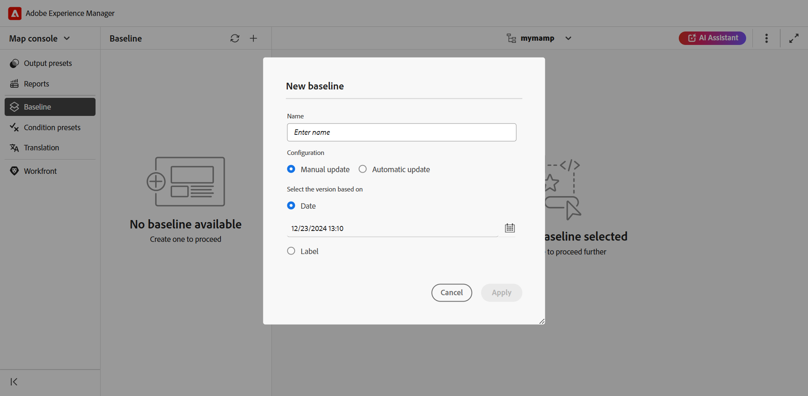
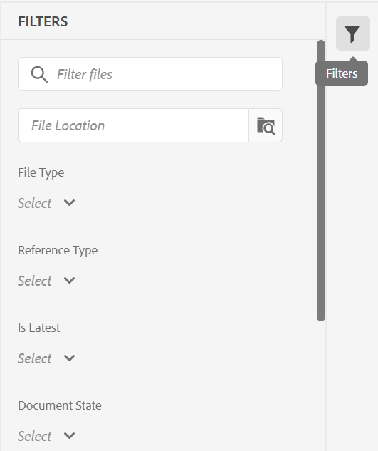

# Create and manage baselines from Map console {#id223MB0ZF043}

The Baseline feature allows you to create a version of your topics and assets that can then be used for publishing or translation. For example, if your DITA map has `topicA` and `imageA`, you can create a Baseline to use the 3rd version of `topicA`, but the 4th version of `ImageA`. Once you have a Baseline in place, you can publish or translate topics of different versions in a single step.

Selecting a Baseline is optional for output presets and a DITA map can have more than one Baseline. However, each output preset within a DITA map can be associated with only a single Baseline. If no Baseline is specified at the time of publishing, then the output is published using the latest version of the content.

Similarly, selecting a Baseline to translate content is optional. However, if you choose to translate content using a Baseline, the contents of the Baseline are also saved along with the translated copies. You can then use the translated Baseline to perform further operations like share it with external publishers or archive it.

>[!TIP]
>
> It is recommended to use this Baseline feature from the Map console. However, you can also [use map dashboard to create and manage baselines](./generate-output-use-baseline-for-publishing.md).

In the **Baseline** tab, you can perform the following actions:

-   [Create a Baseline](#create-a-baseline)
-   [Manage Baselines](#manage-baselines)

## Create a Baseline 

You can create a baseline from the Map console by performing the following steps:

1. [Open the DITA map file in Map console](./open-files-map-console.md).
1. Navigate to the **Baseline** tab, and select the + icon at the top-right to start creating a baseline.
1. In the **New baseline** dialog box, provide the following details:

    {width="500" align="left"}

    - Enter a name for the baseline in the **Name** field.
    - In **Configuration**, choose [Manual update](#configuring-baseline-for-manual-update) or [Automatic update](#configuring-baseline-for-automatic-update).
    - Select **Apply**.

The baseline is created. The baseline creation happens asynchronously, so you can continue working on other files. Once the baseline is created, a pop-up message is displayed confirming that the baseline has been created, and you also receive an Inbox notification for the same.

### Configuring Baseline for Manual update

 You can manually create a static baseline with a specific version of the topics and referenced content available on a specific date and time, or with a label defined for a version of topics:

In **Select the version based on,** select one of the following options:

- **Date**  : Picks the topics' version as on the specified date and time.
- **Label**: Select this option to pick the topics according to the label applied to them. If the topics have labels specified for them, the labels are listed in the dropdown. You can choose a label from the list. You can also add a label in the text box.

    >[!NOTE]
    >
    > When choosing labels, the labels loader remains visible until all labels have been successfully fetched and fully loaded. Once loaded, the labels are displayed in a case-insensitive alphabetical order. They are retrieved in batches of 20, with infinite scrolling enabled in the dropdown to load additional batches as you scroll.  

    For the direct references in static baselines, the labels are pulled from the latest saved version of the map. For example, if you have created labels `Label Release 1.0` and `Label Release 1.1` for versions 1.0 and 1.1 of Topic A, and then add Topic A to the map saved as version 1.0. In this case, you can view the labels `Label Release 1.0` and `Label Release 1.1` in the dropdown for static baseline labels.

    When you select **Label,** you can choose the direct and indirect references.
    - For direct references within the DITA map, you are given an option to use the latest version of topics that do not have the specified label applied to them.

        >[!NOTE]
        >
        > If you enter a label that does not exist and select the option **Do not create a baseline** then the baseline creation fails and gives an error message near the baseline name in the Baseline panel.
        
    - For indirect references within the DITA map, you are given an additional option to use the latest version of topics that do not have the specified label applied on them. You can also choose to **Pick Automatically** for the referenced content, and the system automatically picks the version of the referenced content corresponding to the version of the content in which it is referenced.
    
Once you have selected a label or version as on date, then all referenced topics and media files within the map are selected accordingly. This selection of topics is not shown on the user interface, but it is saved in the backend.

### Configuring Baseline for Automatic update

Select this option for baseline creation to automatically pick the topics according to the label applied to them.
    
Baselines created using the automatic update configuration are updated dynamically. If you generate a baseline, download a baseline, or create a translation project using a baseline, the files are picked dynamically based on the updated labels. For example, if you have used version 1.2 of a topic with Label Release 1.0 for the baseline and later updated version 1.5 with Label Release 1.0, the baseline will be updated dynamically, and version 1.5 will be used.

{width="300" align="left"}

- **Labels**: If the topics have labels specified for them,  then use the **Labels** dropdown to choose from the [listed labels](#labels-list). 

    The labels selected first are given higher priority over the later ones.

   >[!NOTE]
   >
   >While the labels are being pulled a loader appears, and the dropdown is disabled. 

     For dynamic baselines, the labels are pulled from the latest saved version and the current working copy of the map. For example, if you have created labels   `Label Release A.1.0 ` and `Label Release A.1.1` for versions 1.0 and 1.1 of Topic A and labels `Label Release B.1.0` and `Label Release B.1.1` for versions 1.0 and 1.1 of Topic B . Then you can add Topic A to Map A in version 1.0 and Topic B to Map A in 1.0* (working copy). In this case, you can view  `Label Release A.1.0 `, `Label Release A.1.1`, `Label Release B.1.0`,  and `Label Release B.1.1` in the dropdown of dynamic baseline labels.
- **Indirect References**: For indirect references within the DITA map, you are given the following options:
    
    - **Pick automatically**: You can choose to **Pick Automatically** for the referenced content, and the system automatically picks the version of the referenced content corresponding to the version of the content in which it is referenced.
    - **Use selected label**: You can create a baseline with the selected label defined for a version of topics.
    -  **Use the latest version or the working copy**: Use the latest version of topics that do not have the specified label applied on them, or if no version has been created, then use the working copy of the topics to create the baseline.

## Manage Baselines 

You can manage your existing baselines using the various features on the Baseline dashboard.

- You can search for an existing baseline using the text box in the Baseline panel. Use the **Apply Filter** icon to show all baselines or list the baselines with the creation status as Successful, In-Progress, or Failed.
- Use the **Refresh** icon in the Baseline panel to recheck for all baselines and display a fresh list of baselines for the DITA map that's opened in the Map View.
- Select the baseline to view or edit the contents of an existing static baseline in the **Baseline** panel. The baseline editing window displays the DITA map file, map's contents or topics, and the referenced content.

    >[!NOTE]
    >
    >Edit operation for static baselines is only recommended for small number of reference changes. Edit operation is not recommended to change the version of the main DITA map as it must recalculate all the references. This may cause a baseline update failure for large DITA maps. For the larger DITA maps, you can create a new baseline or edit the properties of the baseline. 
    >
    >Edit operation in case of dynamic baseline allows you to edit the properties of the baseline as the references for dynamic baselines are generated at runtime using the labels.  

    {width="500" align="left"}

### Actions available for an existing baseline

You can also perform the following operations on the baseline from the Options menu:

**Duplicate a baseline**

You can duplicate a baseline and modify it according to your requirements. 

   {width="300" align="left"}
   *Duplicate a baseline based on a label or create an exact copy.*
    
 1. Select **Duplicate** from the Options menu of a baseline. The **Duplicate baseline** dialog box opens.
        >[!NOTE]
        > 
        >The default name of the baseline is `<selected baseline name>`_suffix (like sample-baseline_1). You can change the name according to your requirements.
       
       In **Select the version based on**, you can either choose the **Exact copy** option or the **Label** option:

    - **Exact copy**: Experience Manager Guides picks the same version of all the topics and creates an exact copy of the duplicated baseline. 
    - **Label**: Using the dropdown, you can choose one of the [listed labels](#labels-list). Experience Manager Guides picks those versions of the topics with the selected label defined for them, while for the remaining topics, it picks the version from the duplicated baseline. For example, you select the label `Release 1.0` from the dropdown, then it picks those versions of the topics for which you have defined this label. For all other topics, it picks the version from the duplicated baseline.
1. Select **Duplicate**.
    
- **Rename**, or **Delete** an existing baseline**.
- **Manage labels** that allows you to add, remove, or make changes to existing labels for static baselines. If your administrator has configured pre-defined labels, then you are shown those labels in the Add Label dropdown list. For more information about adding labels,view [Use labels](web-editor-use-label.md#).

    >[!NOTE]
    >
    > The process to add or remove labels happens asynchronously, so you can continue working on other files. Once the label is added or removed, a pop-up message is displayed confirming that the label has been added or removed, and you also receive an Inbox notification for the same.

- **Edit properties** of an existing static baseline that you have set while creating the baseline.
- **Export Baseline** option exports a snapshot of the baseline in Microsoft Excel file, including all essential details such as title, file name, file type, version number, document state, and other relevant information.

### List of labels {#labels-list}

The labels listed in the dropdown are based on the following criteria:
- The labels should be added to one of the versions of the topics in the DITA map (on which the baseline is created).
- And only the first-level references (topics or sub-maps) of the DITA map are considered for picking the labels.

## Baseline filters

Using the Filters icon in the **Baseline Filters** panel you can apply filters on the baseline opened in the baseline editing window:

{width="300" align="left"}

- Filter the files based on filenames, or file location.
-  Filter the files based on the values for different columns like File Type, Reference Type and so on.
- Choose the columns to be displayed in the baseline editing window.

>[!NOTE]
>
> You can select a column heading and sort the files based on the columns in the baseline editing window.

**Save or Reset a Baseline**

Once you have edited the baseline, select **Save**  to save the changes to the baseline. You can select **Reset** if you don't want to save the change and reset the baseline. When you select **Reset**, a warning is displayed that your unsaved changes would be lost.

**Parent topic:**[Output generation](generate-output.md)
 
