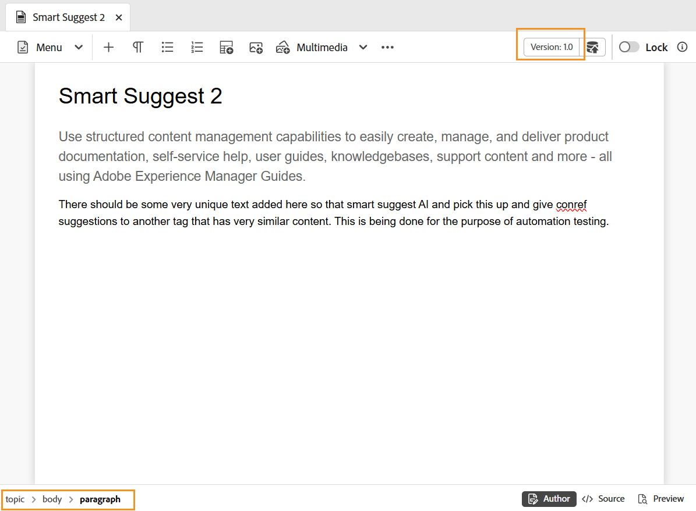

# Content editing area in the Editor 

The content editing area is where the content of your topic or map is displayed. You make all content edits in this area. It gives a WYSIWYG view of the content you are editing. 

At the bottom-left of the content editing area, you have the breadcrumb of the element at current cursor location. In the bottom-right corner, the available Editor views are displayed.

To learn more about the Editor views available for a topic file in the content editing area, view [Editor views](./web-editor-views.md).

>[!NOTE]
>
> If you are working on a map file, then different options or views are displayed in the content editing area , including a **Layout** view for the map file. For more details, view [Map editor features](./map-editor-advanced-map-editor.md).

**Parent topic:**[Introduction to the Editor](web-editor.md)
