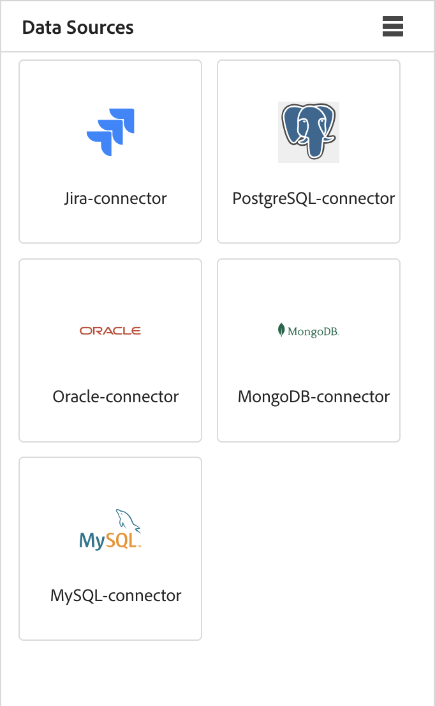
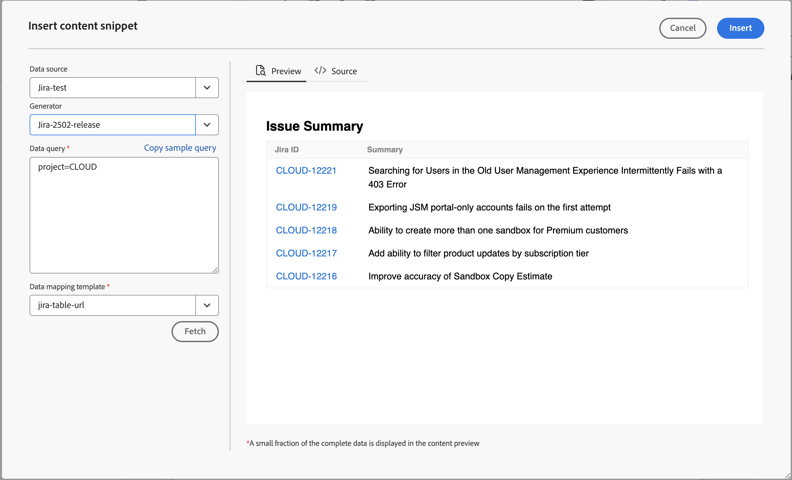
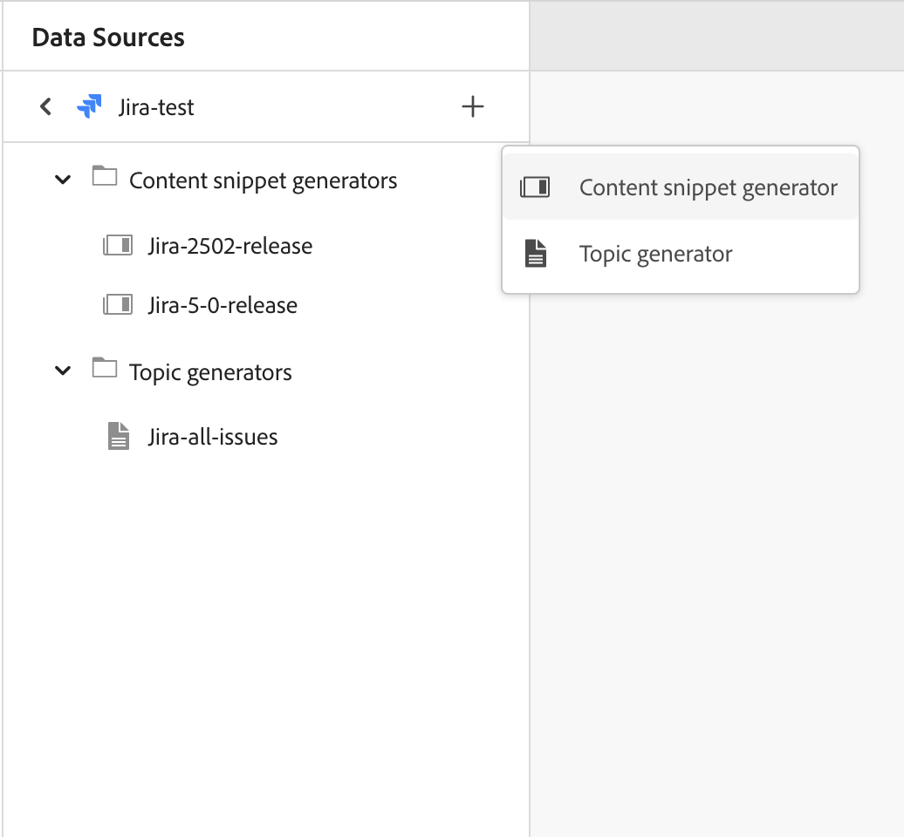
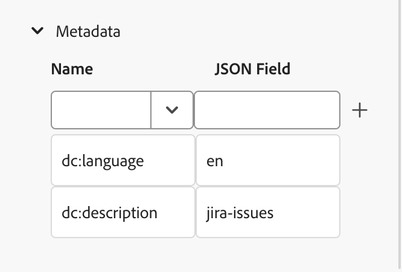
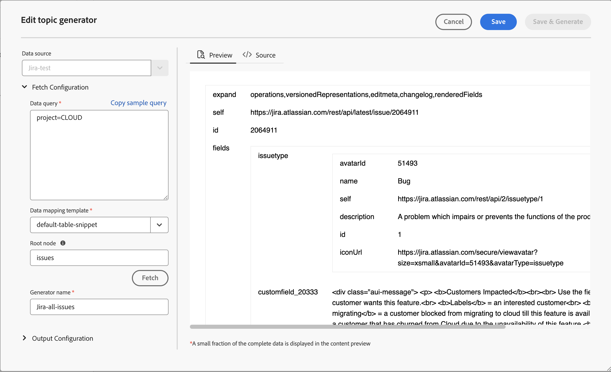

# Use data from your data source

A **data source** is a system where you store and manage the data for your organization. These are your systems of record like JIRA, SQL Databases, PIM, or PLM. AEM Guides provides the feature to connect with your data source and use the data from them.

You can also connect to JSON data files using a file connector. Upload the JSON file from your computer or browse it from the Adobe Experience Manager assets. Then, create content snippets or topics using the generators.

## Data Sources panel

Select **Data Sources**  in the left panel to view the connected data sources. The Data Sources panel opens and displays all the connected data sources. 

Based on your setup your administrator can configure a data source connector:

 Cloud Services 
 

- If you're using the October 2023 release or later, learn how to [configure a data source connector from the user interface](../cs-install-guide/conf-data-source-connector-tools.md) in the Cloud Services Installation and Configuration Guide.

- If you're using the July 2023 or September 2023 release, learn how to [configure a data source connector](../cs-install-guide/conf-data-source-connector.md) in the Cloud Services Installation and Configuration Guide.

    

  On-premise Software 

- If you're using the 4.3.1 release or later, learn how to [configure a data source connector from the user interface](../cs-install-guide/conf-data-source-connector-tools.md) in the On-premise Installation and Configuration Guide.

- If you're using the 4.3 release, learn how to [configure a data source connector](../cs-install-guide/conf-data-source-connector.md) in the On-premise Installation and Configuration Guide.

>[!NOTE]
>
> You will see the data sources for which your administrator has configured the connector. 

## Show List View or Tile View  

You can toggle between the List View or Tile View to view the various data sources in the form of a list or as tiles. 

Select a data source to view the content snippet generators and the topic generators available for the selected data source.

### List View   

  {width="300" align="left"}

*List of connected data sources.*
 
### Tile View    

{width="300" align="left"}

*View the connected data sources as tiles.* 

You can use the data from data sources in two ways:
- Insert a content snippet
- Create a topic 

## Insert a content snippet from your data source

AEM Guides provides the feature to connect with your data source. You can fetch your data, insert it into your topics, and edit it. You can easily create a content snippet using the content snippet generator and reuse it within your topics. 

Perform the following steps to create a content snippet using the content snippet generator and insert it in your topic:

1. Select **Data Sources**    in the left panel to view the connected data sources. 
    
1. Select a data source to view the content snippet generators available for the selected data source.

    {width="300" align="left"}
    
    *The Data Sources panel lists the available content snippet generators.* 

1. Select **Add** to add a new content snippet generator. The **Add content snippet generator** panel opens.

1. Enter the query in the **Data query** text box.  Select **Copy sample query** to quickly copy a data query. Instead of manually creating the query, you can copy and paste the sample query into the **Data query** text box. Then, simply edit the query as per your data requirements. 

    >[!NOTE]
    >
    >Experience Manager provides different sample queries for all resources in the various data sources. These map to the data source from which you are fetching the data.
    
1. If you use a file connector, you can upload the JSON file from your computer or browse a JSON file from Adobe Experience Manager assets.

    >[!NOTE]
    >
    > You will view the options to upload or browse files in place of a data query if you use a file connector.

1. Select the template which maps with your data source from the **Data mapping template** dropdown.
The out-of-the-box templates for the selected data source are displayed in the drop-down. For example, you can view the “sql-table” template for datasource named “PostgreSQL” datasource.

     >[!NOTE] 
     >  
     > If your administrator has configured customized templates, then you’re also shown those templates in the drop-down list (based on the template path configurations done by your administrator). 
     >   
     >You can also use Velocity tools in the templates. Learn more about how to [use Velocity tools](#use-velocity-tools).

1. The **Resource** dropdown appears for some connectors like REST Client, Salsify, Akeneo, and Microsoft ADO.  Select any resource from the dropdown and connect to it to create a content snippet or a topic using the generator for it.  
    
     >[!NOTE]
     >
     > Your administrator can configure default resources or add resources for multiple URLs while configuring the data source connectors. 

1. Click **Fetch** to fetch the data from the data source and apply the template on the data that results from the SQL query.

1. You can view the data in the preview or the DITA source view. 

   1. The preview shows how the data will be displayed when inserted into the content. The preview displays a small fraction of the data in the format of the selected template. 
   For example:
        - If you’ve selected the sql-table template, you can view the SQL data in a tabular format. 
        - If you’ve selected the jira-ordered-list template, you can view an ordered list for the Jira issues.

    1. The source view shows the data in the DITA source view. 
 {width="800" align="left"}
 *Add a content snippet generator. View the data in source or preview mode.* 

1. To save the results of the query, enter the name of the generator and then click **ADD**.   A new content snippet generator is added to the list.

    >[!NOTE]
    >
    > You need to follow the file naming convention for the name of the new content generator. You cannot have a space in the name of the content snippet generator. Also, you cannot save a new content generator with the name of an existing content generator. An error occurs.  

### Options for a content snippet generator

Right-click on a content snippet generator to open the Options. Using the options, you can perform the following operations:

- **Preview**: Use this option to open a pane and view a small fraction of how the data is displayed in the output.
- **Insert**: Use this option to insert the selected content snippet into the topic opened for editing in the Web Editor. As the data is inserted as a snippet, you can also edit the data within your topic in the Web Editor.

    >[!NOTE]
    > 
    > Insert option appears only while you are editing a topic.

- **Edit**: Use this option to make changes in the content snippet generator and save it.
- **Delete**: Use this option to delete the selected content snippet generator.
- **Duplicate**: Use this option to create a duplicate or a copy of the selected content snippet generator. The duplicate is created with a suffix (like generator_1) by default. 

### Insert a query snippet

You can also use the **Insert Query Snippet**    from the main toolbar to insert the data snippet into the topics.  You can select a generator from the dropdown, edit your query, or change the template and insert the data in your topic.

{width="800" align="left"}

 *Edit and insert a data snippet.*

## Create a topic using the topic generator 

A topic generator helps you create topics containing data from your sources. You can quickly create a topic generator and then generate the topics using the generator. Each topic can contain data in various formats, like tables, lists, and paragraphs.   For example, in a topic, you can add a table that includes the details of all new products and a list of all the products which will be discontinued for sale.

The topic generator can create the topics containing the data and a DITA  map for all topics. You also can `<conref>` these topics in your content. This helps you keep your data in sync with the data source, and you can easily update them. 

### Create a topic

Perform the following steps to create a topic using the topic generator:

1. Select a data source to view the content snippet generators and the topic generators available for the selected data source.
 
    {width="300" align="left"}

    *Add a topic generator for a connected data source.*

1. Select **Add**  and select **Topic generator** from the dropdown to add a new topic generator. The **Add topic generator** panel opens.

1. Enter the values in the fields under the following three tabs of the **Add topic generator** panel:

     **Fetch Configuration**
     
      {width="300" align="left"}

      *Add the Data Query, Data mapping template, and Root node details for the topic generator and give it a unique name in the Fetch Configuration panel.*     

      1. Enter the query in the **Data query** text box. Select **Copy sample query** to quickly copy a data query. Instead of manually creating the query, you can copy and paste the sample query into the **Data query** text box. Then, simply edit the query as per your data requirements. 

            >[!NOTE]
            >
            >Experience Manager provides different sample queries for all resources in the various data sources. These map to the data source from which you are fetching the data.

      1. If you use a file connector, you can upload the JSON file from your computer or browse a JSON file from Adobe Experience Manager assets.
      
            >[!NOTE]
            >
            > You will view the options to upload or browse files in place of a data query if you use a file connector.
      
      1. Select the template which maps with your data source from the **Data mapping template** dropdown.

            >[!NOTE]
            >
            > If your administrator has configured customized templates, then you're also shown those templates in the drop-down list (based on the template path configurations done by your administrator). For example, you can create a topic template containing an ordered list, tables, paragraphs, or other DITA elements.

      1. Enter the **Root node**. This is the node at which you want to access your data. The topic generator then creates each topic at the level defined in the root node. For example, you can add ‘issues’ as the root node in Jira. So, if a query returns 13 issues, you will get 13 topics, one topic for each issue.

      1. Click **Fetch** to fetch the data from the data source and apply the template on the data that results from the SQL query. The preview shows a small fraction of how the topic appears in the format of the selected template. For example, you can view a single Jira issue with all the fields that result from the query.
      1. Enter the name of the topic generator. 

         >[!NOTE]
         > 
         > You need to follow the file naming convention for the name of the new topic generator. You cannot have a space in the name of the topic generator. Also, you cannot save a new topic generator with the name of an existing topic generator. An error occurs.

    **Output Configuration**

    {width="300" align="left"}

    *Enter the Output path and Topic naming convention details in the Output Configuration panel. Generate a DITA map and name it.*

     1. Enter the **Output path** details where you want to save your topics.
     1. In the **Topic naming convention**, you can enter a value or a variable with velocity tags. The new topics will follow the convention. For example, you can enter the `$key` to create topics based on Jira keys.
     1. Enable the option **Generate a map** if you want to create a map that contains all the generated topics.      
     1. Enter the name of the new DITA map.
    
      >[!NOTE]
      >
      > The Topic generator generates the DITA map on the same output path as the topics.

   **Metadata**

    Select the metadata properties from the drop-down to pass to the topics. **Name** dropdown lists both the custom and the default properties. 

   For example, in the following screenshot, `dc:description`, `dc:language`, `dc:title`, and `docstate` are the default properties for which you can define the values. You can create a custom property like author and define its value.

   {width="300" align="left"}
 
    *Add the metadata properties in the Metadata panel to pass to the topics.*

1. Enter the generator’s name and click **Save** to save the query results. A new topic generator is added to the list.

1. Click **Save and Generate** to save the topic generator and generate new topics from the topic generator. 

   {width="650" align="left"}
    
    *Generate new topics from an existing topic generator.*

    >[!NOTE]
    >
    > If the topics already exist, then the generator updates the data in the existing topics.

### Options for a topic generator

Right-click on a topic generator to open the **Options**. Using the options, you can perform the following operations:

- **Generate**: This option generates the topics for the selected topic generator. You can also use this option to update the existing topics. It connects to the data source and fetches the updated data. While generating the content, this option is disabled, and you view a loader.
    >[!NOTE] 
    >
    >If your topic already exists, you can either overwrite the data in the topic or save it as a new version.
    
    

    *Generate a topic, and if the file already exists, save it as a new version or overwrite it.*  
- **View Log**: Select this option to view the content generation log file. The log file opens in a new tab. You can view the errors,  warnings, information messages, and exceptions in the log file. This option is enabled if you have generated the content for the selected topic generator.

- **Preview**: Use this option to open a pane and view a small fraction of how the data is displayed in the output.

     
  
- **Edit**: Use this option to change and save the topic generator. This option is disabled while you're generating the content.
- **Delete**: Use this option to delete the selected topic generator. This option is disabled while you're generating the content.
- **Duplicate**: This option creates a duplicate or copy of the selected topic generator. The duplicate is created with a suffix (like `topic-sample_1`) by default.

## Use Velocity tools in the data source templates {#use-velocity-tools} 

Experience Manager templates also support the Velocity tools (version 2.0). These tools help you apply various functions to the data you fetch from the data sources. Learn more about the use of the [Velocity tools](https://velocity.apache.org/tools/2.0/generic.html) and the functions that you can apply.

Perform the following steps to use a Velocity tool in a template:
1. Edit a Velocity template in the Web Editor.  
1. Add a tool and its function in the `<tool.function>` format. For example: 
    - To generate a random number using the math tool, use `$mathTool.random`.
    - To generate the sum of numbers using the math tool, use `$mathTool.add(num1, num2)`.
1. Use the template to create a content snippet or topic.  
1. After you apply the template to the data, you can view the data in the preview or the DITA source view.

 
You can use the following tools within the Velocity templates to apply various functions to the data you fetch from the connector:
-`$alternatorTool`
- `$classTool`
- `$contextTool`
- `$conversionTool`
- `$dateTool`
- `$comparisonDateTool`
- `$displayTool`
- `$escapeTool`
- `$fieldTool`
- `$loopTool`
- `$linkTool`
- `$listTool`
- `$mathTool`
- `$numberTool`
- `$renderTool`
- `$resourceTool`
- `$sortTool`
