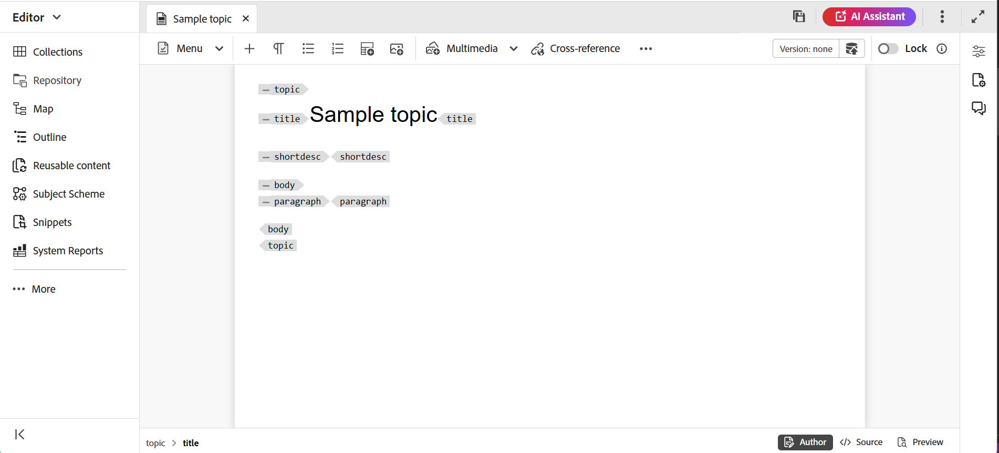

# Create topics {#id2056AL00O5Z}

Adobe Experience Manager Guides allows you to create DITA topics of type — topic, task, concept, reference, glossary, DITAVAL, Markdown and more. Apart from creating topics based on the out-of-the-box templates, you can also define your custom templates. These templates must be added to the folder profile to show up in the template selection Blueprint and the Editor.

>![NOTE]
>
> The Global and Folder profile configuration is only available to folder-level administrative users. For the details on setting up global and folder-level profiles, view *Configure authoring templates* in  Install and configure Adobe Experience Manager Guides for your setup.

There are two ways to create topics in Experience Manager Guides:

- [From the Editor](#create-topics-from-the-editor)
- [From the Assets UI](#create-topics-from-the-assets-ui)

## Create topics from the Editor

Perform the following steps to create a topic from the Editor:

1. In the Repository panel, select the **New file** icon and then select **New topic** from the dropdown menu. 

    {width="300" align="left"}

    You can also access this option from the [Experience Manager Guides Home page](./intro-home-page.md) and the options menu of a folder in the Respository view. 

2. The **New topic** dialog box is displayed.
    
3. In the **New topic** dialog box, provide the following details:
    - A Title for the topic.
    - \(Optional\)* The file name for the topic. The file name is auto-suggested based on the topic Title. In case your administrator has enabled automatic file names based on UUID setting, then you will not see the Name field.
    - A template on which the topic will be based. For example, for an out-of-the-box setup, you can choose from the Blank, Concept, DITAVAL, Reference, Task, Topic, Markdown, Glossary, and Troubleshooting templates. If your folder has a Folder Profile configured on it, then you will see only those topic templates that are configured on the Folder profile.
    - Path where you want to save the topic file. By default, the path of currently selected folder in the repository is shown in the Path field.
    
4. Select **Create**. The topic is created at the specified path. Also, the topic is opened in the Editor for editing.

    {width="300" align="left"}
    
5. Select **Create**. 
    
The map is created at the specified path. Also, the map is opened in the Map Editor for editing.

{width="800" align="left"}

## Create topics from the Assets UI 

Perform the following steps to create a topic from the Assets UI:

1.  In the Assets UI, navigate to the location where you want to create the topic.

1.  To create a new topic, select **Create** \> **DITA Topic**.

1.  On the Blueprint page, select the type of DITA document you want to create and select **Next**.

    {width="800" align="left"}

    By default, Experience Manager Guides provides the most commonly used DITA topics templates. You can configure more topic templates as per your organizational requirements, view *Configure authoring templates* in  Install and configure Adobe Experience Manager Guides for your setup.

    >[!NOTE]
    >
    > In the list view of Assets UI, the DITA topic type is shown in the Type column as Topic, Task, Concept, Reference, Glossentry, Markdown, or DITAVAL. The DITA map is shown as Map.

1.  On the Properties page, specify the document **Title**.

1.  \(Optional\) Specify the file **Name**.

    If your administrator has configured automatic file name based on UUID setting, then you will not see the option to specify the file name. A UUID-based file name is automatically assigned to the file.

    If the file naming option is available, then also the name is automatically suggested based on the **Title** of your document. If you want to manually specify the document name, then ensure that the **Name** does not contain any spaces, apostrophe, or braces and ends with .xml or.dita. By default, Experience Manager Guides replaces all special characters with hyphens. View the Filenames section in the Best practices guide for best practices around naming DITA files.

1.  Select **Create**. The Topic Created message appears.

    You can choose to open the topic for editing in the Editor, or the save the topic file in the Adobe Experience Manager repository.

**Additional information**

1. Every new topic that you create from the Assets UI **Create** \> **DITA Topic** or the Editor is assigned a unique topic ID. The value of this ID is the file name itself. Also, a new document is saved as the latest working copy of the topic in DAM. Until you save a revision of a newly created topic, you will not view any version number in the Version History. If you open the topic for editing, the version information is shown in the right top corner of the toolbar:

    {width="550" align="left"}

2. The version information for a newly created topic is shown as *none*. When you save a new version, then it is assigned a version number as 1.0. For more information about saving a new version, view [Save as new version](web-editor-features.md#save-as-new-version).

3. If your administrator has configured your Editor to lock files before editing, then you will not be able to edit a file until you lock it. Similarly, if configured, you will be asked to unlock any locked file before closing it.

4. Once you have created your DITA topic, keep saving the changes to your working copy and create a new version once you have completed the updates to your topic.

**Parent topic:**[Create and preview topics](create-preview-topics.md)
