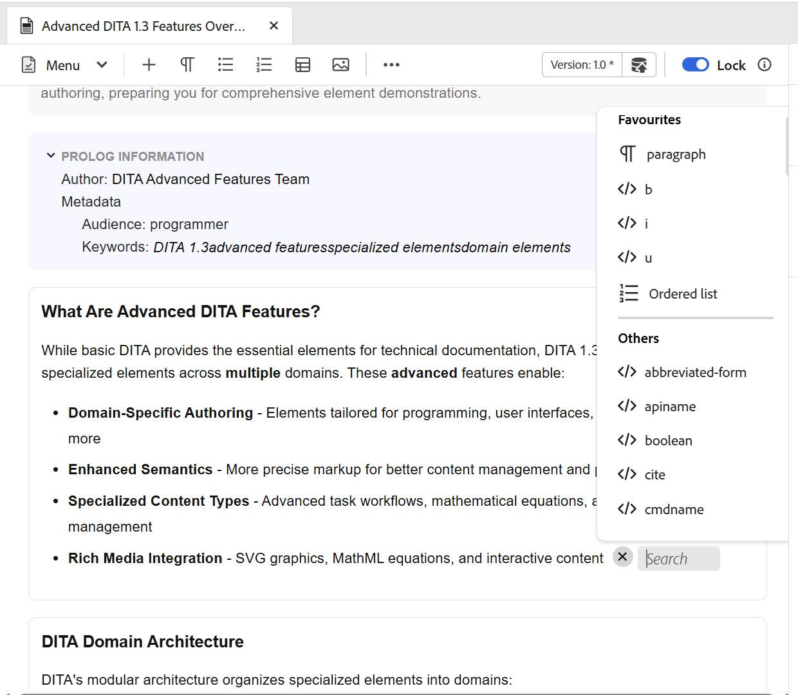
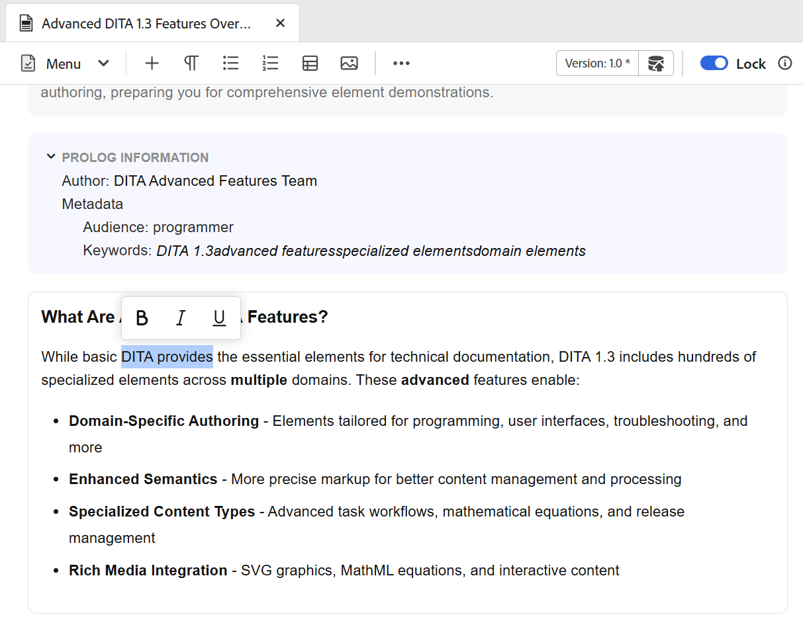
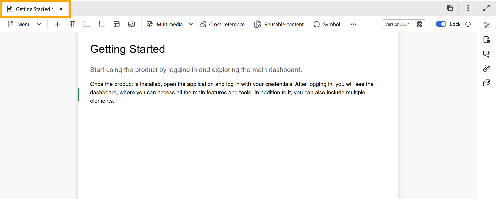
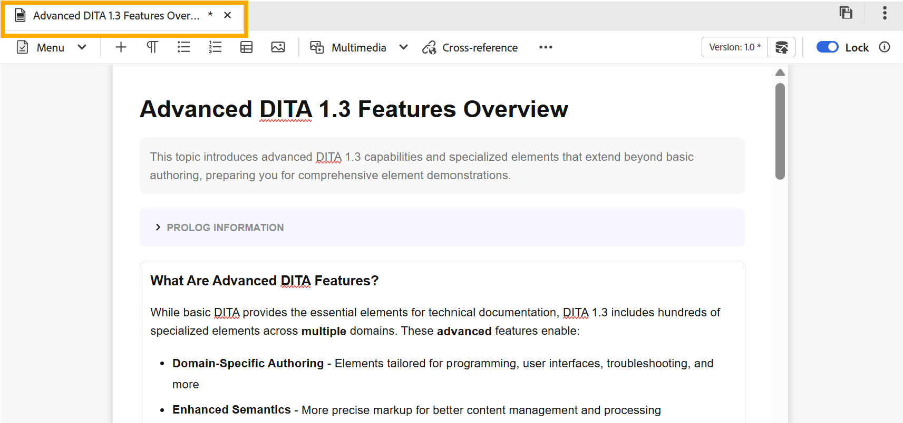

# Edit topics in the Editor {#id2056B040VUI}

The Editor comes with a range of editing features that let you easily create or modify your topic files. Broadly, you would perform the following steps to edit a topic in the Editor.

>[!IMPORTANT]
>
> If you encounter an application error while working on the Editor, refresh the page to continue working.

>[!BEGINTABS]

>[!TAB Classic Editor]

1.  To make changes in your topic, click within the text boundary of the required element and start making edits.

1.  To insert a specific element, move your cursor at the end of the element after which you want to insert the new element and select the required element icon in the toolbar. You can also use the keyboard shortcut `Alt+1` to invoke the **Insert Element** popup. 

     A list of element appears that can be used in the topic. Experience Manager Guides does an intelligent placing of elements as per their valid location in the topic.

    >[!NOTE]
    >
    > You can also choose which icon to be displayed in the toolbar by configuring the `ui_config.json` file located at - `/etc/designs/fmdita/clientlibs/xmleditor/`. For more information about customizing features, contact your system administrator.

1.  Once you have finished editing your document, select **Save all**.

    >[!NOTE]
    >
    > If you do not wish to commit changes into Adobe Experience Manager repository, select **Close**, and then select **Close without saving** in the Unsaved Changes dialog.

>[!TAB Editor 2.0] 

You can enable or disable this feature and configure favorite elements for insertion through the Editor settings. For details, view Editor settings.

1. To edit or insert an element in a topic, click within the text boundary of the required element to make changes, or place the cursor at the end of the element after which you want to add a new element and select the required element from the toolbar (or press Alt+1 to open the Insert Element popup), which intelligently lists and inserts only valid elements for that location in the topic.

1. Additionally you can use the **Quick insert menu**, an inline toolbar to quickly insert allowed elements at the cursor position. Select Control + / for Windows, Command + / for Mac to access the elements form the Quick Insert menu. 

    >[!NOTE]
    >
    >You can enable or disable this feature and configure favorite elements for insertion through the Editor settings. For details, view [Editor settings](./config-editor-settings.md).

1. Search for any new or choose from the favorites and insert the required element directly at the current cursor position.

    

>[!ENDTABS]

## Partial selection of content across elements

Experience Manager Guides also allows you to select content across elements. After selecting the content, you can perform the following operations:

- Formatting : Formatting selected content is significantly easier in Editor 2.0 compared to Editor 1.0, as illustrated below.

>[!BEGINTABS]

>[!TAB Classic Editor]

Make the selected content bold, italics, underline the selected content. The content from the valid open tags is then merged and appears under a single element. For example, you can select the content within a paragraph and extend the selection to another paragraph. Then, if you make the selected content bold, all the bold content from the open tags is merged and appears under a single paragraph element.

>[!TAB Editor 2.0]

You can format the selected content as bold, italics, or underline using the contextual menu. Select the content, then click the appropriate formatting icon in the menu that appears. Make the selected content bold, italics, or underline. The content from the valid open tags is then merged and appears under a single element.

>[!ENDTABS]

- Deletion:  If you delete the selected content, the remaining content after the deletion in the open tags is merged. 

- Surround the content with a valid element: Perform the following steps to wrap the content with a valid element:

    - Select the content within an element.
    - Select the  icon from the toolbar on the top to view the **Insert element** dialog box. The dialog box lists the valid elements for the selected content.

        >[!NOTE]
        >
        > You can also view the Insert element dialog box by selecting the context menu of the selected content.

    - Select an element from the dialog box. The selected content is wrapped under that element. For example, if you select the content in a paragraph and then choose the `<note>` element from the **Insert element** dialog box, the selected content appears under a note.  

        {width="300" align="left"}  

## Refresh browser while editing the files

Experience Manager Guides provides the support to refresh the browser while you edit your content in the Editor. This feature helps you continue editing content in case you encounter an application error while working. If you hit the browser refresh while one or more files with unsaved changes are opened for editing, you are warned that the unsaved changes may be lost. You are given an option to cancel the refresh operation and save your files to preserve your changes.

Even on refreshing the browser, the views of the left and the right panel are retained in the Editor. Experience Manager Guides restores the last saved state of the files opened in the Editor when you refresh the browser. For example, the files opened in the Repository panel are opened again. The map panel is retained along with the previously opened map.

The active topic or DITA map is reopened in the content editing area.

The right panel is also reopened and displays the same view as before the refresh.

## Working copy indicator

Experience Manager Guides provides the working copy indicator which shows whether the current \(working copy\) of file is in sync with the saved version or not. If you have made any changes to your current copy and have not saved your file, a \* mark appears along with the title on the topic's file tab. This indicator acts as a reminder to save your changes and disappears when you save your file.

>[!BEGINTABS]

>[!TAB Classic Editor]

This view displays how the content is rendered in the Classic Editor.

{width="550" align="left"}

>[!TAB Editor 2.0]

This view displays how the content is rendered in the Editor 2.0.

{width="550" align="left"}

>[!ENDTABS]

Experience Manager Guides also indicates if the last saved \(working\) copy of the file is in sync with the saved version or not. If you have some unsaved changes between the working copy and the last saved version, a \* mark appears along with the version information shown in the right top corner of the topic's file tab. This indicator acts as a reminder to save and create a version from your current \(working\) copy of the file.

>[!NOTE]
>
> Any changes to the metadata fields available under [File properties](./web-editor-right-panel.md#file-properties) or applied at the backend will also trigger the asterisk `(*)` on the document version.  To prevent system-generated metadata updates from affecting this indicator, administrators can configure an ignore list for metadata properties. For details on how to configure metadata properties, view [Configure the ignore list of metadata properties](../install-conf-guide/conf-metadata-prop.md).

{width="550" align="left"}

## Access locked files in Author and Source modes

When a DITA or Markdown file is locked or checked out by another user, editing or modifying the content is not possible. However, you can still view the file in a read-only format in both the **Author** and **Source** modes, in addition to the **Preview** mode.

In the read-only mode, you have the ability to view the content, tags, and attributes within the **Author** or **Source** modes. You can also modify the file properties.

>[!NOTE]
>
> As an administrator, you get access to the **Force unlock** feature that allows you to unlock a file that's locked by someone else. 

<!-- This is no more available -->
<!--
The toolbar displays the following icons for read-only access:

- Toggle Tags view
- Version History
- Version Label

Experience Manager Guides also displays a **Read only access** indicator near the version number.
 

You can access the **Layout** view for read-only DITA maps. This view lets you see the DITA map and its properties but prevents edits.

>[!NOTE]
>
> Your folder-level administrative users must update *ui_config.json* so that you can harmoniously access the read-only files in the  Author, Source, and Layout modes.

 -->

## Locate an open file in the Explorer

While you open a file in the Editor, Experience Manager Guides provides the feature to locate the file in the Explorer. For example, it locates the current topic while you are editing it. 
   
You can turn off the feature to locate the file with the **Always locate files in the Explorer** option from the **Appearance** tab of the **User preferences**. 

>[!NOTE]
>
>From 2025.11.0 release, the setting **Always locate files in the repository** is renamed to **Always locate files in the explorer**. For On-Premise setup, it continues to be available as Always locate files in the repository till 5.1 release of Experience Manager Guides.

**Parent topic:**[Work with the Editor](web-editor.md)
