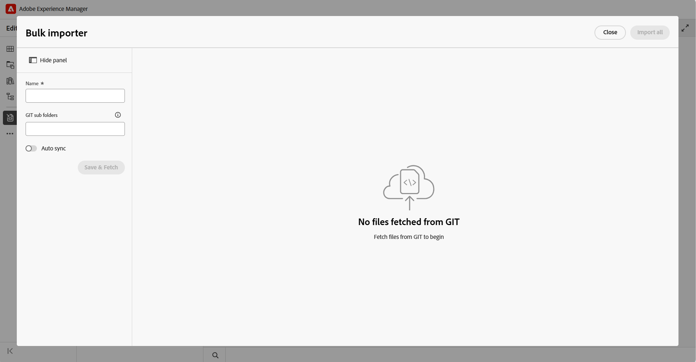
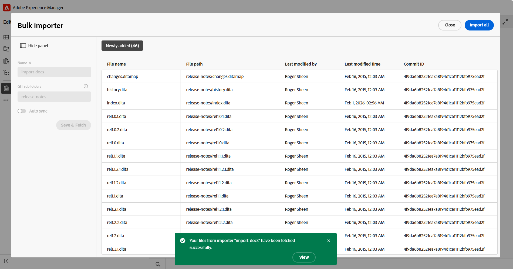
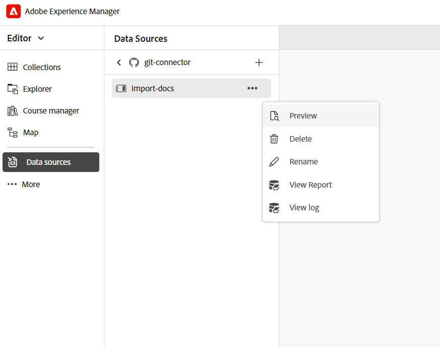
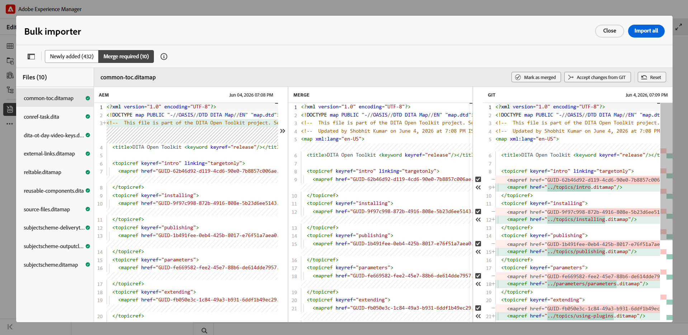
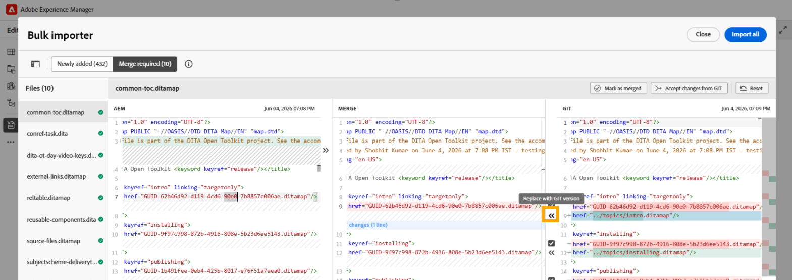
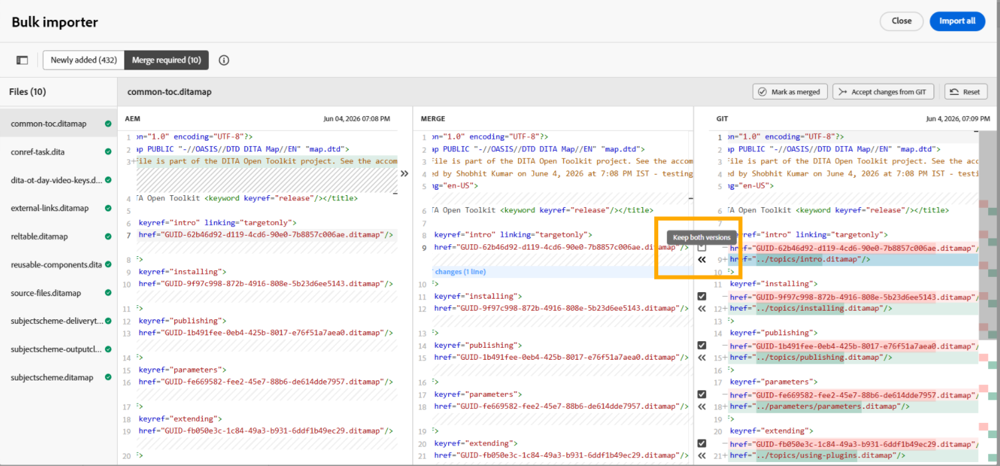
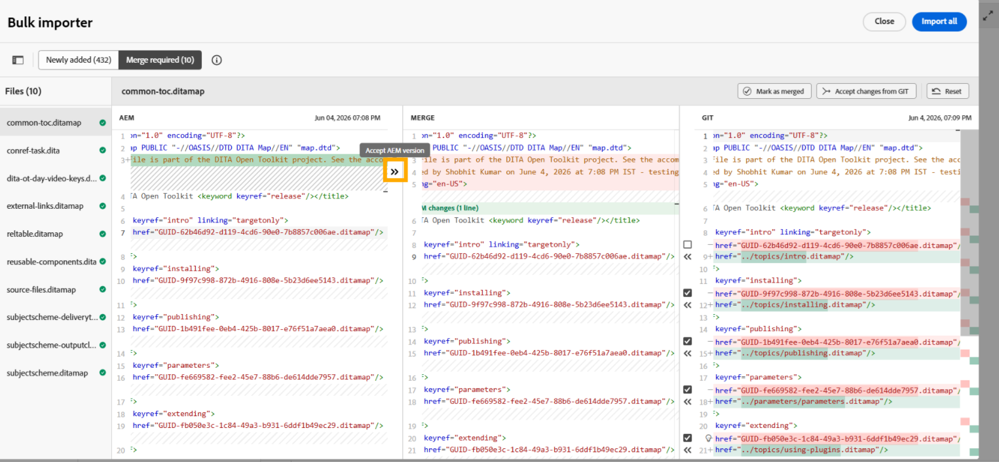
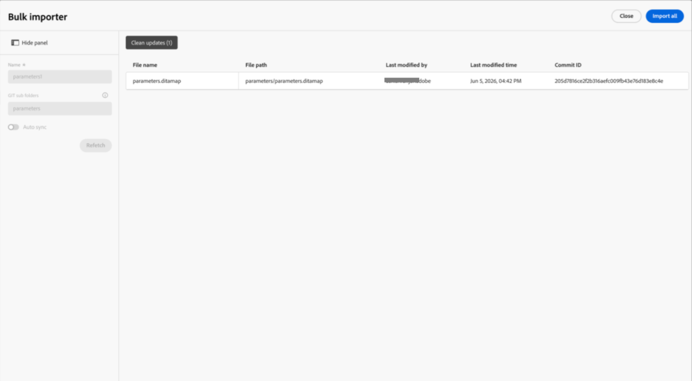

# Import content using Git Connector (Beta)

>[!IMPORTANT]
>
> Git Connector is currently available as a Beta feature, and is disabled by default. Please contact the Customer Success team to enable the feature. 

Git Connector allows you to import content from connected Git repositories into Experience Manager Guides. After the content is imported, you can use Experience Manager Guides authoring, review, translation, and publishing features to develop and deliver documentation.

When content changes in the source repository, you can refetch updates, review conflicts, and synchronize the latest changes with Experience Manager Guides.

## Prerequisites

Before you start using this feature, ensure that:

- Git Connector feature must be enabled for your environment. 
- (*If enabled*) Your Administrator has configured the Git Connector in your environment. For details, view [Create and configure Git Connector from the user interface](../install-conf-guide/conf-git-connector.md). 
- You have *Read* access to the Git repository that contains the content you want to import.
- You know which repository branch and source folder you want to import.
- You know the target folder in Experience Manager Guides where the imported content will be stored.

## Import content from the connected Git repository

After your administrator configures the Git Connector, you can use it from the Editor to start importing content from a Git repository.  Perform the following steps to import content from a Git repository:

1. In the Editor, open the left panel.
1. Select **Data sources**.

    The connected data sources are displayed. 

1. Select the **Git Connector** tile that your Administrator configured. 

1. Select the + icon and then select **Bulk importer**.  

    The **Bulk importer** dialog is displayed. 

    

1. In the **Bulk importer** dialog, provide a name for the import, select a sub folder from your configured Git repository, and select **Save and Fetch**.  The list of files available for import is displayed in the dialog. Review the list and validate the content before you continue.

    

1. After reviewing the files, select **Import all** to import the content into Experience Manager Guides. 

  >[!NOTE]
  >
  > You can enable **Auto Sync** to automatically synchronize and import content from your Git repository into Experience Manager Guides. If conflicts are detected during synchronization, Auto Sync is paused and the conflict-resolution workflow is triggered, requiring you to review and resolve the conflicts before synchronization can continue. Once enabled, Auto Sync cannot be disabled for the importer.

After the content is imported, it is stored under the **Target AEM root path** configured by your Administrator when setting up the Git Connector.

## Manage Git-imported content

Once content is imported into Experience Manager Guides, you can use the available actions to manage the content and keep it synchronized with changes in the source repository.

{width="600"}

- **Preview**: Preview imported content. If the source repository contains updates, review the differences and use the **Refetch** option to import the latest changes. 
- **Delete**: Remove imported content that is no longer required.
- **Rename**: Rename imported content for easier identification.
- **View log**: View the import log to review details of the import operation.
- **View reports**: View and download the **Bulk import report**, which includes details such as:

    - total number of imported files
    - number of successful imports
    - number of failed imports 

  You can also download the detailed report. If some files fail to import, use **Retry failed imports** to try importing them again.

## Review and resolve content conflicts

When you re-fetch content from a Git repository, differences in the content between the repository version and the corresponding content available in Experience Manager Guides are displayed as conflicts. You must resolve and merge such conflicts before importing the data into Experience Manager Guides. 

Perform the following steps to resolve and merge conflicts:  

1. Open the Bulk importer dialog and select **Refetch**.
1. If conflicts are detected, the **Merge required** tab appears and lists the files that contain conflicts. Select the **Merge required** tab, and then select a file from the list to review and resolve the conflicts.
1. Review the content in the following sections:

    {width="600"}

    - In the **AEM** section, the current version of the content present in Experience Manager Guides is displayed. 
    - In the **Git** section, the latest version of the content from the repository is displayed.
    - In the **Merge** section, the merged content is displayed.

1. Review the differences highlighted in the editor and resolve the conflicts using the merge controls:

  - If you want to use the latest changes from the Git repository, ensure that the checkbox for the conflict in the **Git** section is selected, and then select the corresponding `<<<` control. The selected Git content replaces the conflicting content in the **Merge** section.
  
    {width="600"}

  - If you want to keep content from both versions, clear the checkbox for the conflict and then use the `<<<` control to add the required content to the **Merge** section without replacing the existing content.

    {width="600"}

  - Similarly, you can use the `>>>` control in the AEM section to keep the version currently available in Experience Manager Guides.

    {width="600"}

1. After reviewing the merged content, perform one of the following actions:

  - Use **Accept changes from Git** when the repository version should replace the conflicting content.
  - Use **Mark as merged** after reviewing and updating the merged version to ensure it contains the content you want to keep.
  - Use **Reset** to discard all merged updates and restore the content to its original state. This allows you to restart the merge process before selecting **Mark as merged**.

After all files containing the conflicts are marked as merged, the **Import all** button is enabled. Select **Import all** to complete the process of resolving conflicts.

If the repository contains entirely new content, such as a new topic, paragraph, or line that does not conflict with existing content, it is displayed under **Clean updates**. These updates do not require conflict resolution and can be imported directly.

  {width="600"}

