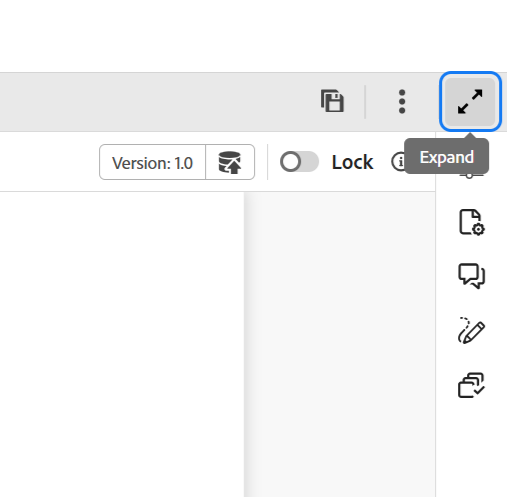

# Header bar in the Editor 

The header bar is the top bar of the Editor that displays the Adobe Experience Manager logo (or a Unified Shell if you are using the Unified Shell as your Experience Manager Guides UI). When you select the logo, it directs you to the Experience Manager Navigation page.

{align="left"}

Use the **Expand** icon in the toolbar to hide the header bar and maximize the content area. To restore the standard view, select **Exit the expanded view**.

{width="350" align="left"}

**Parent topic:**[Introduction to the Editor](web-editor.md)
