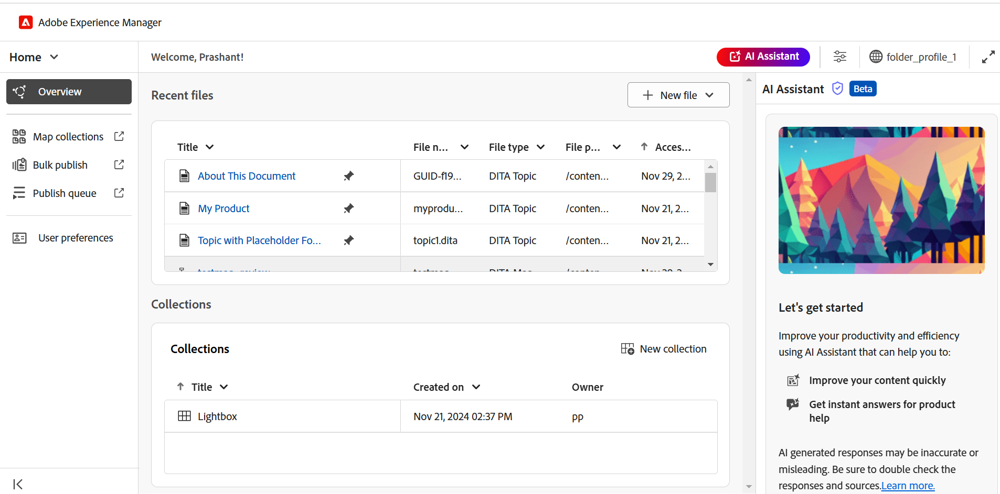
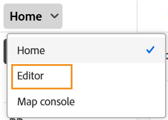
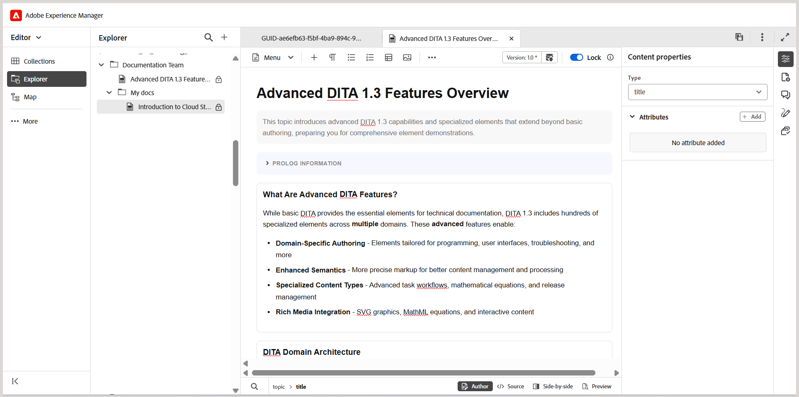
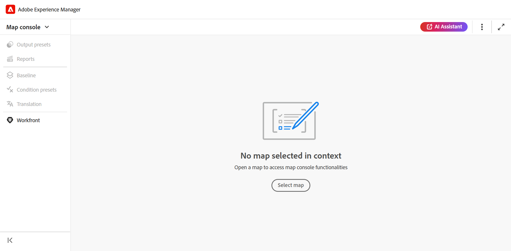
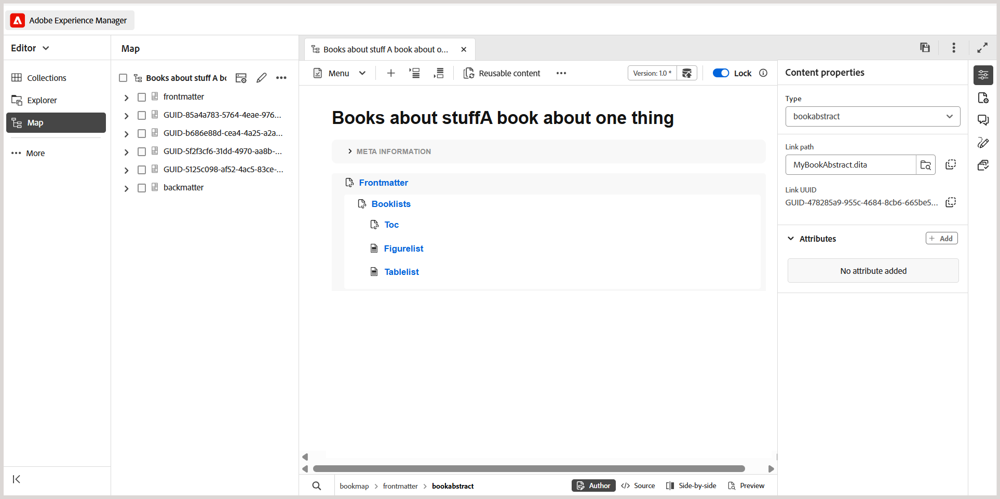

# Launch the Editor {#id2056B0140HS}

>[!INFO]
>
> This topic applies to both New Editor and Old Editor. While the core functionality remains consistent, differences in the user interface, terminology, and interactions are indicated within the content using tabs and callouts where applicable.

You can launch the Editor from the following locations:

- [Adobe Experience Manager Navigation page](#adobe-experience-manager-navigation-page)
- [Adobe Experience Manager Assets UI](#adobe-experience-manager-assets-ui)
- [Map console](#map-console)

The following sections cover the details of how you can access and launch the Editor from various locations.

## Adobe Experience Manager Navigation page 

When you log into Experience Manager, you are shown the Navigation page:

Selecting the **Guides** link takes you to the [Adobe Experience Manager Guides Home page](./intro-home-page.md).

To launch the Editor, go to the navigation bar, and then select **Editor** from the dropdown. The Home page is selected by default.

{width="350"}

As you have launched the Editor without selecting any file, a blank Editor screen is shown. You can open a file for editing from Experience Manager **Repository** or your **Collections**.

Alternatively, you can also launch the Editor by opening the existing files present in the **Recent files** widget and **Collections** widget of [Adobe Experience Manager Guides Home page experience](./intro-home-page.md).

To go back to the Experience Manager Navigation page, select the Adobe Experience Manager logo located at the top-left corner of the top header. 

## Adobe Experience Manager Assets UI 

Another location from where you can launch the Editor is from the Experience Manager Assets UI. You can select one or more topics and open them directly in the Editor. 

To open a topic in the Editor, follow these steps:

1.  In the Assets UI, navigate to the topic that you want to edit.

    >[!NOTE]
    >
    > You can also view the UUID of the topic.

    

    >[!IMPORTANT]
    >
    > Ensure that you have the read and write permissions on the folder that contains the topic you want to edit.

1.  To get an exclusive lock on the topic, select the topic and select **Checkout**.

    >[!IMPORTANT]
    >
    > If your administrator has configured the **Disable edit without locking the file** option, then you must check out the file before editing. If you do not check out the file, you will not be able to view the edit option.

1.  Close the asset selection mode and select the topic that you want to edit.

    The topic's preview is displayed.

    You can open the Editor from the List view, Card view, and the Preview mode.

    >[!IMPORTANT]
    >
    > If you want to open multiple topics for editing, select the desired topics from the Asset UI and select **Edit**. Ensure that your browser does not have a pop-up blocker enabled, else only the first topic in the selected list is opened for editing.

    

    If you do not want to preview a topic and want to open it directly in the Editor, then select the **Edit** icon in the quick action menu from the card view:

    

The topic opens in the Editor.

>[!BEGINTABS]

>[!TAB New Editor ]
    
This view displays how the content is rendered in New Editor

>[!TAB Old Editor]

This view displays how the content is rendered in the Old Editor

>[!ENDTABS] 

You can also open a map file in the Assets UI and launch the Editor to edit the topics in the map file.  

To open a map in the Editor, follow these steps:

1. In the Assets UI, navigate to and select the map file that contains the topic you want to edit. 
1. In the DITA map console, navigate to the **Topics** tab. A list of topics in the map file is displayed. 
1. Select the topic file that you want to edit.
1. Select **Edit Topic**.

    

1. The topic opens in the Editor.

    >[!IMPORTANT]
    >
    > If your administrator has configured the **Disable edit without locking the file** option, then you must check out the file before editing. If you do not check out the file, then the document opens in the editor in read-only mode.

## Map console 

To open the Editor from the Map console, follow these steps:

1. Open the Home page and launch Map console. 

    {width="350"}

    As you have launched the Map console without selecting any map file, a blank Map console screen is shown. You can also open a map file from Experience Manager **Repository** or your **Collections**.

    {width="500"}

1. Choose **Select map** to open a map file containing the topics that you want to edit in the Editor.
1. Select the path where your map file is located. The selected map file is added to the Map console. 
1. Navigate to the map file and select **Open in editor** from the dropdown. 

    

The map file containing the topics is open for editing in the Editor.

>[!BEGINTABS]

>[!TAB New Editor ]
    
Map edit mode in the New Editor:

>[!TAB Old Editor]

Map edit mode in the Old Editor:

>[!ENDTABS]

    
**Parent topic**: [Introduction to the Editor](web-editor.md)
