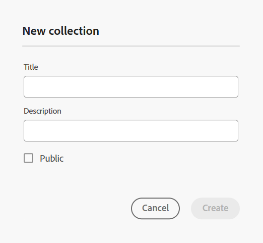
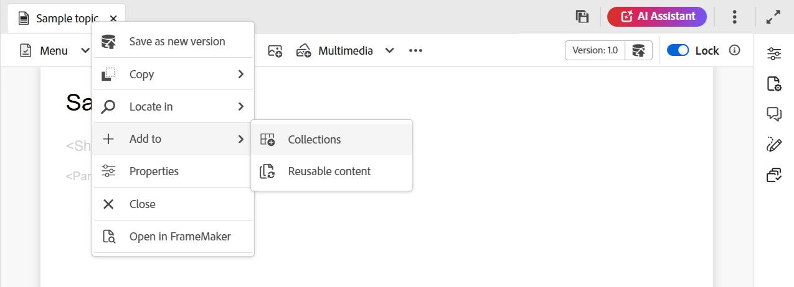
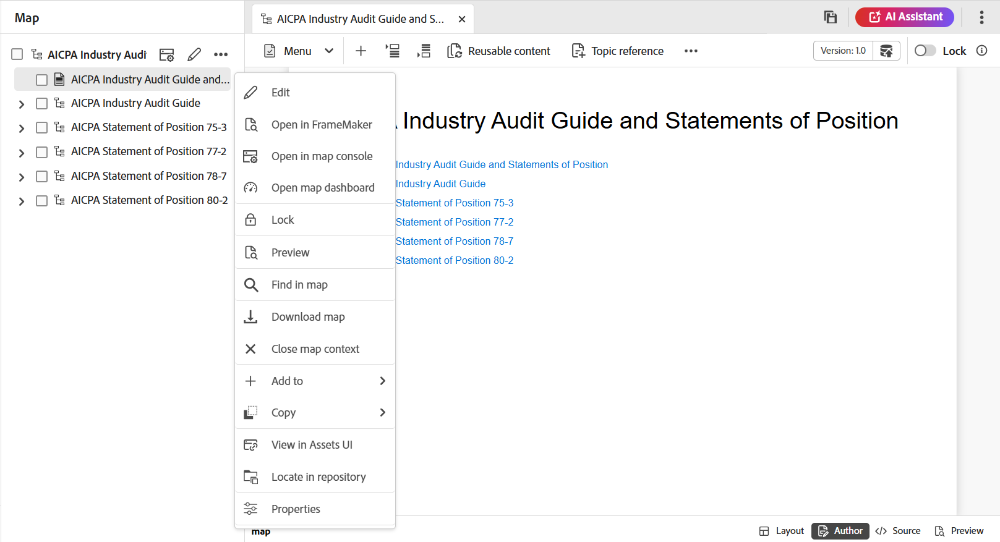
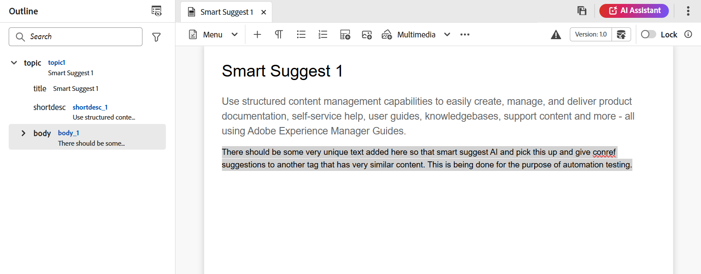
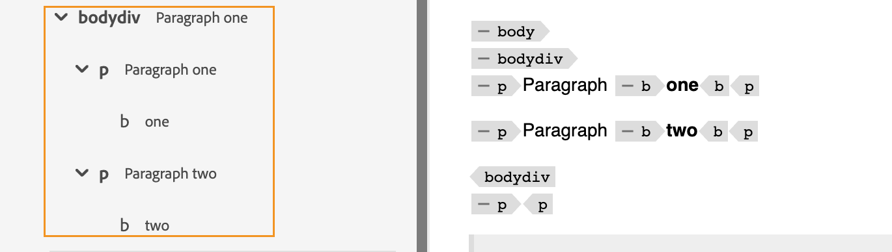
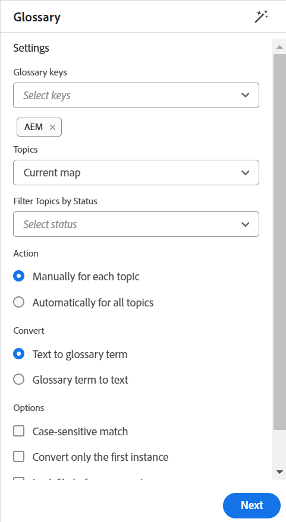
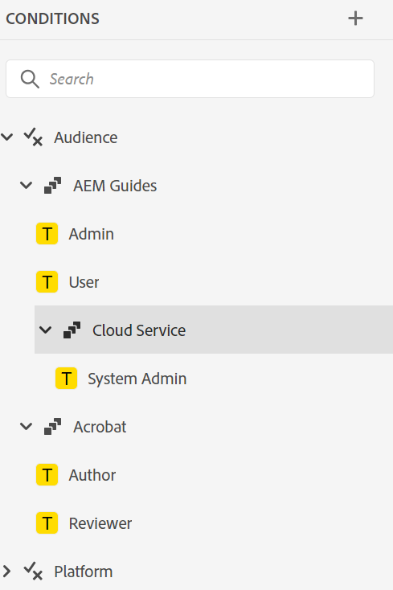
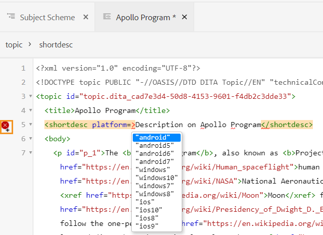
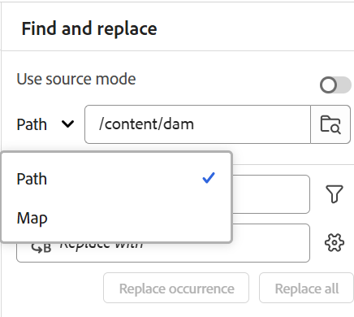
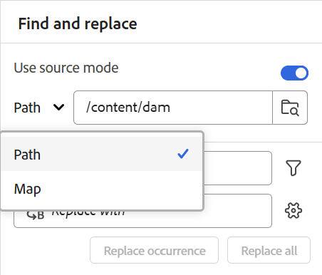

# Left panel in the Editor 

The left panel gives you quick access to Collections, Repository view, Map view, and more features. You can expand the panel by selecting the **Expand** icon placed at the bottom-left corner of the interface. Once expanded, use the **Collapse** icon to collapse the panel. In the expanded view, it displays the names of the icons which appear as tooltips in the collapsed view.

>[!NOTE]
>
>The left panel is resizable. To resize the panel, bring the cursor on the panel boundary, the cursor changes to a double-headed arrow, select and drag to resize the panel width.

The left panel gives you access to the following features:

- [Collections](#collections)
- [Repository](#repository)
- [Explorer](#explorer)
- [Map](#map)
- [Reusable content](#reusable-content)
- [Outline](#outline)

Some of the features in the left panel are available under the **More** section. Select the More icon  to access the below features: 

- [Glossary](#glossary)
- [Conditions](#conditions)
- [Subject scheme](#subject-scheme)
- [Snippets](#snippets)
- [Templates](#templates)
- [Citations](#citations)
- [Language variables](#language-variables)
- [Variables](#variables)
- [Find and replace](#find-and-replace)
- [PDF templates](#pdf-templates)
- [Review](#review)


An additional option labeled as **Workfront** is also displayed in the left panel if Adobe Workfront is configured. 

For details, view [Workfront integration](./workfront-integration.md).

>[!NOTE]
>
> The features available in the left panel are managed by your administrator, allowing them to enable or disable the individual features present in the left panel. Only enabled features are displayed in the left panel. For more details, view the **Panels** section of [Tab bar](./web-editor-tab-bar.md). 

The detailed explanation of the left panel features is as follows:

## Collections 

If you work on a set of files or folders, you can add them to your favorite list to access them quickly. **Collections** show the list of documents that you have added and other publicly accessible list of documents from the other users.

By default, you can view the files by titles. As you hover over a file, you can view the file title and the file path as a tooltip.

>[!NOTE]
>
> As an administrator, you can also choose to view the list of files by filenames in the Editor. Select the **File name** option of the **Editor files display configuration** section in **User preferences**. 

<details>
    <summary> Create a new collection </summary>


To create a new collection, Select the + icon next to Collections panel to bring up the **New collection** dialog box:

{width="300" align="left"}

Enter a title and description for the collection that you want to create. If you select **Public**, then this favorite is shown to other users as well.

>[!NOTE]
>
> You can also create a collection from the Experience Manager Guides Home page. Open the home page, navigate to the **Collections** widget in the [Overview section](./intro-home-page.md#overview), and select **New collection**.  

</details>

<details>
    <summary> Add a file to collections </summary>


To add a file to collections, use any of the following methods:

- Navigate to the required file or folder in the Repository view, select the *Options* icon to open the context menu, and choose **Add to** > **Collections**. In the **Add to collections** dialog box, you can choose to add the file/folder to an existing favorite or create a new one.

    {width="300" align="left"}

- Right-click on a file's tab in the editor to open the context menu. Choose **Add to** > **Collections** to add the file to your favorites list.

    {align="left"}
 

>[!NOTE]
>
> - To remove an item from the favorites list, select the Options icon next to the item in a Favorites collection and choose **Remove from collections**.
> - To preview the file without opening it, select a file and then select **Preview** from the Options menu. 

</details>

**Options menu for a collection**  

You can also perform many actions using the Options menu available for a Collection: 

{width="650" align="left"}

- **Rename**: Rename the selected collection. 
- **Delete**: Delete the selected collection.  
- **Refresh**: Get a fresh list of files and folders from the Repository. 
- **View in Assets UI**: Show the file or folder contents in the Assets UI. 

>[!NOTE]
>
> You can refresh the list using the **Refresh** icon at the top. Additionally refreshing the list reloads the collections, and as a result, any expanded collections in the panel gets collapsed.


## Repository 

>[!NOTE]
>
> Starting with 2025.11.0 release, **Repository** in the Editor will be deprecated and replaced by **Explorer** for **Cloud service** setup. For **On-Premise** setup, you will continue to view and use Repository through the Editor interface till 5.1 release of Experience Manager Guides. 

When you select the Repository icon, you get a list of files and folders available in DAM. By default, you can view the files by titles. As you hover over a file, you can view the file title and the file name as a tooltip.   

>[!NOTE]
>
> As an administrator, you can also choose to view the list of files by filenames in the Editor. Select the **File name** option of the **Editor files display configuration** section in **User preferences**.

75 files are loaded at a time. Each time you select **Load more**… 75 files are loaded, and the button stops being displayed when all the files have been listed. This batch loading is efficient, and you can access the files faster in comparison to loading all the files existing in a folder.

You can easily navigate to the required file within DAM and open it in the Editor. If you have the required access to edit the file, then you can do so.

You can also select and play an audio or video file in the Editor. You can change the volume or
the view of the video. In the shortcut menu you also have the options to download, change playback
speed, or view picture in picture.

Select a map and press Enter or double-click to open it in the **Map view**. For more details, view the **Map view** feature description in the left panel. Select a topic and press Enter or double-click to open it in the [Content editing area](./web-editor-content-editing-area.md). Being able to navigate and open a file directly from the Editor saves time and increases productivity. 

## Filter Search in Repository

The Editor provides enhanced filters for searching text. You can search and filter for a text in the files present on the selected path of the Adobe Experience Manager repository. It searches in the title, filename, and content in the files.


{width="300" align="left"}

*Apply filters to search for the files containing the text `personal spaceship.`* 

 Select the **Filter Search** \(\) icon to open the Filter pop-up. 

>[!NOTE]
>
> When you search any text or filter any files, a blue dot appears on the **Filter Search**  \(\) icon to indicate that we are on the search panel and that some filters have been applied.


You have the following options to filter the files and to narrow down your search in the Adobe Experience Manager repository:

- **DITA Files**: You can look for all **DITA Topics**, and **DITA Maps** present on the selected path. These are selected by default. 
- **Non-DITA Files**: You can search for **Ditaval Files**,  **Image Files**, **Multimedia**, **Documents**, and **JSON** in the selected path.

     {width="300" align="left"}

    *Use the quick filters to search for DITA and Non-DITA files.*

>[!NOTE]
>
> You can also use the **DITA Topic** filter to search for content specific to Markdown files in the repository, including titles, topic content, and properties. This feature currently applies only to newly created Markdown files.

**Advanced filtering**

Select the **Advanced filtering** icon to view the **Advanced filter** dialog box. 

You can view the following options under the **General** and **Advanced** tabs.  

 {width="650" align="left"}


**General**

- **Search results with**: Search for some text in the files present on the selected path of the Adobe Experience Manager repository. The text is searched in the title, filename, and content in the files.

This is in sync with the search box on the repository window. For example, if you type `general purpose` in the search box on the repository panel, it also appears in the **Advanced filter** dialog box and vice versa.

- **Search in**: Select the path where you want to search the files present in the Adobe Experience Manager repository. 
- **DITA Files**: You can look for all **DITA Topics**, and **DITA Maps** present on the selected path. These are selected by default. 
- **Non-DITA Files**: You can search for **Ditaval Files**,  **Image Files**, **Multimedia**, **Documents**, and **JSON** in the selected path.
- **Locked by**: Displays a list of users. The list is paginated and loads asynchronously, showing a limited set of users at a time and fetching more as you scroll or navigate. This improves loading speed and overall performance, especially when working with a large number of users.
- **Modified after** / **Modified before**: Filter content based on modification date. Select a date range from the calendar or choose one of the following time frame options: 
    - In last two hours
    - In last week
    - In last month
    - In last year
- **Tags**: Filter content based on tags. 

**Advanced**

- **DITA Elements**: You can also search for specific values in the attributes of the specified DITA elements. 
    - Select **Add element** to add the elements, attributes, and values.  
    - Apply the filters that you have selected. 

- Select **Clear all** to clear all the applied filters. 


- Select the **Close filter**  icon to close the filter and return to the tree view of the repository.

    >[!NOTE]
    >
    >Your system administrator can also configure the text filters and show or hide other filters. For more details, view *Configure text filters* section in the Install and configure Adobe Experience Manager Guides as a Cloud Service.
    >
    >The list of filtered files that contain the searched text is displayed. For example, the files containing the text `personal spaceship` are listed in the previous screenshot. You can select multiple files from the filtered list to drag and drop them into a map opened for editing.

### Options menu

In addition to opening files from the left panel, you can also perform many actions using the Options menu available in the Repository view. You will view different options, depending on whether you choose a folder, topic file, or a media file.

**Options for a folder**

You can perform the following actions using the Options menu available for a *folder* in the Repository view:

{width="550" align="left"}


- **New**: Create a new DITA topic, DITA map, or a folder. 

<details>
    <summary> Steps to create a new topic </summary>

Steps to create a new topic:

   1. Select **New** > **Topic**.
   1. The **New topic** dialog box is displayed.
    
        {width="300" align="left"}

   1. In the **New topic** dialog box, provide the following details:
        - A Title for the topic.
        - \(Optional\)* The file name for the topic. The file name is auto-suggested based on the topic Title. In case your administrator has enabled automatic file names based on UUID setting, then you will not view the Name field.
        - A template on which the topic will be based. For example, for an out-of-the-box setup, you can choose from the Blank, Concept, DITAVAL, Reference, Task, Topic, Markdown, Glossary, and Troubleshooting templates. If your folder has a Folder Profile configured on it, then you will view only those topic templates that are configured on the Folder profile.

        - Path where you want to save the topic file. By default, the path of currently selected folder in the repository is shown in the Path field.    
    1. Select **Create**. The topic is created at the specified path. Also, the topic is opened in the Editor for editing.

</details>

<details>
<summary> Steps to create a new DITA map </summary>


Steps to create a new DITA map:

   1. Select **New** > **DITA map**.
   2. The **New map** dialog box is displayed.
    
        {width="300" align="left"}

   3. In the **New map** dialog box, provide the following details:
        - A Title for the map.
        - *\(Optional\)* The file name for the map. The file name is auto-suggested based on the map title. In case your administrator has enabled automatic file names based on UUID setting, then you will not view the Name field.
        - A template on which the map will be based. For example, for an out-of-the-box setup, you can choose from the Bookmap or DITA map templates.
        - Path where you want to save the map file. By default, the path of currently selected folder in the repository is shown in the Path field.
   4. Select **Create**. The map is created and added within the folder specified in the Path field. Also, the map is opened in the Map view. You can open the map file in the Map Editor and add topic to it. For more information about adding topics to a map file, view [Create a map](map-editor-create-map.md#). Alternatively, select **Open in map console** to open the map in Map console.
</details>

<details>
<summary> Steps to create a new folder </summary>

Steps to create a new folder:

   1. Select **New** > **Folder**.
   2. The **New folder** dialog box is displayed.
    
        {width="300" align="left"}

   3. In the **New folder** dialog box, provide the following details:
        - A Title for the folder, which is auto-converted into the folder name.
        - Path where you want to save the folder. By default, the path of currently selected folder in the repository is shown in the Path field. 
   4. Select **Create**. The folder is created and added within the folder from where the create folder option was executed.

   </details>

- **Upload assets**: Upload a file from your local system to the selected folder in Adobe Experience Manager repository. You can also drag-and-drop files from your local system onto your current working topic. This is very useful if you want to insert images from your local system into your topic.

    {width="300" align="left"}

    You can select a folder where you want to upload the file and a preview of the image is also shown. If you want to rename the file, you can do so in the file name text box. Select **Upload** to complete the file upload process. If you have dragged and dropped an image file on a topic, then the image file is added in the article, and it is also uploaded.

    If your administrator has enabled the UUIDs option in *XMLEditorConfig*, then you will view the UUID of the uploaded image in the **Source** property.

    {   align="left"}

    After a successful upload, the following confirmation dialog is displayed:

    

    <details>

    <summary>Handling invalid characters in file names</summary>

    If the file name of the asset being uploaded contains invalid characters (such as * / : [ \ ] | # % { } ?), the following scenarios may occur:

    - **Partial Upload**: Indicates one or more assets being uploaded contain invalid characters in their file names. 

        

    - **Upload Failed** : Indicates all assets being uploaded contain invalid characters in their file names.

        

    To resolve these conflicts, remove any invalid characters from the file names of the assets and then re-upload them to the repository.

    </details>
    
- **Refresh**: Get a fresh list of files and folders from the repository.
- **Collapse**: Collapse the selected folder in the repository.

    >[!NOTE]
    >
    > Use the **\>** icon next to a folder to expand it.

- **Find files in folder**: Shifts the focus to repository search wherein you can enter the search term. The search is performed under the selected folder in the repository. You can also apply a filter to return DITA Files, Image Files, or both.

    {width="300" align="left"}

    You can also search using the UUID of a file. In that case, the search results display the title of the DITA/XML file and in case of the file is an image file, then the UUID of the file is displayed. In the following search example, the UUID of an image file is searched and the search results display the UUID of the original image file and the topic title of the file where that image is referenced.

    {width="300" align="left"}

- **Add to collections**: Adds the selected folder to favorites. You can choose to add it to an existing or new collection.

- **Reprocess assets**: Triggers the processing of all the assets for the folder. 
- **View in Assets UI**: Show the folder contents in the Assets UI.

**Options for a file**

Get access to different options in the Options menu depending on whether you select a media file or a DITA file. Some common options available for both media and DITA files are:

- Edit
- Open in FrameMaker 
- Duplicate
- Lock/unlock
- Preview
- Move to
- Rename
- Delete
- Generate 
- Download as PDF
- Add to 
- Copy
- Reprocess assets
- View in Assets UI
- Properties


{width="550" align="left"}

The various options in the Options menu are explained below:

- **Edit**: Open the file for editing. In case of a .ditamap/.bookmap file, it is opened in the [Map Editor](map-editor-advanced-map-editor.md#) for editing.

-  **Edit in Oxygen**: Select this option to edit the selected file in the Oxygen connector plugin. The file is opened for editing.

    >[!NOTE] 
    >
    >Contact your customer success team to get this feature enabled in the environment. This isn't enabled as a part of the out-of-the-box support. For more details, view the [Configure the option to edit in Oxygen ](../cs-install-guide/conf-edit-in-oxygen.md) section in the Installation and Configuration Guide.

- **Open in map dashboard**: In case the selected file is a DITA map, then this option opens the map dashboard.

- **Open in map console**: In case the selected file is a DITA map, then this option opens the map console.    

- **Lock**: Get a lock on the selected file for editing. If the file is locked, hovering the mouse pointer over the lock icon shows **Locked by you** if you locked it, or **Locked by [username]** if another user has locked it.   

- **Preview**: Get a quick preview of the file (.dita, .xml, audio, video, or image) without opening it. You can resize the preview pane. If the content contains any `<xref>` or `<conref>`, you can select it to open it in a new tab. The title of the file appears in the window. If no title is present, then the filename appears. To close the **Preview** panel, you can either select the close icon or select anywhere outside the pane.  

    {   align="left"}


- **Duplicate**: Use this option to create a duplicate or a copy of the selected file. You also have the option to rename the duplicate file in the Duplicate Asset prompt. By default, the file is created with a suffix \(like filename\_1.extension\). The title of the file remains same as the source file and the new file begins with version 1.0. All references, tags, and metadata are copied while the baselines are not copied in the duplicate file.

-  **Move to**: Use this option to move the selected file to another folder.  
   - You can either type the name of the destination folder or choose **Select Path** to select the destination folder.    
   - You can move a file of any type to any destination within the Content folder. 
   - Two files cannot have the same name. So, you cannot move a file to a folder where a file with the same name already exists.  

    If you try to move a file to a folder where a file with the same name but a different title exists, the Rename and move file dialog is displayed, and you need to rename the file before moving it. The moved file in the destination folder has the new file name.  

    {width="550" align="left"}

    >[!NOTE]
    >
    > You can also drag and drop a file to another destination folder. 

    **Exclusion scenarios**   

    Experience Manager Guides doesn't allow you to rename or move a file in the following scenarios: 

    - You cannot move or rename a file if it's part of a review or a translation workflow. 

    - If any other user locks the file, you cannot rename or move it, you will not view the Rename or Move to option for the file. 

    >[!NOTE]
    >
    > If your administrator has given you the permissions on a folder, only then the **Rename** or **Move to** options are displayed. 

    <details>
    <summary> Cloud Services </summary>

    Renaming or moving any file does not break any existing references from or to the file, as every file has a unique UUID. 
    </details>

- **Rename**: Use this option to rename the selected file. Enter the name of the new file in the **Rename Asset** dialog.  
    - You can rename a file of any type. 
    - You can't change the extension of a file. 
    - Two files cannot have the same name. So, you cannot rename a file to a name that already exists. An error is displayed.    

- **Delete**: Use this option to delete the selected file. A confirmation prompt is displayed before deleting the file.

    - A confirmation prompt is displayed before deleting the file.
    - If the file is not referenced from any other file, it is deleted, and a success message is displayed.
    - If the file is locked, you cannot delete it, and an error message is displayed.

        >[!NOTE]
        >
        > If your administrator has prevented the deletion of locked files, only then the error message is displayed. For more details, view *Prevent deletion of checked out files* section in the Install and configure Adobe Experience Manager Guides as a Cloud Service.

    - If the file is added to a collection, the **Force Delete** dialog box is displayed, and you can forcefully delete it.
    - If the file is referenced from any other file then **Force Delete** dialog with the confirmation message is displayed, and you can forcefully delete the file:

        {width="300" align="left"}

        >[!NOTE]
        >
        > If your administrator has given the file delete permission, then **Force Delete** is enabled. Else, **Force Delete** is disabled and a message is displayed that you do not have permission to delete referenced files. For more details, view *Prevent deletion of referenced files* section in the Install and configure Adobe Experience Manager Guides as a Cloud Service.

    - If you delete a referenced topic and you have opened the file containing references for edit, it will show the broken link for the referenced file.

    >[!NOTE]
    >
    > You can also delete the selected file similarly using the Delete key of the keyboard.

- **Generate**: Use the option to publish a map or topics within a map to a Sites page, Content Fragment, or Experience Fragment.    

- **Add to**: You can choose from the following options:
    - **Collections**: Adds the selected file to Collections. You can choose to add it to an existing or new collection.

    - **Reusable content**: Adds the selected file to the Reusable content list in the left panel.

- **Copy**: You can choose from the following options:

    - **Copy UUID**: Copy the UUID of the selected file to Clipboard.

    - **Copy Path**: Copy the complete path of the selected file to Clipboard.

- **Reprocess assets**: Triggers the processing of all the assets for the file.    

- **View in Assets UI**: Use this to show a preview of a .dita/.xml file in the Assets UI. In case of a .ditamap/.bookmap file, all topic files within the map are shown in a single unified page-by-page view. 

- **Properties**: Use this to open the properties page of the selected file. 

    Any addition, deletion, or modification of metadata properties on this page (whether default or custom), will trigger the [working copy indicator](./web-editor-edit-topics.md#working-copy-indicator) on the document version. If the version was previously clean, it will be marked as dirty once a metadata property is changed.

    You can also access the Properties page from the Assets UI by selecting a file and then selecting Properties icon in the toolbar. 
   
- **Download as PDF**: Use the option to generate the PDF output and download it.  

## Explorer

>[!NOTE] 
>
> Starting with the 2025.11.0 release, the term Repository in the Editor will be replaced by **Explorer** for Cloud service setup. On-Premise setup, will continue to see and access Repository in the Editor.

Explorer provides most of the capabilities previously available in Repository, including:

- Navigation through files and folders
- Options menu for files and folders

But, it introduces an enhanced Search and filtering experience, designed to improve usability and efficiency.

For detailed information on the context menu for files and folders, view [Options menu](#options-menu).

For detailed information on the Search experience, view [Search panel](./search-panel-explorer.md).

## Map 

When you select the Map view icon, the Map view is displayed where a a list of topics within the map file is displayed. If you have not opened any map file, then the Map view appears blank. Double-clicking on any map file opens the map file in this view. You can double-click on any file within the map to open it in the Editor.

By default, you can view the files by titles. As you hover over a file, you can view the file title and the file path as a tooltip.

>[!NOTE] 
>
>As an administrator, you can also choose to view the filename of the parent map which is currently opened in the map view. Select the **File name** option of the **Editor files display configuration** section in **User preferences**.


When you open a map in the map view, the title of the current map is displayed in the center of the Tab bar. If the title is too long, then an ellipsis is displayed and you can also hover over the title to view the full title in the tool tip. 

When you define key attributes for the topic or map references, you can view the title, the corresponding icon, and the key in the left panel. The key is displayed as `keys=<key-name>`. 

{width="300" align="left"}

If you have editing rights on the map files, you will be able to edit the files as well. For more information about opening and editing a topic through DITA map, view [Edit topics through DITA map](map-editor-advanced-map-editor.md#id17ACJ0F0FHS).

The following options are available for a map file in the Map view:

- **Open in map console**: Opens the map file in the Map console.
- **Edit**: Opens the map file for editing.
- **Options**: Opens the context menu for the selected map file.

You can perform the following actions using the Options menu of the map file:

{   align="left"}

- **Edit**: Open the map file for editing in the Map Editor.

- **Select all**: Select all files in the map.

- **Clear selection**: Deselect the selected files in the map.

- **Lock**: Get a lock on the selected files in the map.

- **Unlock**: Unlocks the map file and makes it available for editing. It does not revert the changes to earlier version.

- **Save as new version and unlock**: Create a newer version and release the lock on the selected files in the map.

- **Preview**: Open a preview of the map file. In this view, all topic files within the map are shown in a single unified page-by-page view.

- **Copy**: You can choose from the following options:
    - **Copy UUID**: Copy the UUID of the map file to Clipboard.
    - **Copy Path**: Copy complete path of the map file to Clipboard.

- **Locate in explorer**: Shows the location of the map file in the explorer\(or DAM\).

- **Add to**: You can choose from the following options:
    - **Collections**: Adds the map file to collections. You can choose to add it to an existing or new collection.

    - **Reusable content**: Adds the map file to the Reusable content list in the left panel.

- **Properties**: Use this to open the properties page of the map file. This properties page can also be accessed from the Assets UI by selecting a file and selecting the Properties icon in the toolbar.

- **Open map dashboard**: Opens the map dashboard.

- **View in Assets UI**: Use this to show a preview of the map file in the Assets UI. In this view, all topic files within the map are shown in a single unified page-by-page view.
- **Download map**: Select this option to open the **Download map** dialog box. 

    In the **Download Map** dialog box, you can choose the following options:

    **Use Baseline**: Select this option to get a list of Baselines created for the DITA map. If you want to download the map file and its contents based on a specific Baseline, select the Baseline from the drop-down list. For more details about working with Baselines, view [Work with Baseline](./generate-output-use-baseline-for-publishing.md).

    **Flatten File Hierarchy**: Select this option to save all referenced topics and media files in a single folder.
 
    You can also download the map file without selecting any option. In that case, the last persisted versions of the referenced topics and media files are downloaded.
   
    After you select the **Download** button, the map export package request is queued. The **Success** dialog box is displayed if the package is created successfully.  You can select the **Download** button from the **Success** dialog box. 
    
    You receive the map download-ready notification if the map is ready to download. In case the download fails, you receive the notification that the map download failed.

    You can access the download link from the Adobe Experience Manager notification Inbox. Select the generated map notification in the Inbox to download the map in .zip format.

    >[!NOTE]
    >
    >  By default, the downloaded maps remain for five days in the Adobe Experience Manager notification Inbox.

- **Close map context**: Closes the map file.

The following screenshot shows the Options menu for a file in the map view:

{   align="left"}

You can perform the following actions using the Options menu:

- **Edit**: Open the file for editing. In case of a .ditamap/.bookmap file, it is opened in the [Map Editor](map-editor-advanced-map-editor.md#) for editing.

- **Lock**: Locks the selected file. For a locked file, this option changes to **Unlock**.
    


    >[!NOTE]
    >
    > - If a file is locked by a user, hovering the mouse pointer over the lock icon shows the user \(name\) who has locked the file.
    > - When you check in a file, it prompts you to save the changes. If you don't save your changes, then it only checks in the file.

- **Preview**: Get a quick preview of the file (.dita, .xml, audio, video, or image) without opening it. You can resize the preview pane. If the content contains any `<xref>` or `<conref>`, you can select it to open it in a new tab.  The title of the file appears in the window. If no title is present, then the filename appears. To close the **Preview** pane, you can either select the close icon or select anywhere outside the pane.  
- **Copy**: You can choose from the following options:
    - **Copy UUID**: Copy the UUID of the selected file to Clipboard.
    - **Copy Path**: Copy complete path of the selected file to Clipboard.

    
- **Locate in explorer**: Shows the location of the selected file in the explorer \(or DAM\).
- **Expand all**: Expand all topics in the map files.

- **Collapse all**: Collapse all topics that are a part of the current map file.

- **Add to**: You can choose from the following options:
    - **Collections**: Adds the selected file to collections. You can choose to add it to an existing or new collection.

    - **Reusable content**: Adds the selected file to the Reusable content list in the left panel.

- **Properties**: Use this to open the properties page of the selected file. This properties page can also be accessed from the Assets UI by selecting a file and selecting the Properties icon in the toolbar.

- **View in Assets UI**: Use this to show a preview of a .dita/.xml file in the Assets UI. In case of a .ditamap/.bookmap file, all topic files within the map are shown in a single unified page-by-page view.

- **Generate**: Generate the output for the selected file at Sites page, Content fragment, or Experience Fragment.

>[!NOTE]
>
> You can also open and edit the properties of selected topics in a DITA map from the **More Options** menu under References.

## Reusable content

One of the main features of DITA is the ability to reuse content. The **Reusable content** panel can store your DITA files from where you generally insert reusable content. Once added, the DITA files remain in the Reusable content panel across sessions. This means that you don't have to add your DITA files again to access them later.

You can simply drag-and-drop reusable content from the panel onto your current topic and it gets inserted easily and quickly. You can also get a preview of the content before inserting it in your document.

By default, you can view the files by titles. As you hover over a file, you can view the file title and the file path as a tooltip.

>[!NOTE]
>
> As an administrator, you can also choose to view the list of files by filenames in the Editor. Select the **File name** option of the **Editor files display configuration** section in **User preferences**.

To add a DITA file to your Reusable content panel, use any of the following methods:

- Select the **+** icon next to Reusable content to open the **Select file** dialog. 
- Select the file that you want to add and then choose **Select**. You can also search for specific files using filter search option. For more details, view [Other features in the Editor](./web-editor-other-features#browse-files-and-folders-in-experience-manager-guides). 

    

    {width="650" align="left"}
    
    You can also use the **Remove** icon to deselect some files from the Preview. 

    {width="650" align="left"}
- In the Repository view, select the **Options** icon of the desired file and choose **Add to** > **Reusable content** from the context menu.

- Right-click on a file's tab in the editor to open the context menu and choose **Add to** > **Reusable content**.

Once the file is added, you can view all reusable content elements from the file in the Reusable content panel. Reusable content is shown with their IDs and element names.

When you add a file to the Reusable content list, the file's title is shown instead of the UUID of the file. To check the UUID of the file, mouse hover over the file's title and the UUID of the file is displayed in the tooltip.

{width="400" align="left"}

>[!NOTE]
>
> You can add multiple files to the reusable content list. Then you can insert the desired content from the Reusable content panel into your document.

**Refresh**: Rechecks for all reusable content and displays a fresh list of reusable content.

To insert content from the Reusable content panel, use any of the following methods:

- Hover the mouse pointer over an element that you want to insert, select the **Options** icon, and choose **Insert reusable content** from the dropdown.

    {width="400" align="left"}

    >[!NOTE]
    >
    > Select a file and then select **Preview** from the **Options** menu to preview the file without opening it. You can also preview the references present in a topic. The reference ID appears in the window. 
    >
    > The **Preview** option is also available in the **Options** menu of an element, which gives you a quick preview of the element before inserting it.  

- Drag-and-drop the reusable content item from the panel at the desired location in your document.

## Outline

When you select the **Outline** icon, you get the hierarchical view of the elements used in the document.

{width="300" align="left"}

The Outline view offers the following features:

- A tree view of all elements used in the document.

- If an element has an ID, attribute, and text you can view them along with the element.

- Access Outline view in both Author and Source views.

- Use the filter drop-down list to show all elements or only the broken references:

- Choosing an element in the Outline view selects the element's content in the Author or Source view. The Outline view remains in sync with the Author and Source view. If you make any changes in any view, you can view them in the Outline view. For example, if you add a paragraph or update an element in the Author view, it is shown in the Outline view. 

    {width="650" align="left"}

- Drag and drop elements. You can easily replace an element by dropping another element on it. If you drag and drop an element over another element and you view a dashed rectangle box around the element, it indicates that the element will get replaced. It replaces the element on which the element is dropped.

    {   align="left"}

    If you drag and drop an element, a dashed rectangle indicates that the element can be placed at the current location. If the drag and drop is invalid, then an error message is shown to indicate that the operation is not allowed.

    {   align="left"}

- The **Options** menu in the *Outline* view allows you to perform generic operations such as Cut, Copy, Delete, Generate ID, Insert element before or after the current element, Rename or replace an element, Wrap an element, Unwrap an element, and create a snippet out of the selected element.

>[!NOTE]
>
>For more details on Generate ID, Insert element before or after the current element, and Unwrap an element, view [Other features in the Editor](web-editor-other-features.md#).

**View Configure**

Using the **View Configure** option, you can choose to view the following:

-  **Show ID**: Shows the id of the element.
-  **Show Attribute**: Shows the attribute along with its value.
-  **Show Text**: Shows the text. If the text is longer than 20 characters, then an ellipsis is displayed.

If a block element has its own text, it is displayed along with that block element. If it does not have it's own text, the text of the first child element is displayed along with that block element. 

{width="550" align="left"}

If your administrator has created a profile for attributes, then you'll get those attributes along with their configured values. You can also assign display attributes configured by your administrator under the **Display attributes** tab in the **Workspace settings** (appearing as **Settings** for **On-Prem**). The attributes defined for an element are displayed in the Layout and the Outline view.


**Search feature**

Using the search feature, you can search for an element by its name, id, text or attribute value. 

The search is case-insensitive and exactly matches the string. The search results are sorted on the basis of the element's position in the document. 
 
You can search for a string in the element if it is shown in the **Outline** view. For example, if the string "Adobe" is present in the text of the element and is shown in the Outline View panel (as you have selected **Show Text** from the View Options dropdown), then the containing element is filtered. But if the text is not shown in the Outline View panel (as you have not selected **Show Text** from the View Options dropdown), then the containing element is not filtered. Similarly, you will find the string in the ID or attributes if you have selected them.

## Glossary

Experience Manager Guides allows you to easily create and use the glossary type documents. You can create glossary topic files and then include them in a common glossary map. Once this map is added as your root map, the glossary entries are then shown in the Glossary panel.

{width="650" align="left"}

To insert a term from the glossary, simply drag-and-drop the entry from the panel to the desired location in your topic. The Options menu of a glossary term allows you to get a quick **Preview** of the entry term, **Copy path** of the entry term file, or locate the entry term file in the repository.

<details>
    <summary> Steps to search and replace text in glossary abbreviations </summary>

Perform the following steps to search text terms and replace them with glossary abbreviations:

1. Open the DITA topic or map in which you wish to search and convert the text or terms.
1. Select the glossary panel to view the glossary terms present in the root map. You can drag-and-drop these terms to add them to the open topic.
1. Select the **Hotspot** tool \( \) in the Glossary panel to search and convert specific text terms to linked glossary abbreviations. Also, vice versa you can use it to search glossary abbreviations and convert them to text terms.

</details>
    

You can configure the following settings of the Hotspot tool:

{width="300" align="left"}


- **Glossary keys**: Select the glossary keys from the DITA map you want to use for the search in the selected topic. The selected keys will be displayed below. You can remove a selected key by selecting the **Remove** icon.

- **Topics**: Choose either the **Current topic** opened in the Editor, all **Opened topics** in the current map, or the **Current map** being edited in the Map Editor to search the terms.
- **Filter Topics by Status**: You can choose to limit the search to topics that have the selected document status. The topics can be in Draft, Edit, In-Review, Approved, Reviewed, Done status, or in any one of the state as configured by the organization.
- **Action**: You can choose to either search the glossary keys **Manually for each topic** or **Automatically for all topics**. If you choose **Manually for each topic**, it prompts you to confirm before converting each term in every topic. If you choose **Automatically for all topics**, it converts all terms in all the topics automatically.
- **Convert**: You can either convert a searched **Text to glossary term** or **Glossary term to text.**
- **Options**: You can select from the following options:
    - **Case-sensitive match**: Searches for a term to find the match which has the same casing. For example, 'USB' will not match with 'usb'.
    - **Convert only the first instance**: If multiple instances of the searched term are present in a topic, only the first instance is converted.
    - **Lock file before conversion**: The searched file is locked before the terms are converted.
    - **Create a new version after conversion**: A new version of the topic is created after the conversion of terms has been completed.
- **Next** button appears if you select **Manually for each topic** option. Select **Next** to convert the terms for each topic on the basis of the selected settings. It prompts for conversion of terms in each topic and moves to the next file. You can choose to convert a term or skip it and move to the next term.

    {width="300" align="left"}

- **Convert** button appears if you select **Automatically for all topics** option. Select **Convert** to convert all the terms found in the document to linked glossary abbreviations.

A list of the **Topics Updated** with the converted terms and **Topics with Error** is displayed. Hover over the info icon near Topics with Error to view the details of the error.

>[!NOTE]
>
> Refresh the topic to view the converted terms.

## Conditions

The Conditions panel displays the conditional attributes defined by your administrator in the global or folder-level profile. You can add conditions to your content by simply dragging and dropping the desired condition onto your content. The conditional content is highlighted using the color defined for the condition for easy identification.

You can also apply multiple conditions on an element by dragging-and-dropping multiple conditions on an element. When you apply multiple conditions on an element, the Properties panel displays the applied conditions separated with a comma.

{   align="left"}

However, in the Code view the conditions are separated using a space delimiter. When you add or edit a condition in Code view, ensure that multiple conditions are separated using a space.

>[!IMPORTANT]
>
> The following screenshot is of a user with administrative privileges. As a user with administrative privileges, you can add, edit, and delete conditions. Else, as a normal author, you will only get the option to apply conditions.

{   align="left"}

To add or define a condition, select the + icon next to Conditions panel to bring up the Define Condition dialog box:

{width="400" align="left"}

From the Attribute list, select the conditional attribute that you want to define, enter a value for the condition, then specify the label that is displayed in the Conditions panel. Define a group for the condition. You can add multiple conditions to a group. You can also define a color for the condition. This color is set as the background color of the content on which the condition is applied.

You can group the conditions and structure them in nested folders. Groups help you create conditions at multiple levels and organize them better for use in the content. 

For example, you can create condition groups of products like *Acrobat* and *AEM Guides*. You can select the conditional attributes for both groups. Under each group, you can have specific values like *User*, *Admin*, *Reviewer*, and *Author*.  

>[!NOTE]
>
> Either type in to create a new group or select an existing group for a particular attribute.

You can use `/` and define sub-groups like `AEM Guides/Cloud Service`.


{width="300" align="left"}


To edit a condition, choose **Edit** from the Options menu. The Edit Condition dialog box is displayed:

{width="400" align="left"}

Specify the details in the same way as configured while defining a new condition.

## Subject scheme 

Subject scheme maps are a specialized form of DITA maps that are used to define taxonomic subjects and controlled values. Depending upon your requirements, you can create a subject scheme map and reference it within your root map file. Experience Manager Guides allows you to define the nested-level hierarchy of the subject definitions in your subject scheme.

You can easily create and then use the subject scheme in a subject scheme map. Once this map is added as your root map, the subject scheme is then shown in the Subject Scheme panel. The Subject scheme panel displays the available subject scheme in a nested or hierarchical manner.

Experience Manager Guides also supports nested level subject scheme maps, and you can have multiple subject schemes defined under the root subject scheme map.

<details>
    <summary> How to use subject scheme in Experience Manager Guides </summary>
The following example shows how to use subject scheme in Experience Manager Guides.

1. Create a subject scheme file in a tool of your choice. The following XML code creates subject scheme that binds values for the `platform` attribute.

    ```XML
    <?xml version="1.0" encoding="UTF-8"?>
    <!DOCTYPE subjectScheme PUBLIC "-//OASIS//DTD DITA Subject Scheme Map//EN" "subjectScheme.dtd">
    <subjectScheme id="GUID-4f942f63-9a20-4355-999f-eab7c6273270">
        <title>rw</title>
        <!-- Define new OS values that are merged with those in the unixOS scheme -->
        <subjectdef keys="os">
            <subjectdef keys="linux">    </subjectdef>
            <subjectdef keys="mswin">    </subjectdef>
            <subjectdef keys="zos">    </subjectdef>
        </subjectdef>
        <!-- Define application values -->
        <subjectdef keys="app" navtitle="Applications">
            <subjectdef keys="apacheserv">    </subjectdef>
            <subjectdef keys="mysql">    </subjectdef>
        </subjectdef>
        <!-- Define an enumeration of the platform attribute, equal to       each value in the OS subject. This makes the following values       valid for the platform attribute: linux, mswin, zos -->
        <enumerationdef>
            <attributedef name="platform">    </attributedef>
            <subjectdef keyref="os">    </subjectdef>
        </enumerationdef>
        <!-- Define an enumeration of the otherprops attribute, equal to       each value in the application subjects.       This makes the following values valid for the otherprops attribute:       apacheserv, mysql -->
        <enumerationdef>
            <attributedef name="otherprops">    </attributedef>
            <subjectdef keyref="app">    </subjectdef>
        </enumerationdef>
    </subjectScheme>
    ```

    {width="300" align="left"}

1. Save the file with a.ditamap extension and upload it to any folder in DAM.

    >[!NOTE]
    >
    > You can add a reference to the subject scheme file in the parent DITA map.

    {width="550" align="left"}

1. Set the parent map as the root map in the **User preferences**. Once this map is added as your root map, the subject scheme is then shown in the Subject scheme panel.

    {width="650" align="left"}
   

1. In the Editor, open the file where you want to use the subject scheme definitions.
1. Apply the subject scheme to your content by simply dragging and dropping the desired subject scheme onto your content. The content is then highlighted in the defined color.
</details>
    
<details>
    <summary> Handling hierarchical definitions of subject definitions and enumerations </summary>

  Besides handling the enumerations and the subject definitions present in the same map, Experience Manager Guides also provides the feature to define enumerations and subject definitions in two separate maps. You can define one or more subject definitions in a map and the enumeration definitions in another map and then add the map reference. For example, the following XML code creates subject definitions and enumeration definitions in two separate maps. 

   The subject definitions are defined in `subject_scheme_map_1.ditamap`   

 
```XML
  <?xml version="1.0" encoding="UTF-8"?> 
    <!DOCTYPE subjectScheme PUBLIC "-//OASIS//DTD DITA Subject Scheme Map//EN" "../dtd/libs/fmdita/dita_resources/DITA-1.3/dtd/subjectScheme/dtd/subjectScheme.dtd"> 
    <subjectScheme id="subject-scheme.ditamap_f0bfda58-377b-446f-bf49-e31bc87792b3"> 

    <title>subject_scheme_map_1</title> 
    
    <subjectdef keys="os" navtitle="Operating system">
        <subjectdef keys="linux" navtitle="Linux">
        <subjectdef keys="redhat" navtitle="RedHat Linux">
        </subjectdef>
        <subjectdef keys="suse" navtitle="SuSE Linux">
        </subjectdef>
        </subjectdef>
        <subjectdef keys="windows" navtitle="Windows">
        </subjectdef>
        <subjectdef keys="zos" navtitle="z/OS">
        </subjectdef>
        </subjectdef>
        <subjectdef keys="deliveryTargetValues">
        <subjectdef keys="print">
        </subjectdef>
        <subjectdef keys="online">
        </subjectdef>
    </subjectdef>
    <subjectdef keys="mobile" navtitle="Mobile">
        <subjectdef keys="android" navtitle="Android">
        </subjectdef>
        <subjectdef keys="ios" navtitle="iOS">
    </subjectdef>
    </subjectdef>
    <subjectdef keys="cloud" navtitle="Cloud">
        <subjectdef keys="aws" navtitle="Amazon Web Services">
        </subjectdef>
        <subjectdef keys="azure" navtitle="Microsoft Azure">
        </subjectdef>
        <subjectdef keys="gcp" navtitle="Google Cloud Platform">
        </subjectdef>
    </subjectdef>
    </subjectScheme>
```

The enumeration definition is present in    subject_scheme_map_2.ditamap. 

```XML
    ?xml version="1.0" encoding="UTF-8"?> 
        <!DOCTYPE subjectScheme PUBLIC "-//OASIS//DTD DITA Subject Scheme Map//EN" "../dtd/libs/fmdita/dita_resources/DITA-1.3/dtd/subjectScheme/dtd/subjectScheme.dtd"> 
        <subjectScheme id="subject-scheme.ditamap_17c433d9-0558-44d4-826e-3a3373a4c5ae"> 
        <title>subject_scheme_map_2</title> 
        <mapref format="ditamap" href="subject_scheme_map_1.ditamap" type="subjectScheme"> 
        </mapref> 
        <enumerationdef>
        <attributedef name="platform">
        </attributedef>
        <subjectdef keyref="mobile">
        </subjectdef>
        <subjectdef keyref="cloud">
        </subjectdef>
        </enumerationdef>
        </subjectScheme>
```

 Here subject definitions are defined in `subject_scheme_map_1.ditamap`  while the enumeration def is present in `subject_scheme_map_2.ditamap`. The reference to `subject_scheme_map_1.ditamap` is also added in `subject_scheme_map_2.ditamap`. 

>[!NOTE] 
>
> As the `subject_scheme_map_1.ditamap` and `subject_scheme_map_2.ditamap` are referenced with each other hence the subject schemes are getting resolved.  

The subject-enumeration references are resolved in the following order of priority: 

  1. Same map 
  1. Referenced map  

 
The references are not resolved if the enumeration is not found in the same map and the referenced map. 

</details>  

<details>
    <summary> Restrict the values to a specific element </summary>


You can also restrict the conditions to some elements within a topic. Use the `<elementdef>` tag to define the element and the `<attributedef>` tag to define the condition that can be applied to the element.  If you don't add the `<elementdef>` tag, you can apply the conditions to all elements. 
For example, use the following enumeration to restrict the `@platform` attribute to the `<shortdesc>` element.  The other conditions are visible for all elements.

```XML
<enumerationdef>
    <elementdef name="shortdesc">
    </elementdef>
    <attributedef name="platform">
    </attributedef>
    <subjectdef keyref="deliveryTargetValues">
    </subjectdef>
    <subjectdef keyref="os">
    </subjectdef>
  </enumerationdef>
```

</details>


**Attributes** drop-down

You can also change the value of the subject scheme using the **Attributes** dropdown from the **Content properties** panel in the **Author** view. 

Perform the following steps to change the value:

 1. Select an attribute from the **Attribute** dropdown. 
 1. Select **Edit**.
 1. Select the required value from the **Value** dropdown.
 1. Select **Update**.   

You can also apply values for an attribute by selecting multiple values from the dropdown.

**Source view**

You can also change the values from the attribute's drop-down in the Source view. The Source view also prevents you from adding any incorrect value.

{width="550" align="left"}

**View and apply the subject scheme from the Conditions panel**

You can also view and apply the subject scheme from the Conditions panel.

To view the subject scheme from the Conditions panel, your system administrator must select the **Show subject scheme in the Conditions panel** option under the General tab in **Workspace settings** (appearing as **Settings** for **On-Prem**). For more details, view the [Tab bar](./web-editor-tab-bar.md).

The Conditions panel displays the flat vertical structure of the subject definitions within the subject scheme.

You can add conditions to your content by dragging and dropping the desired condition onto your content. The conditional content is highlighted using the color defined for the condition.

## Snippets

Snippets are small content fragments that can be reused across various topics in your documentation project. The Snippets panel shows a collection of content snippets that you have created. To insert a snippet, drag-and-drop the snippet from the panel to the desired location in your topic. The Snippets panel allows you to add, edit, delete, preview, and insert a snippet.

>[!IMPORTANT]
>
> The following screenshot is of a user with administrative privileges. As a user with administrative privileges, you can add, edit, and delete snippets. Else, as a normal author, you will only get the options to preview and insert a snippet.

{align="left"}

**Create a snippet**

To add a snippet, use any of the following methods:

1. Select the **+** icon next to Snippets to open the **New Snippet** dialog box.

    {width="300" align="left"}

    In the New Snippet dialog, provide a Title which appears in the Snippets panel, a Description, select a Format (DITA or HTML) for your content, and provide a code of the snippet content that you want to create. Select **Create** to save and create the snippet.

2. In the content editing area, right-click on the element's breadcrumb that you want to use as a snippet and choose **Create Snippet** from the context menu. The New Snippet dialog appears with the XML code of the selected element populated in the **Content** field. Enter the **Title** and **Description** for the snippet and select **Create** to save the snippet.

3. In the content editing area, right-click anywhere on the content that you want to use as a snippet and choose **Create Snippet** from the context menu. The New Snippet dialog box appears with the XML code of the selected element populated in the **Content** field. Enter the **Title** and **Description** for the snippet and select **Create** to save the snippet.

    The following screenshot highlights the breadcrumb and the content area from where you can invoke the context menu.

    {width="350" align="left"}

**Insert a snippet**

To insert a snippet, use any of the following methods:

- Select a snippet from the Snippets panel and drag-and-drop it at the desired location in your topic. You can also use the filter options at the top of the Snippets panel to refine your view:

    - **Show all snippets**: Lists all the available snippets, including both DITA and HTML formats.
    - **Show only applicable snippets**: Filters the list to show only those snippets that are relevant to your current topic or context. For example, if you're working on a DITA topic, HTML snippets will be excluded from the list to ensure contextual accuracy.

- Place the insertion point where you want to insert the snippet, from the Options menu of the required snippet, choose Insert Snippet.


>[!NOTE]
>
> From the context menu of a snippet entry, you can also choose to Edit, Delete, get a Preview, or Insert a Snippet.

## Templates 

The Templates panel is available to only administrators. Using this panel, administrator can easily create and manage templates that can then be used by the authors. By default, the templates are categorized under *map* and *topic* type templates.

{width="300" align="left"}

By default, you can view the files by titles. As you hover over a template, you can view the file title and the file name as a tooltip.   

>[!NOTE]
>
> As an administrator, you can also choose to view the list of files in the Editor. Select the **File name** option of the **Editor files display configuration** section in **User preferences**.

To learn how to create custom templates, view [Create maps based on customized templates](./create-maps-customized-templates.md). 

## Citations 

In Experience Manager Guides, you can add and import citations and apply them to your content. You can add these citations from any source of books, websites, and journals.

For details, view [Add and manage citations in your content](./web-editor-apply-citations.md).

## Language variables

Experience Manager Guides provides the feature to use language variables in the Native PDF output. You can use language variables to define localized strings in the PDF output or to localize any static text in the output templates. You can use CSS styles to localize the strings coming from a CSS.

For details, view [Support for language variables](../native-pdf/native-pdf-language-variables.md).

## Variables

Experience Manager Guides allows you to create and manage variables for Native PDF publishing. For details, view [Variables in the PDF output](../native-pdf/native-pdf-variables.md).


## Find and replace

The Find and replace icon is located at the bottom of the left panel. The Find and replace panel allows you to search for and replace text across files in a map or a folder within your repository. You can perform Find and replace operations across all topics in a map, including topics in sub-maps and Markdown files.

By default, you can view the files by titles. As you hover over a file, you can view the file title and the file path as a tooltip.

>[!NOTE]
>
> As an administrator, you can also choose to view the list of filenames in the Editor. Select the **File name** option of the **Editor files display configuration** section in **User preferences**.

The Find and Replace feature can be used in two distinct modes, depending on your requirements:

- **With Source mode:** The search scans not only the visible content but also the underlying source content (XML structure, including elements, tags, and attribute values) for the searched term. This mode ensures a comprehensive search across the entire content. 

    >[!NOTE]
    >
    > The **Use source mode** feature is available in the Experience Manager Guides as a Cloud Service with 2026.01.0 release and for On-Premise setup with 5.2 release. To use this feature, you must first index your content depending on the setup you are using. 
    > * **For Cloud services**: A custom index deployment must be performed. For details, view [Deploying custom index](/help/product-guide/cs-install-guide/custom-indexing.md). Once completed, contact your Customer Success team to enable this feature.

    > * **For On-Premise**: Re-indexing of existing content is required before the feature can be used. For details, view [Reindexing content](/help/product-guide/install-guide/custom-indexing-prem.md). Once completed, contact your Customer Success team to enable this feature.


    {align="left"}


- **Without Source mode:** The search is restricted to the text displayed in the Author view, focusing solely on the visible content skipping the source content like XML elements or attributes. This mode is ideal for quick, content-only searches.

    {align="left"}

<details>
    <summary> Perform global search and replace with Source mode disabled </summary>


To perform the global search and replace, perform the following steps:

1. Open the global **Find and replace** panel.
1. Select the **Path** dropdown and choose one of the following options to perform the search.

    - **Path**: To search on the selected path
    - **Map**: To search in the currently opened map
    - **Select Map**: To search in the selected map

    {align="left"}  
        
1. Enter the search term or text in the **Find** field. To narrow down results, select the **Filter** icon next to the Find field and select the following desired filters: 

      
    - **Whole words only**: Select this option if you want to search for the whole search string. For example, if you enter over in the search string, then the search result will return all files containing words like over and overview. If you want to restrict your search to return the exact term that is entered, then select this option.

    - **Include indirect references**: Select this option if you want to search the string in the indirect references also within the DITA map. By default, this is disabled so the search is performed only on the direct references.

    {align="left"}        

1. Enter the term you want to use as the replacement in the **Replace with** field. To customize how replacements are applied, click the **Settings** icon next to the field and choose from the available options.

    - **Lock file before replace**: Select this option if you want to lock a file automatically before replacing the search term. This setting is more relevant in case your administrator has enabled the configuration to lock a file before editing. With the backend setting enabled, you should select this option. It will prevent the file lock dialog from prompting you to lock every file before making any change. If you do not select this option, then a prompt will appear before a file is opened for editing.

    - **Create new version after replace**: Select this option if you want to create a new version of the topic in which you choose to replace the text. You can also provide version comments which will be added with each updated file. If you don't select this option, then the changes are saved in the current version of the topic and no new version is created.

    {align="left"}
    


1. Press Enter or select **Search** icon to perform the search.

    {align="left"}

1. Select a file from the search result list. The file is opened in the content editing area with the searched term highlighted in the content.

1. Select **Replace occurrence** to replace the currently highlighted search term in the topic or select the top and bottom arrows to move to the next or previous occurrence of the text

    {align="left"}

1. Select **Replace all** to replace all occurrences of the searched term in a single file with the replace term in a single go. You will be shown a notification after replacing all the occurrences in the selected file.

    {align="left"}

To enable the **Replace all** icon, your system Administrator must select the option **Enable Replace All** under the **General** tab in **Workspace settings** (appearing as **Settings** for **On-Prem**). If errors occur during the replace operation, those files will be skipped due to XML parsing issues or DITA-related errors.

>[!NOTE]
>
> Hover over a file from the search result list to view **Replace all in File** icon on the right of it, that enables you to replace all the occurrences of the term in a single file. You also get the **Remove** icon to remove the file from the search result. The files which you remove are moved out of the list and the searched term is not replaced in them.

Only one replace all operation can be performed at a time in the whole system, and till the time operation is being performed you will view "Replace all in progress" status. You can also abort the replace all operation in between or view the log report. If you abort the operation, you will receive a notification about it in your Inbox. You will be shown a success notification after replacing all the occurrences in the selected file.

{width="300" align="left"}

You can also use the **Find in map** option from the **Options** menu of a map to find and replace text in a map. This option appears for a map opened in the repository panel or in the map view.

{width="550" align="left"}

</details>


<details>
    <summary> Perform global search and replace with Source mode enabled </summary>

To perform the global search and replace with the Source mode enabled, perform the following steps:

1. Open the global **Find and replace** panel.
1. Enable the **Use the source mode** option.
1. Select the **Path** dropdown and select one of the following options to perform the search.

    - **Path**: To search on the selected path
    - **Map**: To search in the currently opened map
    - **Select Map**: To search in the selected map

    {align="left"}     

    
1. Enter the search term or text in the **Find** field. To narrow down results, select the **Filter** icon next to the Find field and select the following desired filters: 

    {align="left"} 

    - **File type**: Choose the File type; **Topics**, and **Maps** where you want to search the text
    - **Document state**: You can select a document state defined in the Folder profile. The default states include In-review, Done, Draft, Approved, Edit, and Reviewed.
    - **Last modified**: Filter content based on modification date. Select a date range from the calendar or choose one of the following time frame options:

        - In last 2 hours 
        - In last week
        - In last month
        - In last year
    - **Others**: You can configure the following:
        - **Tags**: Filter content based on tags.
        - **Case sensitive search**: Enables search ensuring results match the exact letter casing specified.
        - **List files locked by others**: Displays files currently locked by other users, preventing edits until the lock is released.       

1. Enter the term you want to use as the replacement in the **Replace with** field. To customize how replacements are applied, click the **Settings** icon next to the field and choose from the available options.

    - **Replace unlocked files**: Select this option to allow replace in the unlocked files. This field is displayed based on whether Edit without checkout is enabled or disabled. When disabled, the file remains read-only.

    - **Create new version after replace**: Select this option if you want to create a new version of the topic in which you choose to replace the text. You can also provide version comments which will be added with each updated file. If you don't select this option, then the changes are saved in the current version of the topic and no new version is created.

    {align="left"}    


1. Press Enter or select **Search** icon to perform the search.

    {align="left"}

1. Select a file from the search result list. The file is opened in the Source view with the searched term highlighted in the content.

1. Select **Replace occurrence** to replace the currently highlighted search term in the topic or select the top and bottom arrows to move to the next or previous occurrence of the text.

    {align="left"}

1. Select **Replace all** to replace all occurrences of the searched term in a single file with the replace term in a single go. You will be shown a notification after replacing all the occurrences in the selected file.

    {align="left"}

    To enable the **Replace all** button, your folder profile administrator or system administrator must select the option **Enable Replace All** under the **General** tab in **Workspace settings** (appearing as **Settings** for **On-Prem**).

    >[!NOTE]
    >
    > Hover over a file from the search result list to view **Replace all in file** icon on the right of it, that enables you to replace all the occurrences of the term in a single file. You also get the **Remove** icon to remove the file from the search result. The files which you remove are moved out of the list and the searched term is not replaced in them.

1. After the Replace all operation completes, a downloadable CSV report is generated, providing a snapshot of all replace actions performed. You can download the report to view detailed information on the replace operations, including the number of occurrences successfully replaced, along with details of each, as well as any failures and their corresponding reasons.

    {align="left"}

Only one replace all operation can be performed at a time in the whole system, and till the time operation is being performed you will view "Replace all in progress" status. You can also abort the replace all operation in between or view the log report. If you abort the operation, you will receive a notification about it in your Inbox. 

{width="300" align="left"}

</details>

## PDF templates

Enables you to work with various PDF templates. For details, view [PDF templates](../native-pdf/pdf-template.md). 

## Review

Experience Manager Guides provides the feature to display all the review tasks in your projects. You can view all the review projects and the active review tasks within the review projects, that you're part of from the **Review** panel.  You can then open the review tasks to view the comments of the various reviewers. 

The review panel displays the review tasks. By default, you can view the files by titles. As you hover over a file, you can view the file title and the file path as a tooltip.

>[!NOTE]
>
> As an administrator, you can also choose to view the list of files by filenames in the Editor. Select the **File name** option of the **Editor files display configuration** section in **User preferences**.

As an author, you can address the comments in a topic using the Editor. 

<details>
    <summary> Steps to review comments </summary>


To view the review comments in the active review tasks that are present in your projects, perform the following steps:

1. Select Review in the left panel. The **Review** panel opens.  All the review projects and the active review tasks within the review projects, that you're part of are displayed.

    {width="300" align="left"}
1. Select a review project and then select a review task from the list to open it. 
1. You can select the **Open project dashboard** icon to open the project in the **Projects console**. 

    {width="300" align="left"}

1. You can also filter your projects in the following ways:

    - Enter the search term or text you want to find in the title of the project. Then press Enter to perform the search. For example, you can search all projects with the term 'space' in the title.

    - Select   to open the **Filter** dialog box. You can select all or only specific projects. The selected projects are listed in the **Review** panel.

        {width="300" align="left"}

       The **Filter** dialog also includes the following options that can be enabled or disabled using the toggle:

       - **Tasks initiated by me**: When enabled, displays only the tasks that you have initiated.
       - **Show only active tasks**: When enabled, filters the project list to display only tasks that are currently active.
       
       By default, both the options are disabled. Also, the selected toggle state is maintained even after the page is refreshed. 

1. By default, in your review project you will view a flat list of topics that have comments associated with them. Apply the required filters from the left rail to filter the topics based on the review comments present in them:

    - **View all topics**: Lists all topics present in the projects.
    - **View topics with comments**: List only the topics containing review comments.
1. You can also enter the search term or text you want to find in the topic's title or file path. The topics which contain the term in the title or the file path are listed. 
1. Double-click any topic to open it in the author view. You can view the comments in the **Comments** panel.

    {   align="left"} 

   >[!NOTE]
   > 
   > The **Review** panel and the **Comments** panel are in sync at all times. In the Comments panel, the comments are loaded based on the review task loaded in the Review panel.
   >You can view the closed review tasks in the left rail of Review Panel along with the active review tasks.
   >Additionally, for a closed review task you can view the review comments in the Comments panel on the right but the **Import Comments** and **Revert Version** buttons are disabled. 
   >For more information about how to address the comments, view [Address review comments](review-address-review-comments.md#).
 
</details>

**Parent topic:**[Introduction to the Editor](web-editor.md)
