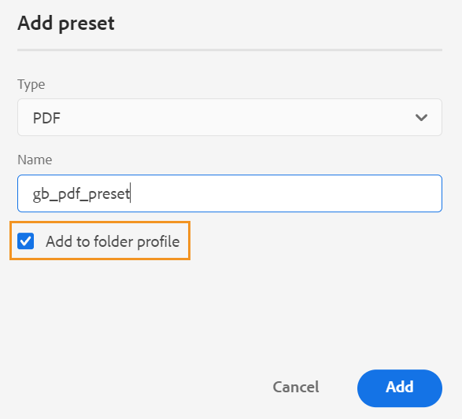

# Manage Global and Folder Profile output presets {#id22BLJ0D0V1U}

The Global and Folder Profile presets are only available to folder-level administrative users.

As an administrator, Adobe Experience Manager Guides allows you to create and manage output presets for the Global and Folder Profiles. Then you can easily use these output presets to generate output for all maps that are related to that Global or Folder Profile.

Perform the following steps to create an output preset for the Global and Folder Profiles:

1.  Select the DITA map for which you want to create an output preset.
1.  Select the **Edit Topics** option from the **Options** menu of the map file. The map file is opened for editing in the Editor.
1.  Select the **Open in map console** icon to open the map file in the Map console. 
1. In the Map console, navigate to the **Output presets** tab, and then select the + icon to create an output preset for your DITA map.

    {width="350"}

1.  Enter the following details in the **Add preset** dialog:
    -   Type
    -   Name
    -   Target \(for Knowledgebase preset\)
1.  Select the **Add to folder profile** check box to create an output preset for the related folder profile and then select **Add**. The preset is created, and it appears under the **Output presets** tab of all related maps. \( \) icon indicates a folder profile level preset.
1.  Enter the configuration details. For more details on output presets, view [Understanding the output presets](./generate-output-understand-presets.md).

    >[!NOTE]
    >
    > These presets added to the folder profile are independent of the maps, so the map specific configurations are not present for these presets.

1.  You can select **Generate output** icon at the top-right corner to generate the output for the maps related to the created output preset. You can view the status of the output generation process. To view the output, select **View Output** in the **Success** dialog box.

>[!NOTE]
>
> Experience Manager Guides also provides an out-of-box PDF output preset to generate the output for your DITA maps.

**Other operations from the Options menu**

You can also perform the following operations on the preset from the Options menu:

- **Generate output**: Allows you to generate an output for an existing preset.
- **View output** and **View log**: Quick links to view the generated output and logs. 
- **Rename**, **Duplicate**, or **Delete** an existing output preset from the **Options** menu.
- **Default PDF**: Allows you to select the existing PDF preset as default pdf preset. The selected preset would be, then used as the default preset to generate the PDF output using the **Download as PDF** option for a map.

>[!NOTE]
>
> When an output preset in Global and Folder Profiles is deleted, it will reflect in all related maps and will not appear under the **Output presets** tab.

**Parent topic:**[Work with the Web Editor](web-editor.md)
