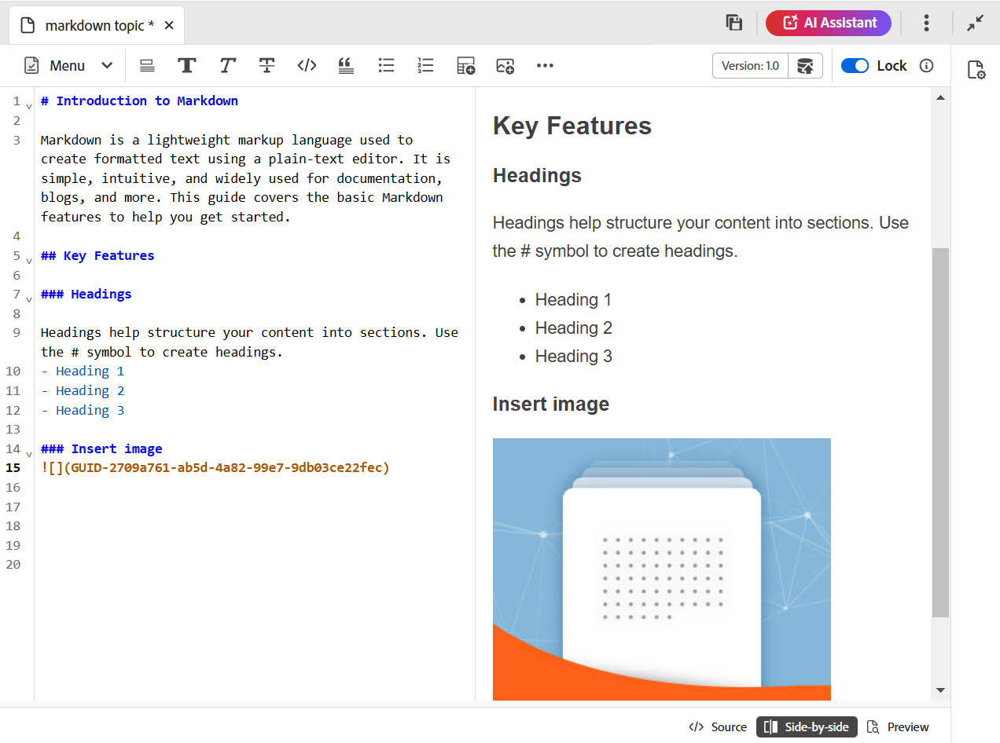

# Author Markdown documents from the Editor {#id223MIE0B079}

Markdown is a lightweight markup language that can help you add formatting elements to plain text documents. Adobe Experience Manager Guides provides the feature to create, author, and preview a Markdown \(.md\) topic from the Editor. You can also upload the existing Markdown documents and edit them in the Editor.

## Create a Markdown topic 

Perform the following steps to create a Markdown topic from the Editor:

1.  In the Repository panel, select , and then select **Topic** from the dropdown.
1.  In the **New topic** dialog box, provide the following details:

    {width="350" align="left"}

    * **Title**: Provide a title for the topic.
    * **Name**: The file name is auto-suggested based on the topic Title. In case your administrator has enabled automatic file names based on UUID setting, then the Name field won't be displayed.
    * **Template**: Select **Markdown** from the dropdown list. The template **Topic** is selected by default. 
    * **Path**: Browse the path where you want to save the topic file. By default, the path of currently selected folder in the repository is shown in the Path field.

    >![NOTE]
    >
    > In case of an upgrade, you need to add the Markdown template into the current folder profile in use. You can [create a new markdown template from the Editor](./web-editor-features.md#templates) or use an existing template for markdown authoring. For details on how to add authoring templates in Experience Manager Guides, view [Configure global or folder-level profiles](../cs-install-guide/conf-folder-level.md).
1. Select **Create**.

   The Markdown topic is created at the selected path and is open for editing.

   {width="550" align="left"}

 >![NOTE]
 >
 > You can also create a markdown topic for a Folder within the Repository panel. Select the folder within which you want to create a markdown topic and select **New**, and then select **Topic** from the Options menu. You can now create a markdown topic by providing topic details in the **Create topic** dialog box. 

## Know the Editor features for a Markdown topic 

This section walks you through the various features that are available in the Editor for Markdown topic authoring. The authoring interface is divided into the following sections or areas:

* [Toolbar](#toolbar)
* [Content editing area](#content-editing-area)
* [Source, Side-by-side, and Preview modes](#source-side-by-side-and-preview-modes)
* [Right panel](#right-panel)

<!--
### Tab bar 

The tab bar features the file tabs of the topics or maps that are currently opened in the Editor along with other file-level options. 

Features available in the tab bar are explained as follows:

 {width="550" align="left"}

* **Topic tab**: Displays the currently opened topics in a tab. By default, you can view the file titles in the tab. As you hover over a file, you can view the file title and the file path as a tooltip.

    >![NOTE]
    >
    > As an administrator, you can also choose to view the list of files by filenames in the tabs. View [User preferences](./intro-home-page.md#user-preferences) for details.
* **Save all**: Saves the changes you have made in all opened topics. If you have multiple topics opened in the Editor, selecting **Save all** or pressing `Crtl+S` shortcut keys saves all documents in one click. You do not have to individually save each document.
* **AI Assistant**: [AI-powered Smart Help](./ai-based-smart-help.md) feature that helps you find relevant content from the Adobe Experience Manager Guides Documentation.
* **More actions**: Allows you to navigate to the **Assets UI**. As an administrator, you also get an option to navigate to the **Settings** page. Learn how to work with [settings](./web-editor-features.md#main-toolbar) or editor settings. 
* **Expand view**: Allows you to expand the page view using the **Expand** icon. In this view, the header bar is hidden, maximizing the content space. To return to the standard view, use the **Exit the expanded view** icon.

-->

### Toolbar

The toolbar is located just below the tab bar. Features available in the toolbar are explained as follows:

 {width="550" align="left"}

| Features       | Description   | 
|----------------|----------------|
| Editing actions  | Provides access to various document editing features including **Cut** &nbsp;, **Undo** &nbsp;, **Copy** &nbsp;, **Delete** &nbsp;, and **Find and replace** &nbsp;. You can access the available options from the **Menu** dropdown. | 
| Text formatting options | Provides access to various text formatting options including **Headings** &nbsp;, **Bold** &nbsp;, **Italic** &nbsp;, **Strikethrough** &nbsp;, **Code** &nbsp;, and **Block quote** &nbsp;.|
| Content insertion options | Provides options to insert a **Numbered list** &nbsp;, **Ordered list** &nbsp;, **Table** &nbsp;, **Image**&nbsp;, **Cross reference** &nbsp;, and **Symbol** &nbsp; into a document.   **Note**: You can also drag and drop images and other files into the Markdown editor. Files are added as cross-reference links, while images are displayed as standard image elements.| 
| Version history|  Allows you to create versions of markdown files and view the history of changes. You can compare different versions and revert to previous ones if needed. The Version history option is present in the **Menu** dropdown.|
| Save as new version|Saves the changes made in the topic and also creates a new version of the topic. If you are working on a newly created topic, the version information is shown as none.|
|Lock/unlock|Locks or unlocks the current file. Locking a file gives you an exclusive write access to the file. This restricts other users from editing the file. Unlock the file if you want others to have editing access. As an administrator, you also get access to the **Force unlock** feature that allows you to unlock the file locked by someone else.|

>[!NOTE]
>
> The **Version history** feature and the fetaures mentioned under editing actions, text formatting, and content insertion can be accessed from both the **Source** and **Side-by-side** views of the markdown topic.

### Content editing area

The content editing area is where the content of your markdown topic is displayed. You make all content edits in this area. It gives a WYSIWYG view of the content you are editing. You can have multiple topics opened at the same time, which are displayed in their respective tabs.

### Source, Side-by-side, and Preview modes

For markdown authoring, the Editor supports three different viewing modes to assist with content creation and formatting:

{width="550" align="left"}

* Source
* Side-by-side
* Preview

**Source**

This is the markdown code view of the Editor. You can edit markdown topics as you would do in any regular markdown editor. In the Source view, you have the options to save a revision of the document, insert headings, insert table, insert image, and more.

Use this view if you want to focus solely on writing and editing the raw markdown without viewing the rendered output.

**Side-by-side**

This mode splits the Editor into two panels:

* The Source panel that displays the markdown topic you are editing.
* The Preview Panel that shows the rendered output of the markdown topic in real time.

{width="550" align="left"}

Use this view if you want to view the rendered output in realtime as you edit markdown topics.

**Preview**

Opening a markdown topic in the Preview mode shows how a topic will be displayed when it is viewed by a user in their browser. In this view, all the editing features are removed from the toolbar. However, you can stil access the **Save as new versions**, **Lock/unlock** features in the toolbar, and the **File properties** feature in the right panel. 

### Right panel

The right panel gives you access to the **File properties**  panel. 

The File Properties has the following two sections:

**General**

The General section gives you access to the following features:

* **Filename**: Displays the filename of the selected topic. 
* **ID**: Displays the ID of the selected topic.
* **Language**: Shows the language of the topic. It is set from the language field in the properties page.
* **Created on**: Displays date and time on which the topic was created.
* **Modified on**: Displays date and time on which the topic was modified.
* **Locked by**: Shows the user who checked out the topic.
* **Document state**: You can select and update the document state of the currently opened topic. For more details, See Document State.
* **Tags**: These are the metadata tags of the topic. They are set from the tags field in the properties page. You can type or select them from the dropdown. The tags appear under the dropdown. To delete a tag, select the cross icon next to the tag.
* **Edit more properties**: You can edit more properties from the file properties page.

**References**

The References section gives you access to the following features:

* **Used in**: The Used in references list the documents where the current file is being referred or used.
* **Outgoing links**: The Outgoing links lists the documents that are referred to in the current document.

>![NOTE]
>
> All Used In and Outgoing links references are hyperlinked to the documents. You can easily open and edit the linked documents.

## Feature limitations

The following Experience Manager Guides features are currently not applicable for Markdown authoring:

1. Review
2. Merge
3. AI Assistant 
4. Track changes
5. Find and replace
6. Search and Filter 

>[!NOTE]
>
> The **Find and replace** feature does not processes Markdown files at the respository level. This includes searching for a Markdown file within a map or folder. However, it can still be used within the Markdown editor. Also, the **Search** and **Filter** options in the Repository view do not processes Markdown files. 

**Parent topic:**[Work with the Web Editor](web-editor.md)
