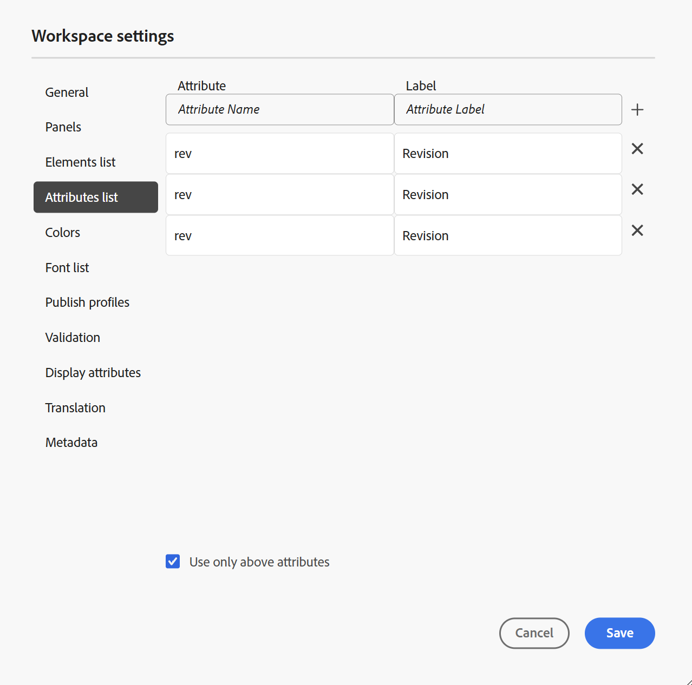

# Editor settings

The **Settings** option present in the [Tab bar](./web-editor-tab-bar.md) of the Editor is available only for administrators and folder profile administrators, and allows configuring the following settings:

- [General](#general)
- [Panels](#panels)
- [Elements list](#elements-list)
- [Attributes list](#attributes-list)
- [Colors](#colors)
- [Publish profiles](#publish-profiles)
- [Validation](#validation)
- [Display attributes](#display-attributes)
- [Translation](#translation)
- [Metadata](#metadata)

>[!NOTE]
>
> If you are updating any default settings, you should reopen documents for the changes to come into effect.

## General

 The General settings allow you to configure the dictionary to use with the Editor. This tab contains four sections: **Spell check**, **Condition**, **Authoring**, and **Citations** .

{width="650" align="left"}

- **Spell check**: There are two options — **AEM spell check** and **Browser spell check**. By default, the editor uses the Browser spell check feature, wherein the spell-check is performed using the browser's in-built dictionary. You can switch to AEM spell check to use Adobe Experience Manager's dictionary, which can also be customized to add your custom word list. For more information about customizing AEM dictionary, view [Customize AEM's default dictionary](../cs-install-guide/customize-aem-custom-dictionary.md) section in the Install and configure Adobe Experience Manager Guides as a Cloud Service.        

-  **Condition**

    - **Highlight conditional text in the Author view**: Select this to highlight the conditional text in the author view. The conditional content is highlighted using the color defined for the condition.

    - **Validate with condition attributes**: Select this to allow the validation of the values defined for the attributes. This prevents you from adding any incorrect value.

    -  **Show key with the title in the Subject Scheme panel**: Select this to show the keys along with titles in the subject scheme. If you do not select this option only the titles are shown. For example, here the keys 'os', 'audience', and 'other' are also shown along with titles.

        {width="550" align="left"}

    -  **Show subject scheme in the Conditions panel**: Select this to view a subject scheme in the conditions panel. If you deselect this, the defined conditions are shown in the conditions panel.

-  **Authoring**

    - **Enable Replace All**: Select this to view the **Replace All** icon in the **Find and replace** panel.        

-  **Citations**
    
    Change the style of citations. Choose the citation style from the drop-down you want to use in your project. For more details, view [Change citation styles](./web-editor-apply-citations.md#change-citation-style).

-  **AI Assistant**
       Select this to enable the [AI Assistant](./ai-assistant.md) feature in the Experience Manager Guides. Unselect to disable the feature. 

## Panels

This setting controls the panels that are shown in the left and right panels of the Editor and Map console. You can toggle the button to show or hide the desired panel. 

{width="650" align="left"}

You can also define the order in which the features present in panels are displayed. To change the default order of the available features in the panels, select the dotted bars to drag and drop the feature tabs at the desired location. A feature can also be moved from the **More** section to the main section of a panel, and vice versa as per the requirement. Once re-ordered, the features appear in the same sequence in the respective right and left panel. 

{width="650" align="left"}

A maximum of eight panels can be displayed at a time. Any changes made to the panel settings are applied immediately. 

>[!NOTE]
>
> If a custom panel has been configured, then it also appears in the list of panels. You can toggle the switch to show or hide the custom panel. 

## Elements list

As an administrator, you can control the list of elements that an author can insert into a file and also define the display name for the element. The Elements list setting allows you to specify the element's name as per DITA specifications and a label that you want to use instead of the DITA defined element name:

{width="650" align="left"}

In the above screenshot, the `p` element has been given a label of Paragraph, and `codeblock` is given a label of Code Block along with some other elements.. If you select the **Use only above elements** option, then only the valid elements \(at current insertion point\) from this list will be shown in the **Insert element** dialog box.

In the following screenshot, only 3 out of 4 configured elements from the previous screenshot are shown in the current context:

{width="300" align="left"}

## Attributes list

Similar to the elements list, you can control the list of attributes and their display names to be displayed in the attributes list of an element. In the following screenshot, only 3 attributes have been configured to be shown in an element's attribute list:

{width="650" align="left"}

With this setting, when you try to add an attribute to an element, you only view the list of attributes configured in the list.

{width="300" align="left"}

## Colors

Displays a list of pre-configured background colors for **Conditions**. Users can select a background color when applying a condition to a topic. As an administrator, you can also create and add custom background colors to the list. To add a new color, enter the desired name in the **Color Name** field, choose a custom color, and select the **+** icon. The custom color will appear at the end of the color list.

## Publish profiles

This contains the Profiles that can be used to publish the **Knowledge Base** output. You can create a new profile for a target knowledge base. For example, Salesforce or ServiceNow.

**Create a Salesforce profile**

**Prerequisites**
        
- Create a connected app for Salesforce. For more details, refer to [Enable OAuth Settings for API Integration](https://help.salesforce.com/s/articleView?id=sf.connected_app_create_api_integration.htm&type=5).
        
- While configuring the connected app ensure the following:

    - Specify the callback. 
        
        `URL: http://<server name>:<port>/bin/dxml/thirdparty/callback/salesforce`

    - Select the following OAuth Scopes:
        - Full access (full)
        - Select Manage user data via APIs (api)
    
        Once the app is configured, Salesforce provides a **Consumer Key** and **Consumer Secret**. These can be used to create the Salesforce profile. 
     

  - To create a Salesforce profile, select the **Salesforce** Knowledge Base from the **Server type** dropdown. Enter a profile Name. In the **Site URL**, enter the consumer site you would use to publish the output and then add the **Consumer Key** and **Consumer Secret** provided by the Salesforce consumer site. Then, **Validate** and **Save** the newly created profile.

    {width="550" align="left"}

    >[!NOTE]
    >
    >To configure a proxy for Salesforce in Experience Manager Guides, use Apache HTTP Components Proxy Configuration in AEM. Learn how to [configure proxy for the AEM Link Checker](https://helpx.adobe.com/experience-manager/kb/How-to-configure-proxy-for-the-AEM-Link-Checker-AEM.html).

**Create a ServiceNow profile**

**Prerequisites**

Configure the ServiceNow server to upload the assets.

- Connect to the **ServiceNow** server.
- Navigate to **System Properties** > **Security**. 
- Uncheck the following option:    

    **This property must be set to activate MIME type checking for uploads (All versions Eureka and up). Enables (true) or disbles (false) mime type validation for the file attachments. File extensions configured via glide.attachment.extensions will be checked for MIME type during upload.**  
    
- Select **Save**.
    
    Once you have configured the app, create the **ServiceNow** profile.

- To create a profile, select the ServiceNow Knowledge Base from the **Server type** dropdown. Enter a profile **Name**. In the **ServiceNow URL**, enter the consumer site you would use for publishing the output and then add the **Username** and **Password** provided by the ServiceNow consumer site. Then, **Validate** and **Save** the newly created profile.
 
    {width="550" align="left"}

   After you validate, you can select the Publish Profile in the output presets of a DITA Map and use it to generate the output to the  **Salesforce** or **ServiceNow** server that you have chosen. 

   Learn more about the [Knowledge Base](../user-guide/generate-output-knowledge-base.md) output preset. 

## Validation

This tab contains options to configure the Schematron validations in the Editor. You can enable the following features:

- **Run validation check before saving the file**: Select this to run Schematron validations using the selected Schematron file(s) before any save operation. You can add a Schematron file by selecting the + icon. The selected Schematron file(s) are listed.

    >[!NOTE]
    >
    > The selected Schematron file(s) will persist for the selected folder profile.

    {width="550" align="left"}

    This prevents the users from saving any file which breaks a rule defined in the selected Schematron file(s). If this is not selected the file will not be validated before saving the changes.

- **Allow all users to add schematron files in validation panel**: Select this to allow the users to add any Schematron file in the Validation panel of the Editor. This allows the users to add Schematron files and then validate the topics against the Schematron file. If this is not selected, the option to add schematron file **Add Schematron File** button is not available to the users in the **Validation panel** of the Editor.

## Display attributes

Like the Attributes list, you can control the list of  attributes to be displayed in the attributes list of an element. By default, four **Display attributes** — audience, platform, product, and props have been configured to be shown in an element's attribute list. You can also add a display attribute using the **Add** icon on the top. You can also delete any of the display attributes using the **Delete** icon.

The attributes defined for an element are displayed in the Layout and the Outline view.

{width="550" align="left"}

## Translation

This tab contains the options to create language groups, propagate the source labels to the target version, and clean up the translation project. 

{width="550" align="left"}

- **Language Groups**: As an administrator, you can create a group of languages and use them as a set to translate the content.    

    Perform the following steps to create a new language group: 

    1. Select **Add**. 
    1. Enter the language group name. Each language should have a unique name. You can view an error if the name field is empty or if the name isn't unique. 
    1. Select the languages from the dropdown. You can select multiple languages.
        
        Type the first few characters of the language, or the language code to filter the desired languages. For example, type 'en' to filter all the languages that contain 'en' at the beginning of their name or code.

    1. Select the Done icon to add the selected languages to the group. The languages are displayed. When you add three or more languages, the **Show more** option is displayed. You can select **Show more** to view all the languages present in the group.

        >[!TIP]
        >
        > Toggle **Show more** to **Show less** and view only a few languages.

    1. Hover over the languages in a group to edit  or delete  the language groups.
    1. Save the **Settings**.

        >[!NOTE]
        >
        >As a user, you can view the language groups configured to your folder profile.

-  **Propagate source version labels to the target version**: Select this option to pass the label of the source file version to the translated file. By default, this is disabled.
- **Translation project cleanup after completion**: Select this option to configure the translation projects to be disabled or deleted automatically after the translation. By default, **None** is selected, so that the project exists after translation.
    
    You can disable the translation projects if you want to use them later. Deleting a project permanently deletes all files and folders present in the project.
       

## Metadata

You can control the version metadata of the topic and their values to be displayed in the **Version history** dialog box.  In the metadata path, specify the location of the nodes from which you want to pick the metadata. You can also define a custom name for the metadata as the label. The default properties are Title, Document State, and Tags.

The metadata can be picked from any property under the `/jcr:content` node of the asset, so you can add the path of the property as the Metadata path.
    

An error is displayed if the metadata path is blank. If you leave the label blank, the last element is picked as the label.     

{width="550" align="left"}

*Configure the metadata for the **Version History** dialog box.*
 
    
    
You can also define the order in which these metadata tags are displayed. To change the default order of these tags, select the dotted bars to drag and drop the tags at the desired location.
The metadata labels appear in the same sequence in the **Version history** dialog box of the Editor. 

**Parent topic:**[Introduction to the Editor](web-editor.md)
