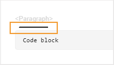
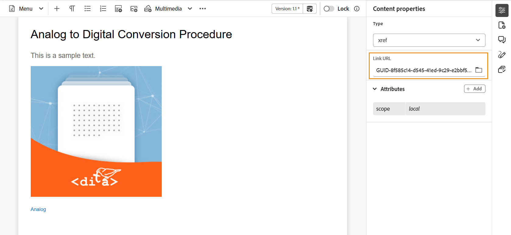

# Toolbar in the Editor 

The toolbar appears when you open a topic or map for editing in the Editor. Features available in the toolbar are as follows:

- [Menu dropdown](#menu-dropdown)
- [Content insertion options](#content-insertion-options)
- [Version information and  Save as new version button](#version-information-and-save-as-new-version)
- [Lock/unlock](#lockunlock)

>[!NOTE]
>
> The features listed above are applicable only for topic files. When working with a map file, different options are displayed in the toolbar based on the current Map editor view. Learn about the Map editor toolbar options in the [Map editor features](./map-editor-advanced-map-editor.md) document.

## Menu dropdown 

The Menu dropdown provides access to the editing actions, Find and replace, Version history, Version label, Merge, Create review task, and Show menu (which includes Track changes, Tags, Non-breaking space).

{width="350" align="left"}

The detailed explanation of these features are as follows:

**Editing actions**

When editing a topic in the Editor, access the various editing actions such as **Cut** or ***Ctrl***+***X*** , **Copy** or ***Ctrl***+***C*** , **Undo** or ***Ctrl***+***Z*** , **Redo** or ***Ctrl***+***Y*** and **Delete** present in the Menu dropdown. 
     

**Find and replace**

The **Find and replace** feature is available in Author and Source view modes. When enabled, the Find and Replace text bar appears at the bottom of the topic editing area. You can use the shortcut keys **CTRL**+**F** to invoke the Find and replace bar.

{align="left"}

Using the settings icon \(\), you can toggle the **Ignore case** and **Whole word only** search options. To perform the case-insensitive search, turn on \(or select\) the **Ignore case** option. Else, if you want to perform the case-sensitive search, turn off \(or deselect\) the **Ignore case** option. You can also choose to search a whole word.

The search is instantaneous, which means that as you type the search phrase or word in the **Find** field, the term is immediately searched and selected in the topic. Similarly, for replacing a text in your topic, enter the search term and its replacement in the respective fields and select the **Replace** or **Replace All** button.

In the Source view, the **Find and replace** feature is extremely useful for searching for a specific element or attribute. For example, if you want to replace the value of the `@product` attribute, it can be easily done from the Source view. The Author view does not allow you to search on the basis of an attribute or element. However, you must use caution while using the **Replace All** feature, as it might overwrite the XML code.

**Version history**

The **Version history** feature in the Editor allows you to check the available versions of your DITA files, compare them, and revert to any version from the Editor itself. You can compare the content and metadata of the current version (which can also be a working copy) with any previous version of the same file. You can also view the labels and comments for the compared versions.

>[!NOTE]
>
> The Version history options only appear if there are changes made to the first version of the topic or map. 

    
 Steps to access the Version history 

 
1. Open a topic in the Editor.
1. Select **Version history** from the **Menu** dropdown.

   The **Version History** dialog box appears.

   {width="550" align="left"}
    
    *Preview the changes in the different versions of a topic.*

1. Choose a version of the topic that you want to compare or revert to in the **Compare with** dropdown list.

    >[!NOTE]
    >
    > If a version has labels applied to it, they are also shown \(in brackets\) along with the version number.
    
1. Enable the **View labels and comments** option to view the labels and comments applied to the current and the compared versions.
1. You can also view the following information in the **Version history** dialog box:
    
    **Preview** tab: The newly added content is in green font, and the deleted content is in red font. 

    **Metadata** tab: The newly added metadata is in green font, and the deleted metadata is in red font.

    {width="550" align="left"}
    
    *Compare the metadata of different versions in the Version history.*

    >[!NOTE]
    >
    > Your system administrator can change the metadata to be shown from the Metadata tab in the **Settings**. For details, refer to the **More actions** section of the [Tab bar](./web-editor-tab-bar.md).

    You can also view the user and time details of the current and the compared version.
  
    Once you choose a version from the drop-down list, the **Revert to selected version** option is made available. The preview window displays the differences between the current version and the selected version of the topic.

1. Select **Revert to selected version** to revert your working copy with the selected version of the topic.

    The Revert Version dialog box appears.

    {width="550" align="left"}

1. \(*Optional*\) Provide a reason for reverting to an earlier version. You can also create a new version of the currently active working copy of your topic.

1. Select **Confirm**.

    Your working copy of the file is reverted to the selected version. If you choose to create a new version of the currently active working copy, then a new version of the file is also created with all working changes.

    When you revert to an earlier version, a visual cue is shown indicating that the version you are currently working on is not the latest version.

    {  align="left"}

 

**Version labels**

Labels help you identify the stage in which a particular topic is in the DDLC \(Document Development Life Cycle\). For example, when you are working on a topic, you could set the label as "Approved". Once a topic is published and made available to customers, you can assign "Released" label to that topic.

Experience Manager Guides allows you to specify labels in a free-form text format or use a set of predefined labels. The custom label would allow any author in the system to specify a label as per their choice. This gives flexibility; however, it introduces inconsistent labels in the system. To overcome this issue, administrators can configure a set of predefined labels. For more information about configuring predefined labels, view *Configure and customize the XML Web Editor* in the Install and configure Adobe Experience Manager Guides as a Cloud Service.

These labels are shown in the form of a drop-down list to authors wherever they need to specify a label. This ensures that only predefined, consistent labels are used in the system.

There are different methods through which you can apply labels to your topics - [Version history](web-editor-use-label.md) panel in Assets UI, [Baselines](/help/product-guide/user-guide/generate-output-use-baseline-for-publishing.md) UI, and the Editor. The Version Label feature in the Editor gives authors a quick and easy way to assign labels to their topics.

    
 Steps to add labels to your topic from the Editor 

1. Open a topic in the Editor.

1. Select **Version labels** from the Menu dropdown.

    The Version Label Management dialog box is displayed.

    {width="350" align="left"}

    The Version Label Management dialog box is split into two parts — the left panel has a list of versions available for the topic along with label drop-down list \(or a text box to enter a label\) and the right panel with a preview of the topic.

1. Select a version on which you want to apply labels.

    When you choose a different version of the topic from the version list, then the preview panel displays the changes in-between the current version and the selected version of the topic

    >[!NOTE]
    >
    > If a label is already applied on a version, it is displayed next to the version number in the drop-down list and below the Select Version list. You can remove an existing label by selecting the \(**x**\) icon next to the label.

1. In case your administrator has defined a list of labels, then you are shown a drop-down list of the labels from where you can choose the labels that you want to apply. You can select multiple labels from the drop-down list.

    Else, you are shown a text box, wherein you can enter the labels that you want to add to your topic.

    >[!NOTE]
    >
    > You cannot apply the same label on multiple versions of a topic. If you try to associate an existing label, then you are given an option to remove it from the existing version and apply it on the selected version of the topic.

1. Select **Add Label**.

1. In the Apply Label confirmation message, select the **Move label(If used on another version)** option to move labels from an existing version to the selected version. If you do not select this option and there are labels that are assigned to a different version of the topic, then they are not moved to the selected topic's version. Such labels are ignored in the label application process.

**Merge**

When you work in a multi-author environment, it becomes difficult to track what changes the other authors have made in a topic or map. The Merge feature gives you more control over not only viewing the changes, but also what changes are retained in the latest version of the document.

    
 Merge topic files 

To merge changes in a topic, perform the following steps:

1. Open a topic in the Editor.

1. Select **Merge**.

    The Merge dialog appears.

    {width="550" align="left"}

1. *\(Optional\)* You can also browse and select a new file from some other location in your repository.

1. Select a version of the file with which you want to compare the current version of the file.

1. From the Options, choose:

    - **Track changes from selected version**: This option shows all content updates in the form of tracked changes. You can then choose to accept or reject changes in the document one at a time or all in one go.

    - **Revert to selected version**: This option reverts the current version of the document to the selected version. This option does not give you any control on what content is accepted or rejected.

1. Select **Done**.

1. If you selected the **Track changes from selected version** option, then all changes from the selected version are shown in the Tracked changes feature of the right panel.

    You can choose to accept or reject all comments from the Tracked changes panel or accept or reject individual comment.

    
 Merge map files 

To merge changes in a map file, perform the following steps:

1. Open a map in the Editor.

1. Select **Merge**.

    The Merge dialog box appears.

    {width="550" align="left"}

1. *\(Optional\)* You can also browse and select a new file from some other location in your repository.

1. Select a version of the file with which you want to compare the current version of the file.

1. From the Options, choose:

    - **Track changes from selected version**: This option shows all content updates in the form of track changes. You can then choose to accept or reject changes in the document one at a time or all in one go.

    - **Revert to selected version**: This option reverts the current version of the document to the selected version. This option does not give you any control on what content is accepted or rejected.

1. Select **Done**.

1. If you selected the **Track changes from selected version** option, then all changes from the selected version are shown in the Tracked changes panel \(on the right\).

    You can choose to accept or reject all changes from the Tracked Changes panel or accept or reject individual change in the map file.

**Create review task** 

You can [create a review task](./review-send-topics-for-review.md) of the current topic or map file directly from the Editor. Open the file for which you want to create the review task and select **Create review task** from the Menu dropdown to initiate the review creation process.

**Show menu**

The Show menu comprises of the following features: 

- **Track changes:** You can keep a track of all updates made on a document by enabling the Track changes mode. After enabling the track changes, all insertions and deletions are captured in the document. All deleted content is highlighted using Strikethrough and all insertions are highlighted in green color text. In addition, you also get the change bars at the edge of the topic page. Again, a red bar is shown for deleted content and a green bar is shown for added content. In case there is an addition and deletion on the same line, then both green and red bars are shown.
The following screenshot highlights the deleted and inserted content along with the change bars:
 {width="650" align="left"}

  A typical use case for tracking changes in a document can be for doing peer review. You can enable track changes and share your document for review, and the reviewer then makes changes with track changes ON. When you receive the document, you should then have a mechanism to view the suggested updates along with a convenient way to accept or reject changes.

  Experience Manager Guides provides the Tracked changes feature that contains information about the updates made in the document. The Tracked changes feature provides information about what updates were made, who made them, and at what time. Using the Tracked changes feature, you can also easily accept or reject the suggested updates in the document.

  To access the feature, select the **Track changes** icon in the right panel.

  {width="300" align="left"}

  Selecting a tracked change selects the changed content in the document. You can accept a change by selecting the Accept Change icon or reject it by selecting the Reject Change.

  If you want to accept or reject all changes with a single click, select **Accept all changes** or **Reject all changes**.

  >[!NOTE]
  >
  > The Preview mode allows you to view the document with or without the changed content's markups. For more details, view the [Preview](web-editor-views.md#preview-mode) mode.

- **Tags:** The **Tags** feature in the Editor is a toggle button that controls the visibility of DITA elements. When enabled, it displays structural tags within the content, allowing you to view and manage the underlying DITA elements more effectively. When disabled, the editor hides these tags, providing a cleaner and more focused authoring environment.

  The following screenshot shows a document with the Tags view enabled:

  {width="650" align="left"}

  The following operations can be performed in a document with Tags:

    - **Select an element**: Select the opening or closing tag of an element to select its content.

    - **Expand or collapse tags**: Select the + or - sign in a tag to expand or collapse it.

    - **Use the context menu**: The context menu provides options to cut, copy, or paste the selected element. You can also insert an element before or after the selected element. The other options allow you to Generate ID or open the Properties panel for the selected element.

    - **Drag-and-drop elements**: Select an element's tag and easily drag-and-drop it on your document. If the drop location is a valid location where the element is allowed, the element is placed at the dropped location.

  >[!NOTE]
  >
  > If a user enables the Tags view from the Editor, it remains enabled even across the sessions. This means that you don't have to enable the Tags view again to access it later. The default value for Tags view for a new user's session is determined by the `tagsView` property in the `ui\_config.json` file. For more details, view the [Configure default value for Tags View](../cs-install-guide/configure-default-value-tags-view.md) section in Install and configure Adobe Experience Manager Guides as a Cloud Service.

- **Non-breaking space:** Enable this option to show an indicator for the non-breaking spaces while editing it in the Editor. It is visible only in the **Author** view for DITA topic and DITA maps.

## Content insertion options

**Element** - 

Inserts a valid element at the current or next valid location. You can also use the keyboard shortcut ***Alt***+***Enter*** to open the Element dialog box. For example, you are editing a paragraph, then in the **Element** dialog box, a list of elements appears that can be inserted in the paragraph. Select the element that you want to insert. You can use the keyboard to scroll through the list of elements and press ***Enter*** to insert the required element. 

You can view two types of valid elements: 

- **Valid elements at the current location**: The list displays the elements that you can insert at the current cursor location itself.  

- **Valid elements outside the current location**: The list displays the elements that you can insert after any of the parents for the current element within the element hierarchy.    

For example, if you are within the inline `<b>` element, you can insert elements like `<u>`, `<xref>`, `<i>` at the current location. In contrast, you can insert elements like `<table>` and `<topic>` outside the current location. 

You can also type a character or string in the search box and search for the elements that begin with it.
 
{width="300" align="left"}

*Enter 't' to search for all valid elements that begin with 't'.*

If you are working inside a block element like a `note`, then use the Insert element icon to insert a new element after the `note` element. In the following screenshot a note element has been inserted inside the p \(paragraph\) element:

{  align="left"}

If you press Enter in the note element, a new paragraph is created within the note element itself. To insert a new element outside note, select the p element \(highlighted in screenshot\) in the elements breadcrumb and then select the Element icon or press ***Alt***+***Enter*** to open the Insert element dialog box. Then, select the desired element and press Enter to insert the selected element after the note element.

You can also add an element between two elements when a blinking block cursor appears. 

{width="300" align="left"}

For example, if you are working on a DITA topic, and the block cursor is blinking between the short description and the body, you can add `prolog` element and then add copyright, author, and other details.

Another way of entering a new element is by using the context menu. Right-click at any place in your document to invoke the context menu. From this menu choose **Insert Element** to display the **Insert element** dialog box and choose the element that you want to insert.

{width="300" align="left"}

**Paragraph** - 

Insert paragraph element at the current or next valid location.

**Bulleted list** - 

Creates a bulleted list at the current or next valid location. If you are on a bulleted list and select this icon, the item is converted into a normal paragraph.

**Numbered list** - 

Creates a numbered list at the current or next valid location. If you are on a numbered list and select this icon, the item is converted into a normal paragraph. 

>[!NOTE]
>
>You can also select the **Split list** option from the context menu of a list item to split the current list and begin a new list at the same level.

**Table** - 

Inserts a table at the current or next valid location. Select the Table icon to open the Insert Simple Table dialog box. 

{width="550" align="left"}

>[!NOTE]
>
> You can also copy a table from MS Word or Excel and paste it into the Experience Manager Guides topic file. The copied table will be pasted as either `<simpletable>` or `<tgroup>` depending on the settings configured in the XML Editor Configuration. For more details, view [Configure the display of pasted tables](../cs-install-guide/conf-pasted-tables.md). 

You can specify the number of rows and columns required in the table. If you want to keep the first row as the table header, select the **Set first row as header** option. To add a title to your table, enter it in the Title field.

Once a table is inserted, you can modify the table using the context menu.

{width="550" align="left"}

Using the table's context menu, you can:

- Insert cells, rows, or columns

- Merge cells in right and down directions

- Split cells horizontally or vertically

- Delete cells, rows, or columns

- Generate IDs

    
 Define attributes on multiple cells, entire row, or column of a table 

You can also define attributes on multiple cells, entire row, or column of a table. For example, to align table cell, drag and select the required cell. In the Content Properties panel (on the right), the property **Type** changes to **entry**.

1. In the **Attributes** section, select **+Add**. 
1. Select the `@valign` attribute from the **Attribute** dropdown list. 
1. From the value dropdown list, select the desired text alignment you want to apply on the selected table cells. 
1. Select **Add.**

{  align="left"}

**Image** - 

Inserts an image at the current or next valid location. Select the Image icon to open the Insert Image dialog and then search and select the image you want to insert.

>[!NOTE]
>
> You can also add an image by dragging and dropping it from your local system on to your article. In this case, the image file is added using the **Upload Assets** workflow.  For more details, view the **Upload Assets** workflow in the [Left panel](./web-editor-left-panel.md) section. 

{width="300" align="left"}

In the **Select file** dialog, you can browse the required image file from **Repository** or **Collections**.

>[!NOTE]
>
> The File and path browser is introduced with a revamped UI in the 2601 release of Experience Manager Guides as a Cloud Service. The new interface is enabled by default. If you prefer to continue using the existing UI without these updates, contact your Customer Success team to have this new enhancement disabled.

Use the breadcrumbs on the top and folder navigation panel on the left to easily navigate through the folders. 

You can search for the required image file by File name, File title, and Content. You can also filter the search results by Path \(to search in\), File type, Document state, Locked by, Last modified, and Tags. 

Once you have found the required image file, select the file and choose **Select** to insert the image in your document. You can insert various formats of image files, such as `.png`, `.svg`, `.gif`, `.jpg`, `.eps`, `.ai`, `.psd`, and more.

You can also add an image/Figure Title and Alternate Text for the image in the Insert Image dialog.

>[!NOTE]
>
> When you insert an image and specify an alternate text for the same, it is added within the `<alt>` element in accordance with the latest DITA standards. The use of the `@alt` attribute for alternate text is deprecated, but it remains supported in previous DITA versions.

Once you have inserted an image, you can change the height, width, placement, and attributes from the Content properties panel. Select the image file and then make changes in the Content properties panel in the right panel.

{  align="left"}

The Source field displays the UUID of the inserted image file. You can find the complete path of the inserted image file by hovering the mouse pointer over the Source field. The path is displayed in the tooltip.

You can resize an image by providing either Height or Width value for the image file. The aspect ratio of the image is maintained automatically. If you want, you can also choose not to maintain the aspect ratio of the image file by selecting the lock icon \(of Maintain Aspect Ratio\) and providing Height and Width values.

You can also specify the Placement setting for the image as Inline or Break. In case you choose to use the Break placement option, you can then choose where to align the image (Left, Center, or Right).

You can also add other properties for an image file by selecting the required properties in the **Attributes** field.

>[!NOTE]
>
>You can also define clickable areas \(image map\) in your image. For more details, view the **Insert/Edit Image Map** feature description in the [Left panel](web-editor-left-panel.md) section. 

**Context menu for image or media files**

You can also perform some common operations for images and media files using the context menu. Right-click at any place on your image to invoke the context menu.

The context menu provides options to cut, copy, or paste the image or media. You can insert an element before or after the selected element. You also have the option to rename or unwrap an element. You can locate the selected image or media in the repository or view the preview of the file in Assets UI.

The other options in the context menu allow you to copy a path, edit an image map, rename element, create a snippet, or generate IDs for the selected element.

**Insert/Edit Image Map** 

Inserts an image map on the selected image. An image with clickable areas that link to topics or web pages is called an image map.

Select an image in the current topic and select the Insert/Edit Image Map icon to open the insert Image Map dialog box.

{width="650" align="left"}

Choose the preferred shape Rectangle , Circle , or Polygon  to define an area over an image that you want to use as a link. After defining an area, the Reference dialog appears wherein you need to specify the link to internal or external content:

{width="350" align="left"}

If areas overlap, you can bring the shape forward or send it backward by clicking on the respective icon in the toolbar. You can also remove an area by selecting it and clicking the Delete icon. Double-clicking on an area opens the Reference dialog wherein you can change the destination link. Once you have marked the required areas on your image, save the changes by selecting **Done**.

**Multimedia** 

Inserts different types of multimedia files. Select the Multimedia dropdown icon and choose the type of file you want to insert. The supported multimedia formats are:

- Audio File
- Video File
- YouTube
- Vimeo

On selecting the Audio or Video file option, you are shown the **Select file** dialog to browse and select the desired file from Repository or Collections. 

{width="650" align="left"}

If you choose YouTube or Vimeo, then you get the **Insert Multimedia** dialog. Paste the link of the video file in the Web Link field and select Insert to add the video at the current or next valid location in your document.

{width="350"  align="left"}

>[!NOTE]
>
> While adding a YouTube video link, you need to replace the string `watch?v=` with `embed` in the URL. For example, to add a YouTube video link: `https://www.youtube.com/**watch?v**=WlIKQOrmZcs`, you need to add it as: `https://www.youtube.com/**embed/**WlIKQOrmZcs`. This change ensures that the video gets embedded in the AEM Site and PDF output.

You can also add the Audio or Video file from the **Insert Multimedia** dialog. Select the Audio/Video File option and then, select the browse icon to launch the repository view. Select the audio or video file from the repository and select **Select** to add the link of the file in the Audio/Video File field. In case you choose a video file, then a preview of the file is also shown in the Preview area. You can play the video file to view its preview.

{width="650" align="left"}

**Cross Reference** 

Insert references of type — Content Reference, Content Key Reference, Key Reference, File Reference, Web Link, or Email Link.

Select the **Select File** icon \(for Content Reference and File Reference\) or **Select Root Map** icon \(for Content Key Reference and Key Reference\) and select the desired file or content to link to.

{width="650" align="left"}

A link of the selected reference is added in the document. The context menu on the link gives you the options to:

- **Insert Element**: Shows a list of valid elements that you can insert at the given context.
- **Copy UUID**: Copies the UUID of the inserted reference.
- **Copy Path**: Copies the complete path of the inserted reference.
- **Generate IDs**: Generates unique ID for the inserted reference.

You can also search using the UUID of the file that you want to reference. For Content and Key Reference links, enter the UUID of the file that you want to link to, and the file is automatically searched and displayed in the Preview section. When you specify the UUID of the file, you need not explicitly mention the file extension for .xml files. The .xml extension is auto-appended to the UUID.

{width="650" align="left"}

If your administrator has enabled the UUIDs option in *XMLEditorConfig*, then you will view the UUID of the referenced content in the **Link** property.

{  align="left"}

>[!NOTE]
>
> If the **Enable UUIDs** option is not enabled, then the relative path of the referenced content is shown.

>[!IMPORTANT]
>
> Even though the relative path of the referenced content is shown in the **Link** property, internally the link is created using the UUID of the referenced content.

>[!TIP]
>
> View the References section in the Best practices guide for best practices around referencing content.

**Filter search in Repository view**

In the **Select file** dialog, you can search for some text in the files present on the selected path of the **Repository**. For example, *braking* is searched in the below screenshot. 

>[!NOTE]
>
> The File and Path browser is introduced with a revamped UI in the 2601 release of Experience Manager Guides as a Cloud Service. The new interface is enabled by default. If you prefer to continue using the existing UI without these updates, contact your Customer Success team to have this new enhancement disabled.

{width="650" align="left"}

You can use the breadcrumbs on the top and folder navigation panel on the left to easily navigate through the folders. 

You can search for the required file by File name, File title, and Content. You can also narrow down your search using enhanced filters from the Right panel. For more details, view [Filter search in Repository](./web-editor-left-panel.md#filter-search-in-repository). 

The list of filtered files which contain the searched text is displayed. You can also preview the content of the file.

>[!NOTE]
>
> Your system administrator can also configure the text filters and show or hide other filters. For more details, view *Configure text filters* section in the Install and configure Adobe Experience Manager Guides as a Cloud Service.

**Reusable Content** - 

Reuse content that exists within any other document in your project. You can insert content by directly linking to the content in a file or by using a key reference, view [Resolve key references](map-editor-other-features.md#id176GD01H05Z). When you select the Reusable content icon, you get the Reuse Content dialog box:

{width="650" align="left"}

In the Reuse Content dialog box, select the DITA file for file references or the DITA map file that contains the key references. Once selected, the topic or key references are shown in the dialog. You can select the ID/key of the topic that you want to insert and select **Done** to insert the content within your topic.

For inserting Content Reference, you can also enter the UUID of the file and the reusable content from that file is listed in the Preview section.

Based on the setting for inserting links, you could either view the UUID of the inserted content or the relative path in the Properties panel or the Source code view. The link is always created using the UUID of the referenced content. View *Configure UUID-based links* in the Install and configure Adobe Experience Manager Guides as a Cloud Service.

>[!NOTE]
>
> To add content before or after the referred content, use *Alt*+*Left* Arrow or Alt+*Right* Arrow keys to move the cursor to the desired location.

You can also embed the referred content within the topic by right-clicking on the referred content and choosing **Replace Reference with Content** from the context menu.

**Symbol** - 

Inserts special characters in your topic. Select the Symbol icon to open the Insert Special Character dialog box.

>[!NOTE]
>
> Experience Manager Guides provides movable and resizable dialog boxes. Dialogs that have two cross lines at the bottom-right corner can be resized. The cross lines in the Special Character dialog are shown below.

{width="350" align="left"}

In the Insert Special Character dialog box, you can search for a special character using its name. All special characters are stored under various categories. Use the Select Category drop-down list and select a category. The special characters available within the selected category are displayed. You can navigate the list of special character using the arrow keys or select the desired character that you want to insert. The Name and Hex Code of the selected special character are displayed below the list. Select **Insert** to insert the selected character in your document.

**Keyword** - 

Insert keyword defined in your DITA map. Select the Keyword option to open the Key Reference dialog box.

{width="550" align="left"}

The keywords are listed in alphabetical order and you can also search keyword\(s\) by typing a search string in the Search box. The search result will return the keywords containing the string in ID or Value. The keywords defined in your DITA map are listed in this dialog. Choose the keyword that you want to insert and select **Insert**.

You can also change the attributes of the inserted keyword by right-clicking on the keyword and selecting the Attributes option. The **Attributes for Keyword** dialog box open:

{width="550" align="left"}

You can change the keyword's attributes or add a new attribute to the keyword.

**Snippets** - 

Insert a snippet at the current or next valid location. For this feature to work, you must have snippets defined in your system. For more information about adding a snippet, view the **Snippet** feature description in the [Left panel](./web-editor-left-panel.md) section. 

When you select the Snippets option, you are shown the Insert Snippet catalog. The catalog is context-sensitive, which indicates that it will show the snippets only if they are allowed at the current location.

The following example shows two pre-configured snippets - Warning and Error that can be inserted at the current location in the document.

{width="300" align="left"}

When you choose a snippet from the list, it gets inserted at the current or next valid location in the document. The following screenshot shows the Error snippet inserted in the document:

{width="400" align="left"}

**Citations** - 

Create Citations and add them to your content. Learn how to [add and manage citations in your content](./web-editor-apply-citations.md).

**Query data** - 

Connect with your data source and use the data to create content. Learn how to [use data from your data source](./web-editor-content-snippet.md).

## Version information and Save as new version

The **Version information & Save as new version** feature combines version tracking and content saving into a single functionality.

- Version information displays the current version of the topic or map. An asterisk (*) appears next to the version number to indicate unsaved changes. 

    The version number changes with every new version that is created for the topic or map file. If you are working on a newly created document, the version information is shown as **none**.

    {  align="left"}

- **Save as new version** is a button that saves the changes you have made in your topic and also creates a new version of your topic.

    {  align="left"}

When you choose to save a topic or map using **Save as new version**, the following dialog box appears:

{width="300" align="left"}

Enter comments and version labels to identify the changes and select **Save** to create a new version of your file.

When you choose the **Save as new version** option, the first version of the topic is created in DAM, which also becomes the currently active version of your topic. Later, if you revert to an older version of the topic, then that becomes your current active version of the topic.

If your administrator has pre-configured version labels, then you will view those labels in a drop-down list. You can choose a label from the list of available labels and save your document.

{width="300" align="left"}

At the time of saving a topic, you can add a comment specifying the changes that you have made in the topic. This comment is shown in the topic's Version History.

If your topic is under review, your reviewers will get a notification saying that a newer version of the topic is available. They can easily access the latest revision of your document and continue reviewing the latest version of your topic.

When you hover your pointer over a topic's title, you are shown the file title, file path, and the version number.

{  align="left"}

>[!NOTE]
>
> Once a version of your topic is available, you can also add labels to your topic. These labels can then be used to create a baseline for publishing a specific version of your document. For more information about using labels in your topics, view [Use labels](web-editor-use-label.md#).

## Lock/unlock 

Locks or unlocks the current file. Locking a file gives you an exclusive write access to the file. This restricts other users from editing the file. Unlock the file if you want others to have editing access. When the file is unlocked, the changes are saved in the current version of the file.

{  align="left"}

If you are in the Map View and you expand the parent map, you can lock all files in the map with a single click. Simply expand the parent map file and select the parent file, which results in selecting all files within the map. Then you can select **Lock**   to get the lock on all files within the map.

In the Repository panel, the locked files are displayed with a lock icon. When you hover over this lock icon, the Locked by you/username is displayed as a tooltip. 

{width="350" align="left"}

If a file is locked by another user, hovering over the lock icon in the Repository displays the name of the user who locked it. In this case, the file opens in Read-only mode, with **Read-only access** displayed next to the version information.

As an administrator, you also get access to the **Force unlock** feature that allows you to unlock the file locked by other users. Use this feature to access the editing rights on a file locked by other users. 

{width="350" align="left"}
**Parent topic:**[Introduction to the Editor](web-editor.md)
