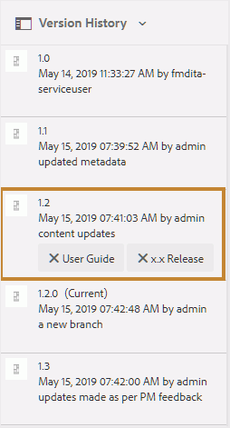

# Use labels {#id164JBG0M0T1}

Adobe Experience Manager Guides allows you to add labels to different versions of a file. You can use these labels to specify the version that you want to include in a baseline for publishing. For more information about using labels to create a baseline, view [Work with Baseline](generate-output-use-baseline-for-publishing.md#).

For example, if you want to use *version 1.0* of a topic in *release 1.0* and *version 1.1* of the same topic in *release 2.0*, you can add *release 1.0* label on the *version 1.0* and *release 2.0* label on the *version 1.1*.

Once you have added the labels, you can create a baseline and specify which version of the topic should be included for publishing using that baseline. To view what version should be included or excluded in a baseline, you can use the Version History option.

## Add a label from the Editor

Perform the following steps to add a label to your topic from the Editor:

1. In the Repository panel, navigate to a topic and open it in the Editor.
1. Select **Version label** from the **Menu** dropdown.  

    {width="400" align="left"}

    The **Version Label Management** dialog is displayed. 

1. In the **Version Label Management** dialog, select a version where you want to add a label.
1. Select a label for the selected version and select **Add Label**. 

    {width="650" align="left"}

    >[!NOTE]
    >
    > You cannot add the same label to the different versions of a topic. However, you can add multiple labels to the same version of a topic.
1. Confirm to apply the labels in the confirmation prompt. 

    The labels are displayed in the Version History of the selected topic. 

    {width="650" align="left"}

    >[!NOTE]
    >
    > Using a baseline, you can add a label to multiple topics. For more information about adding labels using baseline, view [Add labels to a Baseline](generate-output-use-baseline-for-publishing.md#id184KD0T305Z).

To delete a version label from a topic, use the **Remove** icon provided against each label added in the Version Label Management dialog. 

{width="800" align="left"}

## Working with labels from the Assets UI

You can also add labels to a topic and delete them as needed from the Assets UI. 

Perform the following steps to add a label to your topic from the Assets UI:

1.  In the Assets UI, select a topic, and open it.
1.  Select the left rail selector icon and select **Version History**.
1.  In the Version History dropdown, select a version where you want to add a label.
1.  Enter a label for the selected version and press Enter. For example, *2.6 Release*.

    >[!NOTE]
    >
    > You cannot add the same label to the different versions of a topic. However, you can add multiple labels to the same version of a topic.

    The labels are displayed in the Version History of the selected topic. The following screenshot displays the labels *x.x Release* and *User Guide* added to the highlighted version of the topic.

    {width="300" align="left"}

>[!NOTE]
>
> Using a baseline, you can add a label to multiple topics. For more information about adding labels using baseline, view [Add labels to a Baseline](generate-output-use-baseline-for-publishing.md#id184KD0T305Z).

To delete a version label from a topic, use the **Delete** button provided against each label in the Version History panel.

{width="300" align="left"}

**Parent topic:**[Introduction to Editor](web-editor.md)
