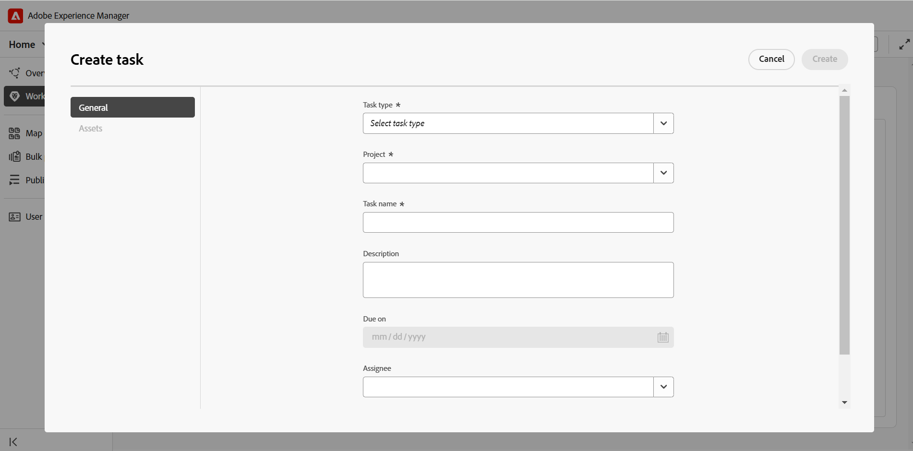
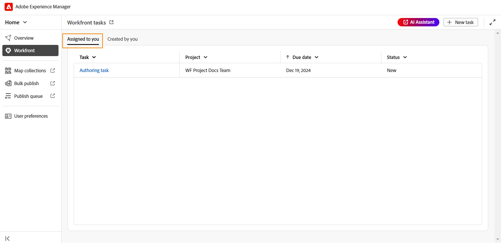
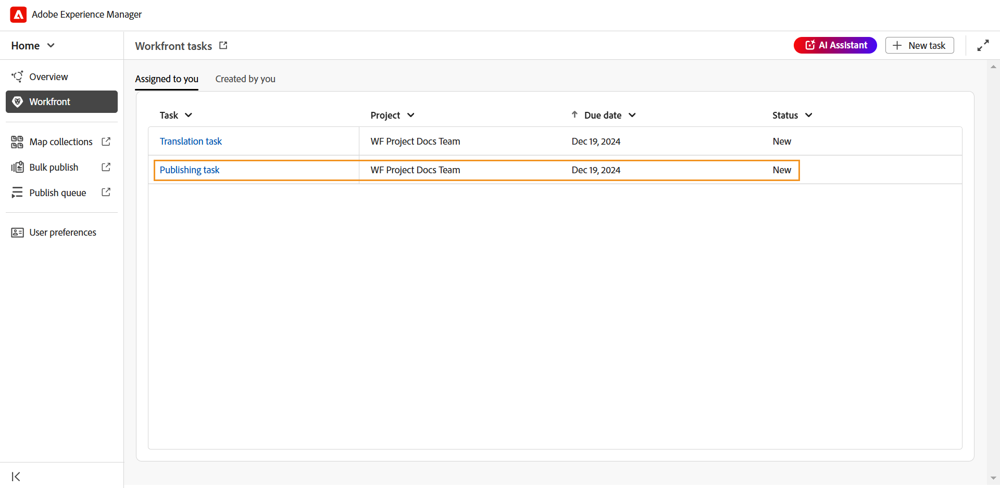

# Workfront integration

Adobe Workfront is a cloud-based work management solution that helps teams and organizations plan, track and manage their work efficiently. The integration between Experience Manager Guides and Adobe Workfront gives you access to robust project management features on top of Experience Manager Guides core CCMS capabilities, allowing you to plan, allocate, and track tasks efficiently. 

With this integration, you can create and manage Adobe Workfront tasks directly from Experience Manager Guides. For example, as an author, you can create a review task (with one or more DITA topics or maps added) directly within the Experience Manager Guides interface and assign it to a reviewer. As a reviewer, you can work on assigned tasks in the Experience Manager Guides Review UI and return them to the author with comments. Similarly, you can create a publishing and translation task, and then assign it to the users who are required to work upon it.

The integration also provides you the ability to monitor your work queues, ensuring you stay organized and on top of all your tasks (assigned tasks).

**Key features**

With the Experience Manager Guides and Adobe Workfront integration, you can: 

* Plan, allocate, and track the progress of individual tasks and projects without relying on multiple, non-integrated tools. 
* Manage all Experience Manager Guides workflows including authoring, reviewing, publishing, and translating content more efficiently. 
* Receive email notifications from Adobe Workfront whenever new tasks are assigned. For more details, view [Notifications overview](https://experienceleague.adobe.com/en/docs/workfront/using/basics/use-notifications/wf-notifications).
* Monitor project health using Adobe Workfront's intuitive dashboard, offering real-time insights into project performance. 

    Learn about the Adobe Workfront's robust project management capabilities enabled for project managers through this integration.

## Get started 

Once configured and enabled by your administrator, Adobe Workfront tasks can be accessed right from the [Experience Manager Guides Home page](./intro-home-page.md). 

Perform the following steps to access your Adobe Workfront tasks: 

1. Log into Experience Manager Guides and open the **Home page**.  
2. In the left panel, select **Workfront**.  

   The **Workfront tasks** page is displayed. 

   {width="300" align="left"}     
3. Select **Sign In**. 
   
   You are redirected to the Adobe Workfront Sign In page.
4. Sign in using the same email address as used in Experience Manager Guides, and then select **Allow access** to let the the application access your Adobe Workfront account.

   You are automatically redirected to the **Workfront tasks** page on Experience Manager Guides.
     
   {width="300" align="left"}  
   
## Features available on the Workfront tasks page

The following features are available on the Workfront tasks page:

* [New task](#create-workfront-tasks): Allows you to create Adobe Workfront tasks right from the Experience Manager Guides interface.
* [Assigned to you](#managing-tasks-assigned-to-you): Lists all tasks that are assigned to you and still active.  
* [Created by you](#managing-tasks-created-by-you): Lists all tasks that you have created and are still active.  

The Workfront tasks page also includes a link out icon , which, when selected, takes you to the Adobe Workfront project page. Here, you can view task details, view comments, add comments, and access other features based on the permissions that are mapped with your Adobe Workfront account. 

For more details, view [Overview of the Project, Task, and Issue dates in Workfront](https://experienceleague.adobe.com/en/docs/workfront/using/basics/navigate/definitions-pti-dates).

### Create Workfront tasks

You can create Adobe Workfront tasks directly from the Experience Manager Guides interface using the **New task** button present on the Workfront tasks page.  

Perform the following steps to create a new Adobe Workfront task: 

1. On the Workfront tasks page, select **New task**.

   The **Create task** dialog box is displayed.

   {width="300" align="left"} 
2. In the **General** tab, enter the following task details: 

    * **Task type**: Select the task type that you want to create. The available options are: **Authoring**, **Reviewing**, **Publishing**, and **Translation**. 
    * **Project**: Select the project within which you want to create this the task. 
    * **Task name**: Enter a descriptive name for the task. 
    * **Description**: Enter a brief description of the task. 
    * **Due on**: Set the due date for task completion. 
    * **Assignee**: Select an assignee for the task.  
3.  In the **Assets** tab, select **Add** to add an asset to this task. 

     {width="300" align="left"}
    
    * For authoring, publishing, and translation tasks, you are prompted to select the location of the required file in the **Select path** dialog box. The selected file(a topic for authoring and map for publishing and translation) is added to the task as soon as the **Create** button is selected.

        {width="300" align="left"}
    
    * For review tasks, you are first prompted to select Asset type (Map or Topics), and then the selected files are displayed as following:

        {width="300" align="left"}    
        *Caption: Adding topics to a review task* 

        {width="300" align="left"}    
        *Caption: Adding maps to a review task* 

        The following actions are available to modify your selection before sending for review:

        * Unselect some topics or remove all topics from the list. 
        * Filter the topic list based on document state.
        * Edit or set the version of selected topics to **Latest version**, **Version on**, and **Baseline**(only available for maps) as per the need. 
        
        For more details, view [send topics for review](./review-send-topics-for-review.md).        
          

    >[!NOTE]
    >
    > Adding an asset to a task provides assignees quick access to a topic, map or any other file they need to work upon. For authoring, publishing, and translation tasks, adding an asset is optional but can be helpful to streamline workflows. However, for review tasks, adding an asset is mandatory. 

4. Select **Create**.

A new task is created and listed under the **Created by you** tab. 

>[!NOTE]
>
> As a project manager, you can view this newly created task in your Adobe Workfront dashboard along with other key task details. For more details, view [understand dashboards](https://experienceleague.adobe.com/en/docs/workfront/using/reporting/dashboards/understand-dashboards/understand-dashboards).

### Managing tasks created by you

All tasks that you have created and are still active are displayed in the **Created by you** tab on the Workfront tasks page, giving you key task details like project name, assignees, task creation date, task completion date, and task status. 

{width="300" align="left"}

The following options are available when you hover over a task present in the Created by you tab: 

**Open** - 

Allows you to open the task. Depending on the type of the task, it will open in the Editor, Map console, or Review UI.

**Edit** - 

Allows you to edit task details added while creating the task. All fields are editable except Task type and Project. Also, you can only edit tasks that are created by you. Assigned tasks can not be edited. 

**Task details** - 

Displays the task information, including details entered during task creation, task status, and any added assets. 

### Managing tasks assigned to you

All tasks that are assigned to you and still active are displayed in the **Assigned to you** tab on the Workfront tasks page, giving you key task details like project name, assignees, due date, and task status. 

{width="300" align="left"}

The following options are available when you hover over a task present in the Assigned to you tab: 

**Open** - 

Allows you to open the task. Depending on the type of the task, it will open in the Editor, Map console, or Review UI. 

**Task details** - 

Displays the task information, including details entered during task creation, task status, and any added assets. 

{width="300" align="left"}

#### Accessing assigned tasks from Overview section

You can also access your assigned Adobe Workfront tasks from the [Overview section](./intro-home-page.md#overview). The Overview section, when selected, features different widgets that help you stay focused and organized. 

**Your tasks** is one such widget where a list of Adobe Workfront tasks(that are assigned to you and are still active) is displayed along with the key task details including name of the task, associated project, due date, and the current status.

{width="800" align="left"}

Similar to the Assigned to you tab, the Your tasks widget also provides options to **Open** and view **Task details** when you hover over a task.

The widget also provides you with options to sort and resize columns for a customized view. To apply sorting to a column, select the column header and the options would display in a list. To adjust a column's width, hover over the column divider line in the header, then drag to resize.

>[!NOTE]
>
> When away from your Experience Manager Guides interface, you receive an email notification from Adobe Workfront for any newly assigned task. To check out these tasks, log in to your Experience Manager Guides instance and access the assigned tasks. 

## Working with Adobe Workfront assigned tasks

There are four types of Adobe Workfront tasks that you can create, and then assign, or work upon when assigned on Experience Manager Guides:

1. [Authoring tasks](#authoring-tasks)
2. [Review tasks](#review-tasks)
3. [Translation tasks](#translation-tasks)
4. [Publishing tasks](#publishing-tasks)

The following sections walk you through the detailed process of working on assigned Adobe Workfront tasks. 

### Authoring tasks

Perform the following steps to work upon an authoring task: 

1. Access the task either from the [Overview](#accessing-assigned-tasks-from-overview-section) section or [Assigned to you](#managing-tasks-assigned-to-you) tab. 

    {width="300" align="left"}
    *Caption: Authoring task in the Assigned to you tab*

    {width="300" align="left"}
    *Caption: Authoring task in the Your tasks widget*
2. Hover over the task you want to work on and select&nbsp; &nbsp; to open it. You can also open the task by simply selecting the task. 
   All authoring tasks open in the Editor. 
3. Review the task details in the **Details** tab and select the **Asset** file to open it. 

    {width="300" align="left"}

4. Make the required edits and select **Mark as done**. 
5. Switch to the **Comments** tab to add a comment to this task. These comments, added at task level, will also reflect on the Adobe Workfront project dashboard.  

    >[!NOTE]
    >
    > Once the task is marked as done, it will be removed from both your assigned task list and the task intiator's **Created by you** task list.  

### Review tasks

As a reviewer, you can review Adobe Workfront review tasks that are assigned to you. 

Perform the following steps to work upon a review task assigned to you.

1. Access the task either from the [Overview](#accessing-assigned-tasks-from-overview-section) section or [Assigned to you](#managing-tasks-assigned-to-you) tab. 

    {width="300" align="left"}
    *Caption: Review task in the Assigned to you tab*

    {width="300" align="left"}
    *Caption: Authoring task in the Your tasks widget*
2. Hover over the task you want to work on and select&nbsp; &nbsp; to open it. You can also open the task by simply selecting the task. 

    For reviewers, the review task opens in the **Review UI**. 
    
    {width="300" align="left"}

3. Perform the required review. For details on how to review a topic, view [review topics](./review-topics.md).
4. Once the review is complete, select **Mark as done**.
5. Switch to the **Comments** tab to add a comment to this task. These comments, added at task level, will also reflect on the Adobe Workfront project dashboard.  

Marking the task as done by the reviewer does not indicate the completion of the task. All review tasks are assigned back to the user who created the task (ideally an author who requested for a review). 

>![NOTE]
>
>
If the task is assigned to multiple reviewers, then it is re-assigned to the task creator only after all reviewers have marked it as done. 

Review tasks re-assigned to the creator/authors for review incorporation, can be accessed from [Overview](#accessing-assigned-tasks-from-overview-section) section or from [Assigned to you](#managing-tasks-assigned-to-you) tab. For such tasks,the task state for the assignee changes to **Authoring** while the task type remains as **Review**. 

Authors can access completed review tasks from the **Assigned to you** tab on the Workfront tasks page.
    
{width="800" align="left"}
*Caption: Review task assigned back to authors*
    
Selecting the task or the open icon  opens the task in the Editor where the author can [address review comments](../user-guide/review-address-review-comments.md), edit the task by updating the version of the topics, and then re-assign the task back to reviewer if needed. 

This process forms a continuous cycle, where the task moves back and forth between the author and reviewer until it is fully completed. Once all the suggested changes are incorporated, the author can complete the task by selecting **Mark as Done**. 

### Translation tasks

You can perform various translation actions on Adobe Workfront translation tasks that are assigned to you. 

Perform the following steps to work upon a translation task: 

1. Access the task either from the **Your tasks** widget or **Assigned to you** tab. 

   {width="300" align="left"}
    *Caption: Translation task in the Assigned to you tab*

   {width="300" align="left"}
    *Caption: Translation task in the Your tasks widget* 

2. Hover over the task you want to work on and select&nbsp; &nbsp; to open it in the **Map console**. You can also open the task by simply selecting the task. 
3. Review task details and the file added for translation. 

   {width="300" align="left"}
4. Navigate to the **Translation** tab for the various translation options. Learn how to [translate content](../user-guide/translation.md) in Experience Manager Guides. 
5. Perform the required translation and select **Send for translation**. 
   {width="300" align="left"} 
6. Navigate to the **Workfront** section and select **Mark as done** to indicate that the task is complete.  
7. Switch to the **Comments** tab to add a comment to this task. These comments, added at task level, will reflect on the Adobe Workfront project dashboard.  

    >[!NOTE]
    >
    > Once the task is marked as done, it will be removed from both your assigned task list and the task intiator's **Created by you** task list.

### Publishing tasks

As a publisher, you can view details and publish a publishing task assigned to you.  

Perform the following steps to work upon a publishing task: 

1. Access the task either from the **Your tasks** widget or **Assigned to you** tab.

    {width="300" align="left"}
    *Caption: Publishing task in the Assigned to you tab*

    {width="300" align="left"}
    *Caption: Publishing task in the Your tasks widget*
2. Hover over the task you want to work on and select&nbsp; &nbsp; to open it in the **Map console**. You can also open the task by simply selecting the task.  
3. Review task details and the file added for publishing.

   {width="300" align="left"}
4. Navigate to the **Output presets** and perform the publishing actions required to publish the task. For more details, view [understanding the output presets](../user-guide/generate-output-understand-presets.md/). 
5. Once publishing is complete, navigate to the **Workfront** section and select **Mark as done** to indicate that the task is complete.  
6. Switch to the **Comments** tab to add a comment to this task. These comments, added at task level, will reflect on the Workfront's project dashboard. 

    >[!NOTE]
    >
    > Once the task is marked as done, it will be removed from both your assigned task list and the task intiator's **Created by you** task list. 