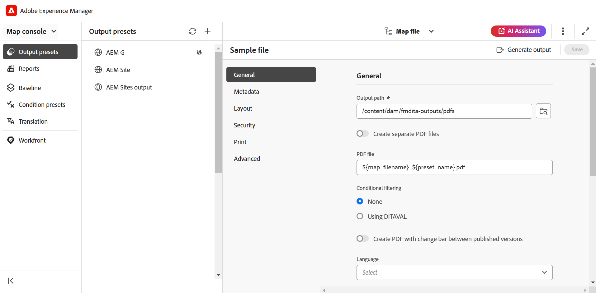
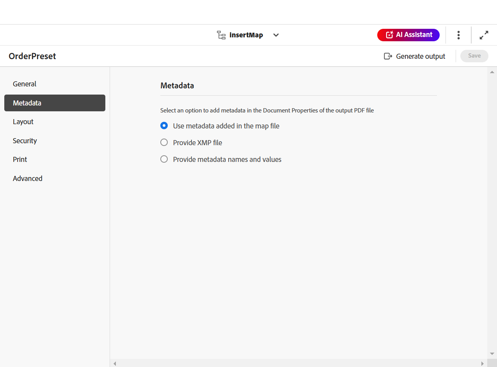

# Native PDF output preset

When authoring content, it becomes essential to ensure that the content is optimized for viewing, editing, and printing. Using standards such as the W3C CSS3 for content styling and CSS paged media standards for page definition properties such as size, margins, orientation, page breaks, headers, footers, and page numbering, you can set the view and layout for your PDF document ensuring consistency and usability. The Native PDF publishing feature uses these standards to generate a PDF. 

With the native PDF publishing, you can use predefined templates to ensure consistency in content layout and structure, apply stylesheets to alter the look-and-feel of your output, optimize PDF, set printer marks, allow screen reader support, set PDF conformance, embed fonts, and much more.  

Generating a PDF using Native PDF publishing has two aspects: 

* Use of templates to apply styling to content, set page layouts, and various settings to fine-tune your PDF. Authors can choose to use/modify the sample templates provided or create custom templates and set advanced configuration options used by publishers and developers. 

* Create or configure a PDF output preset to control the PDF settings. Once you create a PDF output preset, you can generate the PDF.  

## Create an output preset

Perform the following steps to create the PDF preset from the Map console:

1. [Open a DITA map file in the Map console](../user-guide/open-files-map-console.md). 

    You can also access the map file from the **Recent files** widget in the [Overview section](../user-guide/intro-home-page.md#overview). The selected map file would open in Map console. 
1. In the **Output presets** tab, select the + icon to create an output preset. 
1. Select **PDF** from the Type dropdown in the **New output preset** dialog box. 
1. In the **Name** field, provide a name to this preset.
1. In the **Generate PDF Using** field, select **Native-PDF**.
1. Select the **Add to current folder profile** option to create an output preset within the current folder profile. The  indicates a folder-profile-level preset.  

   Learn more about [Manage Global and Folder profile output presets](../user-guide/web-editor-manage-output-presets.md).

 1. Select **Add**.   

    The preset for PDF is created.

## Native PDF preset configuration

Once the preset is created, configure the Native PDF preset settings. The preset configuration options for DITA-OT are organized under the **General**, **Metadata**, **Layout**, **Security**, **Print**, and **Advanced** tabs.

 

**General**

Use to specify basic output settings, such as specify output path, PDF file name, and more. 

| Setting  | Description|
| --- | --- |
|**Output Path**|The path within the AEM repository where the PDF output is stored. Ensure that the output path is not located inside the project folder. The output path is set through the variable `${base_output_path}`, which is configured by the Administrator. To configure the Output path, view [Configure Base Output Location for Publishing PDF](../native-pdf/configure-base-location-cs.md). You can also use the following out-of-box variables to define the Output Path. You can use a single or a combination of variables to define this option.   `${map_filename}`: Uses the DITA map files name to create the destination path.   `${map_title}`: Uses the DITA map title to create the destination path.  `${preset_name}`: Uses the output preset name to create the destination path.   `${language_code}`: Uses the language code where the map file is located to create the destination path.   `${map_parentpath}`: Uses the complete path of the map file to create the destination path.   `${path_after_langfolder}`: Uses the path of the map file after the language folder to create the destination path.| 
|  **PDF File**  | Specify a file name to save the PDF. By default, the PDF file name adds the DITA map name along with the preset name. For example, ditamap is 'TestMap' and the name of the preset is 'preset1' then the default name of the pdf will be 'TestMap_preset1.pdf'.  You can also use the following out-of-box variables to define the PDF File. You can use a single or a combination of variables to define this option.  `${map_filename}` `${map_title}` `${preset_name}`   `${language_code}`.  |
| **Apply Conditions Using** |   For conditionalized content, choose from the below options to generate a PDF output based on those conditions:  <ul> <li> **None Applied** Select this option if you do not want to apply any condition on the map and source content.  <li> **DITAVAL file** Select a DITAVAL file to generate conditional content. You can select multiple DITAVAL files either by using the browse dialog or by entering the file path manually. To remove a selected file, click the cross icon next to its name. If an invalid file is selected, an error message is displayed stating **Invalid DITAVAL file is selected**.    You can also apply flagging within a DITAVAL file. This allows the insertion of start and end flags, each containing an image to visually mark the content. Additionally, the flagged content can be styled using formatting such as bold or italics, among other options. To manage any conflicts that arise, a background color can be selected under Style conflict settings. For more details, view [Use the DITAVAL editor](../user-guide/ditaval-editor.md). <li> **Condition Preset** Select a condition preset from the drop-down to apply a condition while publishing the output. This option is visible if you have added a condition for the DITA map file. The conditional settings are available in the Condition Presets tab of the DITA map console. To know more about condition preset, view [Use condition presets](https://help.adobe.com/en_US/xml-documentation-for-adobe-experience-manager/index.html#t=DXML-master-map%2Fgenerate-output-use-condition-presets.html).   </ul>|
|  **Use Baseline**  | If you have created a Baseline for the selected DITA map, select this option to specify the version that you want to publish. View [Work with Baseline](https://help.adobe.com/en_US/xml-documentation-for-adobe-experience-manager/index.html#t=DXML-master-map%2Fgenerate-output-use-baseline-for-publishing.html) for more details.  |
|  **Create PDF with Change Bar between Published Versions**  | Use the following options to create a PDF showing the differences in content between two versions using change bars:    <ul><li> **Baseline of the Previous Version** Choose the baseline version which you want to compare with the current version or another baseline. A change bar appears in the PDF to indicate the modified content. A change bar is a vertical line that visually identifies new or revised content. The change bar appears on the left of the content that has been inserted, changed, or deleted.   **Note**: If you select **Use Baseline** and choose a baseline to publish, the comparison will be done between the two selected baseline versions. For example, if you choose baseline Version 1.3 under **Use Baseline**, and Version 1.1 under **Baseline of the Previous Version**, the comparison will be done between baseline Version 1.1 and baseline Version 1.3.  <li> **Show Added Text** Select to show the inserted text in green color and underlined. This option is selected by default.   <li> **Show Deleted Text** Select to show the deleted text in red color and marked with a strikethrough. This option is selected by default.  **Note** You can also customize the styling of the change bar, inserted content, or deleted content using the stylesheet. </ul> |
| **Post Generation Workflow** |Select to show a drop-down list that contains all workflows configured in AEM. You can select the workflow you want to execute after the completion of PDF generation workflow.|
 
**Metadata**

Metadata is the description or definition of your content. Metadata helps in content management and helps in searching files on the internet. 

Use the Metadata tab to set the metadata fileds such as the author's name, document title, keywords, copyright information, and other data fields for the PDF output. You can also add custom metadata for your PDF output. 

This metadata is mapped to the metadata in the **Description** tab within the **Document Properties** of your output PDF.  

From the Output presets, select  **PDF** > **Native-PDF** > **Metadata** to add and customize metadata options. 
* **Use Metdata added in topicmeta**

   This option is selected by default. You can use the metadata that you have added in the topicmeta element of the DITA map to populate the metadata fields of the PDF output. 

* **Provide XMP file**

  You can also directly populate the metadata fields by importing [XMP](https://www.adobe.com/products/xmp.html) (Extensible Metadata Platform) file. You can download a sample XMP file from here.
   
   [Download](assets/SampleXMP.xmp)

   Alternatively, you can generate an XMP file using Adobe Acrobat.
   1. Select **File** > **Properties** in Acrobat.
   1. Under **Description**, select **Additional Metadata**.
   1. From the left panel, select **Advanced**. 
   1. Select **Save**.

   XMP file is saved on the device.

* **Provide metadata names and values**

   1. Add name by selecting from the drop-down or add a custom metadata by typing directly in the name field.
   1. Enter the value for the metadata and select the '+' icon.
The metadata is added to the list of metadata for the PDF. 

You can also use variables to define the metadata values.  You can use the metadata defined for the DITA map or bookmap file as variables. The metadata can be found under the `/jcr:content/metadata` node of the DITA map or bookmap file.
When you use a variable, its value is picked from the metadata properties.

To use a variable, you need to define it in the `${<variable>}` format. 

For example, one of the metadata properties defined in the /`jcr:content/metadata` node is
`dc:title`. You can specify `${dc:title}`, and the title value is used in the final output. 

You can use a single or a combination of variables to define the metadata. For example, `${dc:title} ${dc:docstate}`. You can also use the combination of a variable and a string.  For example, `View ${dc:title} in ${dc:language}`.

Use language variables to define the localized value of metadata properties. Depending on your chosen language, the localized value is automatically picked in the PDF output. For example, you can print "Author" as the metadata value in English and "Autorin" in German. 

Format: `${lng:<variable name>}`. For example, `${lng:author-label}` where `author-label` is a language variable. 

Hover over  near the option to view more details about it. 

**Layout**

Use to set page layouts and specify page view options for PDF output such as Page Display and set Zoom levels.

| Setting  | Description|
| --- | --- |
|**PDF Template**|   PDF templates provide a clear structure for defining page layouts, content styling, and applying various settings to your PDF output. Select from the PDF template drop-down options to choose your preferred template.   You can also select **Browse Template**   to choose a template. In the **Select PDF template** dialog you can also preview the thumbnail and view the title and description for the selected template.  |
|  **Page Display**  | Use the Page Display for page view that shows how the PDF is displayed when it is opened. Select from the Page Display drop-down options to choose a preferred view.  <ul><li> **Default**  Displays as per the default setting of the PDF viewer on a user's machine.    <li> **Single Page View** Displays one page at a time.     <li> **Single Page Scrolling** Displays a single page in a continuous vertical column.    <li> **Two Page View** Displays two-page spread side-by-side at a time. .  <li> **Two Page Scrolling** Displays two-page spread side-by-side with continuous scrolling. </ul> |  
|  **Zoom**  | Select to resize the page view that shows how the PDF is displayed when it is opened.   <ul><li> **Default** Displays as per the default setting of the PDF viewer on a user's machine      <li> **100%** Makes the page appear in its actual size.       <li> **Fit Page** Makes the page width and height to fit within the document pane.   .  <li> **Fit Page Width** Makes the width of the page fill the width of the document pane.    <li> **Fit Page Height** Makes the height of the page fill the height of the document pane. </ul> | 

**Security**

Protect your PDF by adding restrictions to open and read the file. Use the below options to avoid unauthorized access. 

| Setting  | Description|
| --- | --- |
|**Set password to open the document**|   Select to add a secure password to view your PDF file. Specify a password in the **User password** field. Users can open the PDF only by entering the password provided in this field.  |
|  **Set the document restrictions**  | Select to restrict how users can interact with your PDF. Specify a password in the **Owner Password** field for the below restriction settings to work.   <ul><li> **Printing** Select to allow a user to print the PDF.   <li> **Draft quality printing** Select to allow a user to print the PDF in a lower resolution.    <li> **Content copying** Select to allow a user to copy contents from the PDF.     <li> **Annotations** Select to allow a user to add a note or comment in the PDF.    <li> **Content modifications** Select to allow a user to alter the contents in the PDF.    <li> **Content copying for accessibility** Select to allow screen readers to read and navigate content in PDF.     **Document assembly** Select to allow users to insert pages in the PDF.    **Note**: The users need to enter the owner password to change any restrictions from the File > Properties in Adobe Acrobat. |  

**Print**

>[!NOTE]
>
> Starting with the Experience Manager Guides 5.0/2025.02.0 release, the Print section is now part of the **Native PDF Output preset**. For the existing templates with saved Print settings, the Print data will remain intact but will no longer appear in the UI or apply during output. To continue using these settings, you must reconfigure them within the Native PDF Output preset.

Configure the print production settings to assign printer marks, select color models, and specify properties related to printing of your PDF output.

* **Printer Marks**: When you prepare a document for print production, printer marks are added to the page boundaries to assist in proper alignment, trimming, and color selection during printing. By selecting a printer mark, the page boundary is extended to accommodate the mark, which are trimmed during print. You can choose to display the following printer marks in your PDF output:
   * **Trim Marks**: Select the option to place a mark at each corner of the trim area to indicate where the paper needs to be trimmed after printing.
   * **Bleed Marks**: Select to place a mark at each corner of the bleed box to indicate the trim area for the extended image.
   * **Registration Marks**: Select to place a mark outside the crop area for aligning the different separations in a color document.
   * **Color Bars**: Select to add a strip of colors outside the trim area to maintain color consistency and adjust ink density when printing.

   Set dimensions for the selected printer marks using the **Line Width**, **Line Color**, and **Bleed Box Width** options.

* **Media Box size**: This is the overall page size including the extended area occupied by printer marks. Use the drop-down option to select the page size for your PDF output or create your own custom size.

* **Color Space**: You are given an option to choose from RGB or CMYK color spaces to print your PDF document. Choose RGB to display the generated PDF digitally and CMYK for physical printing. Colors defined in the document are converted to the chosen color space.

* **ICC profile**: Here, you can manage color accuracy across devices by specifying an ICC profile. This ensures consistent color rendering in the printed output. 

To configure this setting, specify the ICC profile file path on your server and provide the ICC profile name for easy identification. Alternatively, if the ICC profile is stored online, you can provide its URL instead of the file path.

   >[!NOTE]
   >
   > An ICC color profile is necessary for PDF/A creation if using CMYK color space.

   <!--For more information on applying these print settings, see *Printing preferences*.-->

**Advanced**

Use the following options to specify advanced settings to merge PDFs, use compression, select compliance standard, and more. 

| Setting  | Description|
| --- | --- |
|**Create accessible (tagged) PDF**|   Select this option to generate a PDF with tags. A tagged PDF makes it easier for screen readers to read and navigate content, hyperlinks, bookmarks, and so on. For example, if a table is tagged, the screen reader will know that it is reading the table and not just lines and text.  |
|  **Merge PDFs included in the TOC** | Select this option to merge existing PDFs into your output by adding them to your DITA map as a resource file. The PDFs will be inserted at the location represented in the map and the pages will be incremented accordingly. |  
|  **Embed used fonts** | Select this option when using fonts that may not be installed on end user's machine. With this option selected, the used fonts get embedded in the PDF, ensuring the user can view the PDF as intended even if the fonts are not installed on their machine.   **Note**: A font can be embedded only if it contains a setting by the font vendor that permits it to be embedded. Ensure you have the required setting or license before embedding a font.  | 
|  **Use automatic hyphenation** | With automatic hyphenation enabled, words at the end of lines are broken in grammatically correct places with a hyphen. |  
|  **Enable JavaScript** | Enable this option if you have a JavaScript code that you want to use to transform your content dynamically before generating a PDF. |  
|  **Embed multimedia files** | Select this option to include any audio, video, and any interactive content to the PDF. |  
|  **Use full compression to optimize the PDF size** | Select this option if you want to compress/reduce the size of a large PDF. Remember, compressing the PDF may reduce the file quality. | 
|  **Use image compression to optimize the PDF size** | Select this option if you want to compress/reduce the size of images used, in your PDF. Remember, compressing an image may reduce the image quality.  | 
|  **Use custom resolution (pixels per inch)** | It is the page display resolution at pixels per inch. Enter a preferred value in the field that appears when this option is selected. The default value is 96 pixels per inch. Set a higher value to fit more content in an inch, and vice versa, if you set a lower value. | 
|  **Show Watermark** | Select this option to superimpose a watermark in your output. You can enter a new text string in the text box with the character casing the way you want.   Use static text or language variables to publish the localized version of the watermark.  Depending on your chosen language, the localized value is automatically picked in the PDF output. For example, you can print 'Publisher' as a watermark in English and 'Auteure' in French.    Format: `${lng:<variable name>}`. For example, `$ {lng:publisher-label}` where `publisher-label` is a language variable.   Hover over  near the option to view more details about it. | 
|  **Enable MathML equations** | Select this option to render MathML equations present in your content. The equations will be ignored otherwise by default.  | 
|**Create interactive PDF form**|Select this option if you want to include interactive and customizable PDF form fields for enhanced user input in generated PDF outputs. |
| **Include track changes** | Select this option if you want to include tracked changes in the generated PDF for easy review and comparison.|
|**Retain temporary files**|Select this option if you want to retain the interim HTML files created while generating the Native PDF output. You can later download the temporary files after generating the output. The downloaded files would also include `system_config.xml` file that gives you information about author URL, local URL and publish URL. These URLs are configured in the AEM Externalization settings and are reflected in the `system_config.xml` file.|
|  **PDF conformance** | It is the standard to which you intend to save your PDF to ensure it is compliant. Select from the dropdown to choose from the list of available PDF standards. For more details about the supported standards, view [About PDF standards](https://helpx.adobe.com/acrobat/using/pdf-conversion-settings.html#about_pdf_x_pdf_e_and_pdf_a_standards). | 
|**File properties**| Select the metadata that you want to pass to Native PDF publishing. The dropdown lists both the custom and the default properties. For example, `dc:description`, `dc:language`, `dc:title`, and `docstate` are the default properties while you can have `author` as the custom property. The selected metadata properties are passed to the PDF file generated using Native PDF.   These properties are picked from the `metadataList` file available at:`/libs/fmdita/config/metadataList`.  This file can be overlaid at: `/apps/fmdita/config/metadataList`.|

<!--------------

### Additional notes for PDF output

**Download temporary files after generating the Native PDF output**

If you select the **Download temporary files** option in the Advanced settings, you can also download the interim HTML files created while generating the Native PDF output. Once you've generated the output, you can download the temporary files using the **Download temporary files** icon on the top bar. This feature helps you view your interim HTML styles and layouts and helps you correct or change your CSS styles according to your requirements.

>[!NOTE]
>
> The **Download temporary files**   icon appears only if you have generated the last PDF output using the preset wherein you have selected the option in the **Advanced** tab. 

**Use language variables**

AEM Guides also provides the support for language variables. Select **Language Variables**   in the left panel to define a localized version of the out-of-the-box labels like Note, Caution, and Warning or static text in the PDF output. For more details, view [Support for language variables](../native-pdf/native-pdf-language-variables.md).

**Support for Markdown documents**

Experience Manager Guides also provides support for your Markdown documents.  Markdown files are easy to author and also provide a variety of formatting options. Learn how to [author Markdown documents from the Editor](../user-guide/web-editor-markdown-topic.md). 

You can add the Markdown topics to your DITA map and generate the PDF output using the Native PDF output presets.  Learn how to configure or [create a PDF output preset](#create-a-pdf-output-preset-create-output-preset). 

--------------->